# 25年モノのバイクをフルメンテ…CBR250RR，もう少し現役で走ってもらいましょうか

📅 投稿日時: 2017-08-07 04:13:25

えー．

我が家にある，約25年モノのバイク，

CBR250RR．

厳密にはうちの妻のバイクなんだけど．

子供が生まれてから，ほとんど乗ることはなく．

今では，私が時々思い出したように乗る程度．

私はスキーシーズンにバイクに乗る時間が取れないので，

冬の間は，バッテリーを外して，

いろいろなところをグリスアップしたりして

厳重にカバーして放置してあるわけですけど．

スキーシーズンが終わった，この7月．

「さーて．久々にバイク動かすべ…」

と．

シーズン初めの儀式，

バッテリー搭載と，

タイヤの空気入れをやろうとしたところ…

がががーーん！

空気を入れるタイヤバルブ部分．

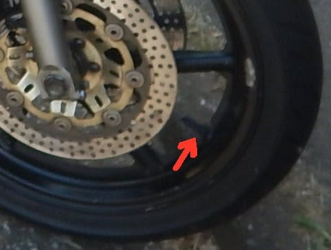

ここのゴムがボロボロに劣化して，

空気が漏れまくっている

じゃないですか…！！（涙）

これは，自分では直せない（泣）．

バイク屋に持っていって，タイヤバルブ交換

してもらわないとダメですね…（泣）．

…どうせなら．

せっかくバイク屋に持ってくので，

ついでにちょっと気になってる部分，

一気に修理してもらいましょうか…

ってことで，

バイク屋にもっていっていろいろ相談したわけで．

私からお願いしたのは…

・フロントフォークシール＆オイル交換

フロントフォークシールが劣化したのか，

わずかにインナーチューブにオイルのにじみが

あるのが気になったので，相談したところ．

「まだ部品があるから変えた方がよい」

とのことで，交換．

・F/Rブレーキフルード交換

たしか，5年近く変えてない気が…（汗）．

・F/RブレーキキャリパO/H

長らくキャリパO/Hしてないから，

時々ピストンの戻りが悪く引きずりっぽく

なってるのでオーバーホール

・エンジンオイル交換

こいつは定番なのでまぁ換えておく，と．

・エアクリーナ交換

エアクリーナーを前に換えたのは

いつかもう覚えていないくらい前なので，

とりあえず交換．

キャブエンジンはエアクリーナーの汚れで

燃調狂うので…

・フロント・リアタイヤバルブ交換

そもそも，今回バイク屋に来たきっかけなので…

…という感じで．

以上のメンテナンスを自分の方から

お願いしたところ．

バイク屋からは

・F/RブレーキマスタシリンダO/H

フロントブレーキがちょっと深いので，

マスターシリンダーもオーバーホールした方が

良さげ，とのことで．

…確かに，10年以上オーバーホールしてない気が

したので，お願い．

・フロントホイールベアリング＆シール交換

フロントホイールの回転が結構渋め．

ベアリングも部品が出るうちにをおススメ…

とのことだったので，交換．

・F/Rタイヤ交換

7年近く前のタイヤなので，硬化してひび割れも

入っており．バルブ交換時，再びタイヤを

取り付けてもリムから空気漏れするかも…

ということで，交換．

・クーラント追加

リザーバタンクの水位が低かったので追加．

…確かに，冷却水水位見てなかった…（汗）．

・チェーン洗浄

これはおまけでやってくれるとのこと．

というところまで，今回やってもらうことに．

ただ，以下の修理は

今回は行わないことに…

・フロントブレーキディスク交換

これも，バイク屋としてはおススメだったけど…

これは，部品が出てこず．

純正じゃないパーツも探したけど出てこず．

もう，交換不能…ということで．

このまま乗り続けることに．

段付き摩耗が出てるけど，まぁディスクの

ブレが出ているわけじゃないから，このまま

乗り続けることに．

うーむ．

さすがにこれだけ古いバイクだと．

もう手に入らない部品が増えてきたので．

部品があるうちに交換できるものは

交換しておいた方が良い感じ…

・冷却系

冷却水ポンプの周りに，ちょっとクーラントが

漏れたような跡があるので，冷却水パイプから

冷却水ポンプまでオーバーホールした方が

イイかも…

ってことでしたが，高すぎるので次回へ繰り越し

・スプロケ交換

もうしばらく大丈夫だけど，部品がいつなくなるか

分からないので，あるうちに替えた方がよいかも…

ってことでしたが，これも金額の観点から

次回へ繰り込し．

その他，

・エンジン本体

・キャブ，燃料系

・ミッション・シフトドラム

・クラッチ

は，まだまだ大丈夫そう…

ということで．

25年モノとしては，驚くべき程度の良さ

らしいのですが．

＃まぁ，私がかなり気を使ってメンテしてますから

しかし，やはり25年モノ．

かなりの修理が必要ですね…（涙）．

最新のATOMICのS9iPRO+X12VARが買えるくらいの

修理費がかかったのですが…（泣）

とりあえず，約6年ぶりのフルオーバーホール．

時間がかかってもいいので，じっくり見てください…

と，お願いして．

つい先日，出来上がりました…

報告を聞いたところ．

リアのブレーキマスターシリンダが結構

ヤバい状態だったり，

フロント・リアのブレーキキャリパのシリンダーは

部品自体はきれいで交換不要だったけど，

汚れが溜まって動きがかなり渋かったり．

フロントホイールベアリングは，シールが硬化して

ベアリング内部に水が入ってしまっていたとか…

いろいろあった部分，すっきり直してもらいました．

残念ながら，フロントディスクは変わらなかったけど．

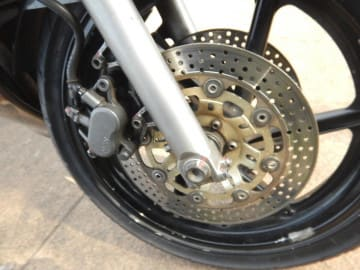

キャリパも完全O/Hされて．

オーバーホールして組み直した部分，

きちんととネジにマークしてありますね…

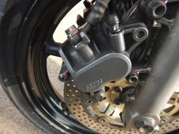

リヤブレーキのキャリパーもきれいになりました

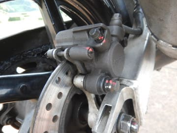

フロントのマスターシリンダーも完全分解から

組み直しされて，ピカピカです．

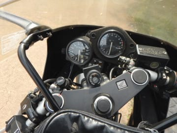

フロントフォークシールも新品になり，

インナーチューブもピカピカに．

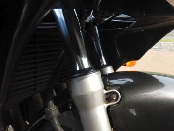

そうそう．

交換したタイヤは，ブリヂストンの

BATTLAX BT92.

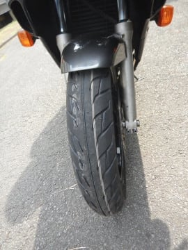

…これって，たしか20年前にも一回

履いたことある気がするんだけど…？？？

こんな古いタイヤ，まだ売っていたのか…！！

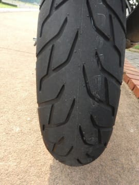

しかし，当時は割とハイパフォーマンスな

高級タイヤだった気がするけど…

今はミドル～ローレンジの安いタイヤ扱い

なのね…．

…ってか，こんな古いバイクが履けるサイズ，

ブリヂストンだとこのタイヤしか選べないのか…

ってことで．

無事組みあがったバイクで．

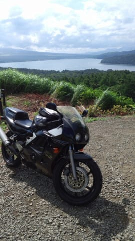

本日，山梨県から…

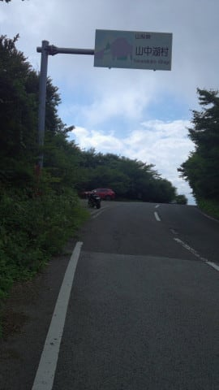

静岡県方面へ，走ってきました．

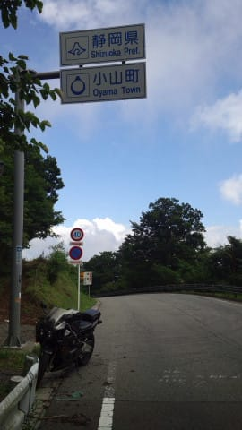

うーむ．

エンジンは快調だし．

25年モノとは思えないほどに復活！

また元気を取り戻したこのバイク．

長距離ツーリングも，安心して行ける

ようになりました…

って感じで．

うちの嫁さんの，このバイク．

かつては夫婦でバイク2台連ねて，北は稚内から，

南は鹿児島まで走り倒した，

思い出がいっぱい詰まったバイクですので．

まだまだ現役で走ってもらいましょうか…

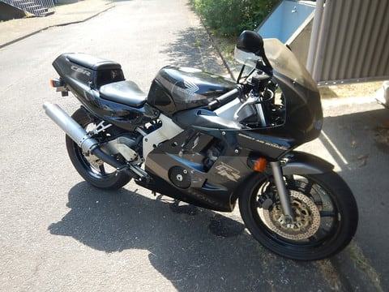

## 💬 コメント一覧

### 💬 コメント by (つーちゃん)
**タイトル**: Unknown
**投稿日**: 2017-08-08 08:15:30

おぉ！バイクも乗ってたんですね！知らなかった！

ニダボいいですねぇ２５０ｃｃで４発、フロントダブルディスク

今じゃ考えられないくらい豪華ですよね

過去にバリオスⅡ乗ってましたが１万回転以上回るバイクは気持ち良い！

私はスキーが終わったらバイクのシーズンに突入しまして

KawasakiZ800に乗ってます。稀少車（不人気）です。

### 💬 コメント by (Skier_S)
**タイトル**: つーちゃんさま
**投稿日**: 2017-08-08 10:46:58

そうなんです…

バイク乗りだったんです．

娘もバイクの後ろに乗るのが大好きです．

CBR250RR，ぜいたくなバイクでした…

今のCBRは単気筒か2気筒だし．

やっぱり4発に乗りたいですよね…

レッドゾーンが19000回転ですから（笑）

私はCRM250以外，

CBR，CBとずっとホンダの4発に

乗り続けてます…

