# 八ヶ岳の阿弥陀岳・赤岳ピストン登山！その4…阿弥陀岳山頂到着！

📅 投稿日時: 2022-09-27 01:39:12

🏷️ カテゴリ: [登山・旅行](c1d637a11a25b457ac978d197adbdafc5.md)

ってなことで．

ほぼ頂上の手前，

頂上までは直線距離で150mほどしかない，

西の肩までつきましたが…

ここから先，あそこを超えてかなきゃ

ならないのね…

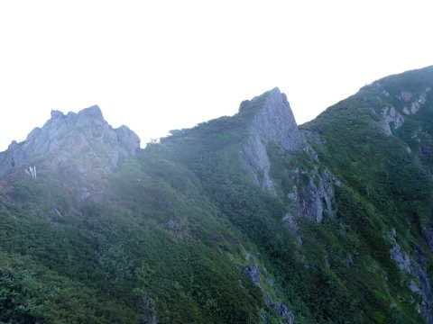

とりあえず．

しばらく登って，

とんがった岩場にとりつきますが…

ちょっとスリルが感じられる

岩場ですね…

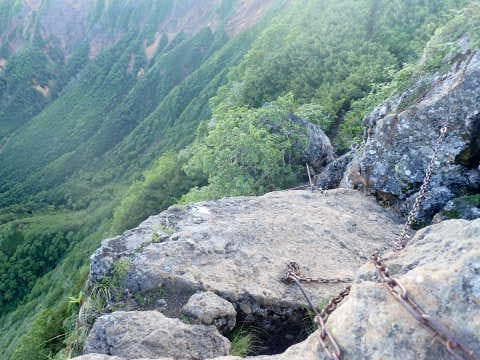

振り返ると．

さっきの「西の肩」の案内板が

矢印のところに見えてます…

そして，最後の岩を乗り越えると…

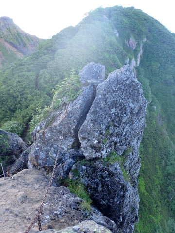

これまで見えてなかった，

向こう側の景色が！

天狗・根石岳から硫黄岳，横岳に連なる

稜線が目の前に飛び込んできます！

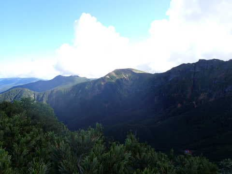

ここまでくれば，阿弥陀岳はあとわずか．

ハイマツ等の低木が茂るルートを

100mも進むと…

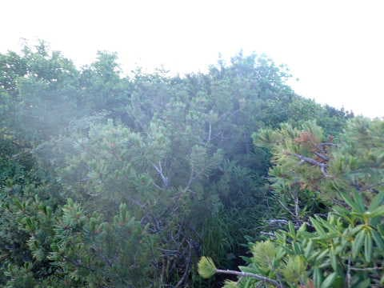

ついに，阿弥陀岳山頂へ到着！！

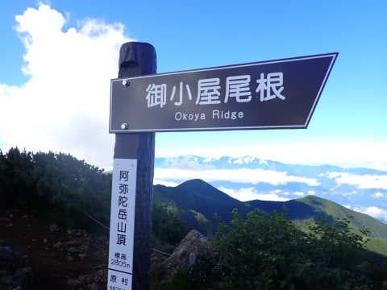

時刻は7:41．

標準コースタイム4時間45分くらいのところ，

駐車場から2時間41分で，

阿弥陀岳到着です！

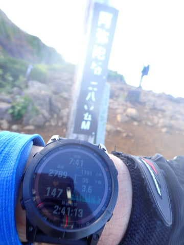

…前半は緩めの斜面だったので，

コースタイムの半分ペースだったものの．

後半，手足を使って登らないといけなく

なってくると，早足で歩くってわけには

いかないので，標準コースタイムと

そんなに変わらないペースになりますね…

で．

山頂ですが．

そこそこの広さがあって．

見晴らしもかなりいいです！

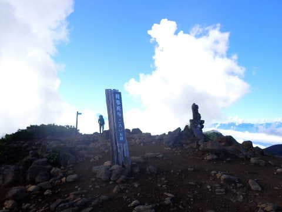

南西方向を見れば，正面に南アルプスが

見えますし…

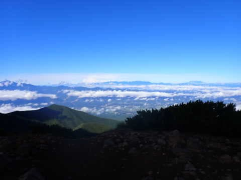

西を見れば，御岳から乗鞍，穂高方面まで見えてて…

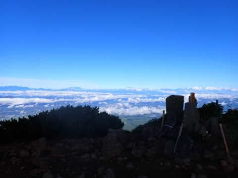

北の方を見れば，蓼科山から北八ヶ岳，南八ヶ岳が

一望できます…

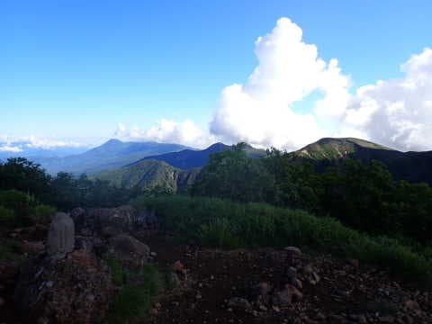

…で．

景色はいいんだけど．

何だか，東側から怪しい雲が近づいてます…

うーん．

これはやっぱり，午後は天気が

崩れるのかも…？

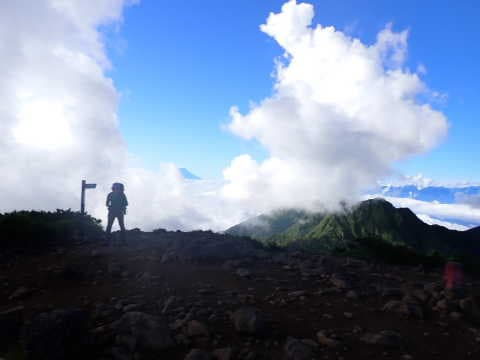

雲の隙間から，富士山がちょこっとだけ

見えてます…

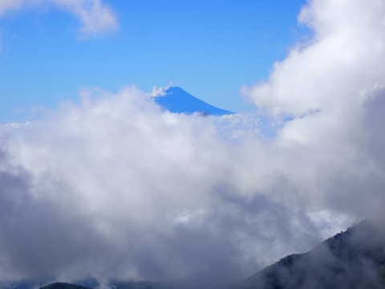

そして．

これから行く予定の赤岳が見えてるけど．

赤岳も，白い雲がバックに広がってます．

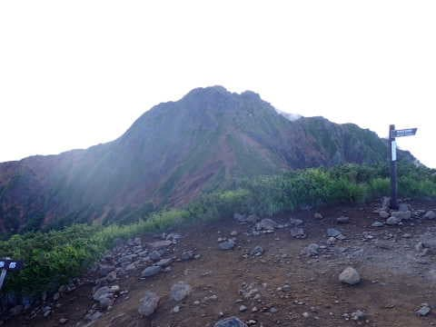

ここから，赤岳往復の標準コースタイムは

約3時間．

赤岳往復だけで標高差500mダウン，

500mアップとそこそこ厳しいし．

かなりの岩場や急斜面があるので，

標準コースタイムからそんなに時間が

削れないはず…

そして，阿弥陀岳から駐車場まで戻る

標準コースタイムは2時間50分．

さて．

金曜までも睡眠時間が短めで．

さらに金曜夜に睡眠2時間ちょいで

家を出てきたこの状況で．

かつ，東から怪しい雲が迫っているけど．

…どうする？

目の前の赤岳に．

行くか？引き返すか…？？

