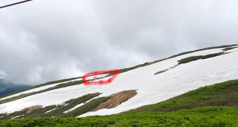

# 2023/6/25(日)の月山スキー場速報！…Tバーはかなり上に上がってるけど，まだ1週間以上は滑れそうかな…

📅 投稿日時: 2023-06-26 02:13:30

ということで．

行ってきましたよ，日帰り月山に…

とりあえず，今日は朝2時半に家を出て，

滑って帰ってきたら深夜0時ごろ．

そして片付けやら明日の仕事の準備やらを

やっていたらこんな時間…(涙)

もう，活動時間が24時間を越えています．

先週も1週間ただでさえ睡眠不足気味

なので，今日はもう寝ないと死ぬ…

でも．

急ぎ速報レポートをするこの偉さ！←いや，寝ようよ

とりあえず．

月山ですが，もう2週間以上前にまだ雪が

あるように見えるのに，コース維持（コース外

立ち入り禁止のロープ張りとか？）が難しいのか，

沢コースどころか大斜面も滑走禁止になり，

上のTバーしか滑れなくなってますが…

今日は，赤でしるしをした大斜面への

トラバースルートが完全に切れていたので．

まぁ，昔みたいに途中で藪漕ぎが入ろうが，

大斜面を滑れるよう開放していたとしても，

もうこれではさすがに滑れませんね…

6月4日から20日間で，かなり雪が

消えました（涙）

そして．

Tバーはかなり上のほうに移動してました…

リフトを降りてから，さらにかなり歩いて

登らないと，Tバー乗り場につきません（泣）

朝9時の営業開始のころは，Tバー周辺が

ガスってたけど…

じきガスは上がり，

バーンが良く見えるようになってきました…！！

…でも．

コースはTバー山頂側から見てもこのくらいの

長さで，かなり短いです…

でも．

今日はそこまでTバーの待ちはなく，

午前中は平均的に3－4人待てば乗れたし．

ピークでもこのくらい．

…まぁ，輸送力が低いので，このくらいの

待ち人数でも結構待ちますが…

そして．雪もところどころカリカリになってる

スプーンカットぽい感じでしたが…

でも，もうすぐ7月の時期に，これだけ滑れる

だけでも恵まれてるかな！！

とりあえず．

元気があれば，明日詳細レポートします…

もう起きてから24時間．

眠い．

眠すぎる…

これから寝ます．

おやすみないzzz…
