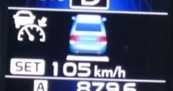

# プロジェクトX第2章…アイサイトのオートクルーズはすごいよ！その１

📅 投稿日時: 2013-06-27 00:41:23

🏷️ カテゴリ: [車](cba0e8330b3f2ded7c1addfacc75d4547.md)

…ってことで．

まだまだ続く，レガシィのレポートですが．

前回のアイサイトの基本編に続いて．

今回は，アイサイトのオートクルーズについて，語ってみましょうか…

さてさてさて．

車で長距離移動を繰り返すスキーヤーにとって．

高速の運転の楽さはきわめて重要なわけですが．

…すごいよ．アイサイト．

とりあえず，いったんセットすれば．

あとはひたすら前の車についていってくれます…

先行車を認識していない場合は，40km～114kmの範囲の設定速度で．

一定のスピードをキープして走り続けてくれます…

先行車を認識すると．

画面に車の絵が現れて，先行車を認識していることが分かるようになってます．

＃なんだかメーターが日本の法律で許されないスピードを指している気がするけど，

＃…気のせいです．

んで，ひたすら前の車についていってくれます…

前にいるのがバイクでも，ちゃんとついていきます…

車間距離は，基本的に速いスピードでは広めに…

中くらいのスピードではそこそこの距離…

遅いと近くまで近づくという，自然な車間距離を保ってくれるという，

なかなかスグレモノ．

車間距離設定は，このボタンを押すことで3段階に設定できます．

車間距離広め，

普通の運転ではこのくらいが快適ですね．

中くらい，

これが，狭め．

狭めにすると，結構つめてくれます．

ただ，前の車の加減速が激しいと，それにぴったり従って自車も加速したり

減速したりするので，前の車の運転がおとなしい場合にのみお勧めですか．

で．

前の車が静止すると，ブレーキを踏まなくても前の車に

したがって自動で止まってくれます．

停止するブレーキングも，人間が運転するのと大差ない自然さ．

こんな感じで，スピードメータが0kmを指して停止してます．

このあと，自動的にアイドリングストップが効いて，エンジンも

勝手に止まってくれるという…

…ただし．

このあと，先行車が発進しても，自動では発進してくれない…ってのが

ちょーーいと残念．

でも，停止中，もうすぐ発進するかな～ってタイミングで，

ステアリングのRESボタンを押しておけば．

ボタンを押したあと3秒以内に先行車が発進したとき．

エンジンがかかって，勝手に発進，ひたすら先行車に着いて行ってくれるのだ．

＃何かやっててRESボタンを押しそびれるようなときでも，先行車発進警報が出たら

＃反射的にRESボタンを押せば良い

…ボタンを押したあと，3秒以内に先行車が発進しなかった場合は．

エンジンもかからず，そのままの停止状態をキープするので．

また発進しそうなタイミングでRESボタンを押せばOKです．

もう，渋滞のとろとろ運転とかではチョーーーーーーー便利です．

運転で使うのは右手1本．

左手と足は全く使わずにOKっ！

ハンドルを回すのと，止まったあと再発進のRESボタンを押すだけで．

いつまでも渋滞にしたがって走り続けてくれます…

高速の長時間運転でも．全く足を使わないので．

スキーの後に疲れた足に，なんと優しいこと！

さらに，先行車がいれば．

ETCゲートも，先行車についていってアクセルもブレーキも

踏むことなく通過できるし．

もう，足を使うことを忘れてしまいます．

月山に行ったときは，3時間以上ペダルを踏まなかった気が…

…で．

アイサイトを使ってみて．

アイサイトを使った人，100人中125人くらいの人が

もつであろう感想を，私も持ったのでした．

これで，ハンドルも自動ならば…

## 💬 コメント一覧

### 💬 コメント by (ゆうこ)
**タイトル**: いいですねぇ。
**投稿日**: 2013-06-27 19:39:16

記事を読んでると本当に私も欲しくなります！

羨ましいです。

でも、私の車は車検を通してしまったので、もう少し乗ります。

増税前に買おうか悩みます。

### 💬 コメント by (Skier_S)
**タイトル**: ゆうこさま
**投稿日**: 2013-06-28 02:56:36

アイサイト，これが10万円プラスで付くなら

かなりお買い得機能だと思いました…

これを一度知ってしまうと，他の車に

乗れなくなるかも…ってくらい，危険な依存症に

陥ります．

アイサイトVer.2搭載車でも，レガシィ以外は

停車まではしてくれますけど，その後の停止保持＆

アイドリングストップまで自動でしてくれるのは，

今のところレガシィ＆アウトバックのみなんですね～．

増税前が買い替えチャンスかも？？

### 💬 コメント by (ともママ)
**タイトル**: 雨の高速
**投稿日**: 2014-03-21 11:38:19

エクシーガ2.5giアイサイト乗ってます。

昨日、初めて東北道～圏央道で追従クルーズ使用して見ました。

パーキングブレーキが電子式？じゃないので停止状態はある程度しかキープしてくれませんが、走行に関しては、結構な雨で視界不良にもかかわらずエラーにならずちゃんと認識してくれましたね。

情報としては十分理解してたつもりでしたが、実体験で凄さを再認識しました。

私個人の見解では、割り込まれた際や全車の減速の際、自車の反応がほんの少し遅く感じました。

「お、大丈夫か？」という思わせぶりな挙動から

「あくまでも支援システムなんだからねっ！ちゃんと見ててよっ!」

という開発者の意図が感じ取れたかなぁ

### 💬 コメント by (Skier_S)
**タイトル**: ともママさま
**投稿日**: 2014-03-21 17:41:29

コメントありがとうございます～

確かに，前の車の減速の際，シチュエーションによっては

反応が遅れる感じを受けるときもありますよね…

特に，広い車間が縮まっているときに，前車が

ブレーキ踏んだときとか…

これは，ブレーキランプを認識する，アイサイトver.3

からは解消されるのでは？と期待してるですが．

でも，今のアイサイトでも十分すごいですよね．

とろとろ渋滞のときとかもうこれ無しでは

生きて行けない体になってしまいました（笑)

また，これからもご愛読のほどを～

### 💬 コメント by (レガシィまにあ)
**タイトル**: またやられましたな
**投稿日**: 2016-02-12 15:37:21

カネに任せてトヨタ様にエンジン盗まれたみたく、アイサイトもトヨタ様にガメられてしもうた( p_q)何れにせよ、トヨタ様の脚はヴィヴィオ以下なんやから、電気部品つけても安全にならん。自動車とは他人も自分も殺せる運転手が操作して速度出して使う道具である。運転手の操作以外の動きをしたら危険です。自動車はそもそも電気部品に依存して使う道具ではありませぬ。初代レガシィを競技場含めて160,000km程使った結論でし。皆様御安全に_(..)_エアバッグが安全な訳あんめや目の前に爆発物があるんですぞ。

### 💬 コメント by (Skier_S)
**タイトル**: レガシィまにあさま
**投稿日**: 2016-02-12 22:42:50

あれ？

アイサイト，トヨタに提供したんですか？？

今回初めてスバル車に乗りましたけど，

いろいろ言われるBRレガシィ，満足してます．

FBエンジン＆リニアトロニックは電子制御の

固まりですが（＾＾：

