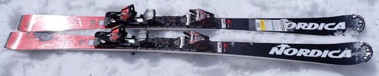
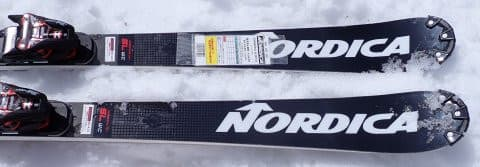
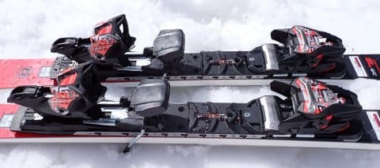
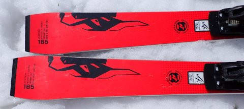
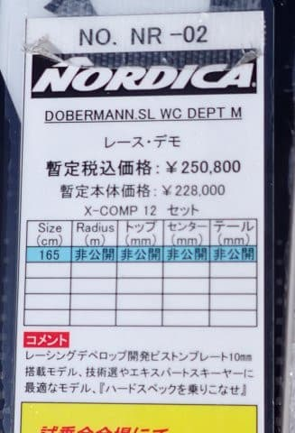

# 2025シーズンモデルのスキー板，試乗レポートその24…NORDICA DOBERMANN SL WC DEPT M PLATE

📅 投稿日時: 2024-07-05 04:15:25

今日ももうこんな時間（涙）

今の時期はこの時間になると明るくなって

来るので，かなり悲しい感じ…

そろそろいろいろ厳しくて，

Blog更新しているどころでなく

なってきてるんだけど…

いつも通り，それでも更新！！

今日は書き溜めておいた，2025シーズン

モデルのスキー板の試乗レポートが

残っているので更新できますが．

…もし明日更新がなければ，Skier_Sは

死んでいると思ってください…

てなことで，今回はNORDICA編です！

〇NORDICA DOBERMANN SL WC DEPT M PLATE 165cm

SL競技用

FISマーク付きの，ガチの小回り競技用の

本格的板です．

DEPT M PLATEは高さ10mmのピストン

プレート付き．

それも，サイドにメタルが入った

かなり気合の入った強いプレートが

乗っています…

MのつかないDEPT PLATEというモデルもあり，

そちらは14mm高さのプレートが付くらしく，

さらに激しい板でしょうか…

ちなみに，DOBERMANN SL WCには，

DEPTがつかないもう一つ安いモデルが

あるようなので，今回試乗した

SL WC DEPT PLATEとDEPT M PLATEが

どちらも同じお値段のトップモデルに

なるようですね…

ビンディング付きで25万越えか…（涙）

高い…

とりあえず，履いてみたところ．

重い．重いよ…！！！

ピストンプレートも重いけど，板もしっかり

メタルが入って重いのか，SLモデルと

思えない板のどっしり感．

これはかなり手ごわい板か…と思ったら．

トップ側を抑え気味にしっかり板を

踏んでいくと，あら不思議．

どっしり安定感を持ったまま，

微塵もずれる気配がないメチャ鋭い

カービングターンをしていきます．

雪質がザブ雪だろうが荒れていようが，

なぜこの雪面でここまで切れる？？

と不思議になるほど，スカーンと

キレるハイスピードカービングで

斜面を駆け下りていけます．

4月のザブザブ雪でも板が叩かれるとか，

凸凹に板が飛ばされるとかいうことなく，

どっしりした安定感と鬼グリップで

ガッツリ超高速カービングで滑って

行けて．

荒れた斜面が全く怖くない…！！

なので．

普通なら容易にバランスを崩すような

ザブザブ春雪斜面でも，荒れた雪を

蹴散らして，手を擦るようなハイスピード

深回りの小回りターンができます…！！

こんな重量級で硬そうな板なのに，

荒れた春雪でここまで板が回ってきて，

安心して滑れるとは…！

安定感が高く安心して滑れるので，

荒れた斜面でも谷回りの早い段階から

しっかり踏んでいけるし．

そのせいで，谷回りからしっかりターンを

作っていけて，鋭い深い小回りができます．

…ただ．

雪が柔らかかったからか，板の返りは

グリップが強い小回り板にしては

そこまで強くなく．

ターンを弧を深くしていっても，

反復横跳び系の鋭い切り替えの小回り

というよりは，小回りでも比較的

ゆったりしたリズムの深回りになって

いく感じ．

板の反動でヒュンと切りかわっていく

というより，サイドカーブで板が

回っていき，左右が入れ替わる…

という感じの切り換えの板．

板がぐっとたわんで，たわみがヒュンと

解放される快感はちょっと弱いかな…

あと，これだけ板の張りが強いのに

旋回性が高いという板なので，

あまりたわませなくても，エッジが

食いついた瞬間からサイドカーブで

回ってきてしまう板なので，

あまり踏まずに縦目に落とす…という

ことができず，ロング目のターンを

引っ張るのは苦手．

大回りをしようとすると，まったく傾かず

最低限のエッジングでまっすぐ滑らないと

いけない感じ．

この板はもう，サイドカーブとグリップを

最大限満喫するために，深い小回りを

楽しむ板です！←競技用だから．楽しむ板じゃないから…

あと，ずらして滑ってもそんなに楽しく

ありません．←だから，楽しむ板じゃないと思う…

何にしろ，硬い斜面だろうが荒れた斜面だろうが，

鬼のような安定感とグリップで，

うぉぉぉぉ！！という深いハイスピード

小回りができる板ですが．

体力とかなりのスピードと硬いブーツ（おそらく

フレックス150クラス）が必要となる感じ．

体力自慢で，強烈なハイスピードを出しても

全くびくともしない重い小回り板が

欲しい人はおススメ！！

…私は結構気に入ったけど，ちょっと硬派すぎて，

この板を気に入る人はかなり少なそうな予感．

競技をする人は別として，軽量な小回り板が

好かれる日本では，ゲレンデ用としては

あまり売れないのかな…

いい板なんだけどな…
