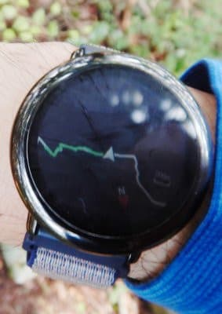

# スマートウォッチAmazfit PACEには，意外と知られてないGPSナビゲーション機能があるんだけど…

📅 投稿日時: 2021-07-17 00:30:27

ということで．

先日，山を登った際．

常用スマートウォッチのAmazfit GTR君を左腕に，

登山アクティビティ記録用のAmazfit PACE君を

右腕に…と，両腕に時計をつけて登ったわけですが．

（GPS精度はAmazfit PACE君が圧倒的に良いので，

　登山アクティビティ記録はPACE君にお任せ）

実は，知られざる機能として．

このAmazfit PACE君．

GPSナビゲーション機能をもって

いるんですね…

Amazfit GTRには，GPSナビゲーション

機能は無いので．

ここでも，Amazfit PACE君のほうが

一歩リードしています．

Amazfit PACE君．

山登りする時にClimbingモードを選んでおけば，

行動記録をGPSで残してくれるだけじゃなく．

こんな感じで

・記録開始からの時間（歩き始めてから35分34秒）

・これまで歩いた距離（1.85km）

・現在の標高（492m）

・今の心拍数（155回/分，VO2Max領域）

・獲得標高差（277m）

・登り坂を歩いた距離（1395m）

などの情報が常時表示されますし…

タッチパネルで画面をスワイプすれば，

過去20分間でどれだけ標高を稼いだかの

グラフとかが出るし．

登山のあと，GPS記録をもとに，

行動記録やら歩いたペースやらを

スマホで見ることができるという．

大変便利なスマートウォッチなのですが．

それだけじゃなく，

事前に歩くコースの計画を，ヤマレコとかの

アプリやWebページの地図で作成しておき…

この地図を，GPXデータに書き出して．

このGPXデータを，USBでPCと繋いだ

Amazfit PACE君の「GPX」フォルダに

コピーしておけば…

登山アクティビティを開始する画面で．

このセッティングメニューを選び…

セッティング画面から…

「Import routes」を選ぶと…

さっきのGPXデータを読み込むことが

できます！

この地図を読み込んでから，登山を始めると．

何と，登山モードの現在地表示画面．

普通だと，これまで歩いたルートが緑で表示

されるだけなのに．

「計画ルート」が白色で表示されるように

なります！

これで，今歩いているルートが計画から

外れてないかどうか，時計で常時

確認しながら歩くことができるように

なります！

「歩くルートから外れてないかどうか

　時計で確認できたら楽じゃないか！

　そして，道迷いも少なくなって

　いいじゃないか！」

と思っていたけど．

でも．実際は．

確かにルートから外れてるか外れて

ないかは分かるものの．

実際，分かりにくい分岐点とか，

どっちが道か悩ましいところにきたら，

等高線も道路表記も何もないこの画面で

これから行くべき道を選ぶのは無理で．

結局地図を見ないと分からない

ということに気づきました…

で．

実際「ルートから外れたかな？」

という時は，スマホ地図で行くべき方向を

見定めるし．

さらに次の経由地までの時間や距離は，

時計画面だけじゃわからないので，

結局そういうのの確認のために，

何度もGPSで現在地が表示される

スマホ地図を確認しちゃうし．

さらに．

時計の画面には，現在標高や歩行距離，

時間が見れるこの画面を表示して

おくのが一番良いし．

いちいち地図画面にスワイプするぐらい

なら，スマホ出してみた方が早い…

ってなことで．

一見便利そうな，Amazfit PACE君のこの機能．

実際の山では，ほとんど見ることなく

終わりました…

うーん．

GarminのFenix6みたいに，地図が出て

等高線とか分岐とかが確認できるうえに，

次の経由地までの距離とかが出るくらいの

ナビゲーションなら，使えるのかなぁ…

（[Garminホームページ](https://www.garmin.co.jp/products/wearables/fenix5-x/)より．この写真はちょっと古い型のFenix5X)

なんだか，この時計．

ApplewatchみたいにSuicaも使える

みたいだし．

スキーのログ機能もすごいみたいだし…

良さそうだなぁ…

はっ！！

いかん．

また物欲に負けそうになっている…

いや．

買わない．

新しいスマートウォッチなんて，

買わないぞ～…（弱弱しい語尾で）

## 💬 コメント一覧

### 💬 コメント by (yumi)
**タイトル**: Unknown
**投稿日**: 2021-07-17 10:33:47

Ｓさぁ～ん🏞️🧭⌚

いったい🙄いくつ❓️腕に はめるつもりですかぁ～～～😅

### 💬 コメント by (なんちゃってレーサー)
**タイトル**: いやいや
**投稿日**: 2021-07-17 22:51:13

どうせ買うなら，これ行きましょうよ．

ダイブコンピュータとして使えて，世界2,000箇所のスキー場のデータも入っているそうですよ．

https://www.garmin.co.jp/minisite/descent/descent-mk2/

### 💬 コメント by (Skier_S)
**タイトル**: 今日は登山してきたよ
**投稿日**: 2021-07-17 23:29:05

＞yumiさま

新しい時計を買ったら三つつけるかも…？？

噓です．

どれか一つ引退させて，左右にひとつづつにします…

（左右両方にはめてることがそもそもおかしいですが）

＞なんちゃってレーサ―さま

実はDescent mk2も候補に挙がっているんですが…

お値段が高すぎるのと，電池もちがFenix6Xの方がいいのと，

分厚さがちょっと普段使いには厳しいかというのがあり，

Fenix6Xが最有力候補です…

でも，Descent mk2もすごく惹かれてます．

これなら，ダイコン＆スキーログ＆登山用と，全てひとつで

済みますから…

### 💬 コメント by (アリス)
**タイトル**: スマートウオッチ
**投稿日**: 2021-07-18 22:02:00

S様

このスマートウオッチいいですね♪

Sさんが買うなら私も買います・・・

使い方分からないときに教えてください。

PACEもお蔭様で、楽しく利用させていただいております。♪

### 💬 コメント by (Skier_S)
**タイトル**: ＞アリスさま
**投稿日**: 2021-07-19 05:11:04

いや．

すごくいいんですよ．GarminのFenixシリーズ…

ただ，高すぎて買えなさそうです．

すごいお金持ちになったら買います（笑）．

