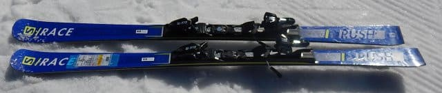
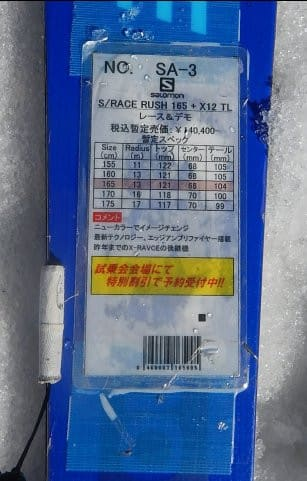
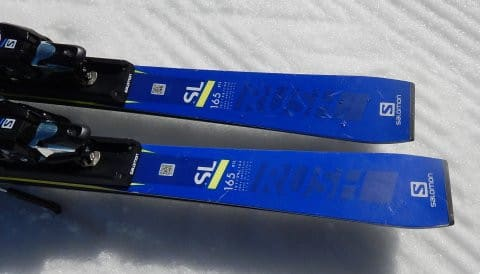
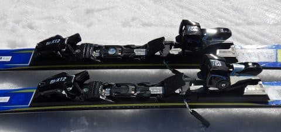
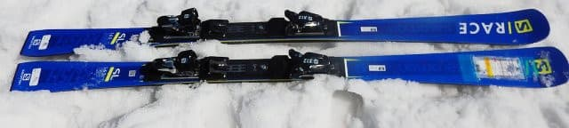
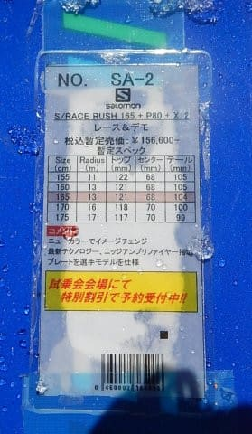
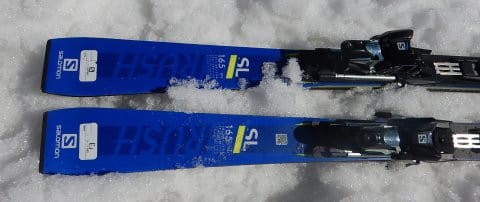
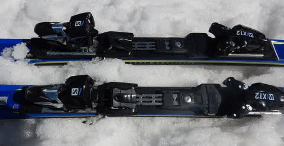
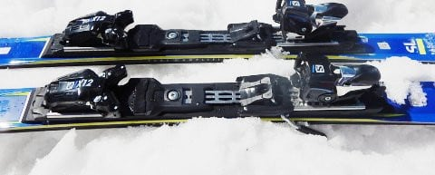

# 2019シーズンのスキー板，試乗レポート第10回…SALOMON編その2

📅 投稿日時: 2018-05-23 00:39:45

🏷️ カテゴリ: [スキー板試乗](c0bd8048615710cee890e403a36cc9a2b.md)

えー．

どうやら，驚くことに．

まだかぐらクワッドが営業している

みたいですね…

一昨日の日曜の段階では，もうメインバーン

上部を滑らせるのは厳しいよね，

と思っていたのですが…

しかし．

明後日の木曜は雨になりそうなので．

この雨を乗り越えての営業は，さすがに

難しいんじゃないかな～．

と，思っているSkier_Sです．

ってことで．

本題へ．

本日は，久しぶりの2019シーズンスキー板の

試乗レポートです！

今回は，サロモンのRACEシリーズ．

それも，同じ板のビンディング違い．

X12TLと，X12VARのビンディングがついたモデルの

乗り比べというマニアックな記事です．

では，どうぞ～！

----

○SALOMON S/RACE RUSH SL X12TL 165cm

SL競技・基礎小回り用．

競技用はS/RACE PROがこの上のモデルとして

あるようなので…それが今年モデルだと，

X-RACE LABに当たるのかな？

今回試乗したのはセカンドモデル，去年の

X-RACE SWに当たりますか…

だもんで，純粋なSLモデルというより，

SL競技＆基礎小回り用ですね．

このS/RACE RUSH，簡単ブーツサイズ調整機構付きのX12TLビンディングと，

しっかり前後をつなぐバーが入ったX12VARビンディング付きモデルが

ありますが，これはS/MAX BLASTと同じ，

X12TLビンディングをつけた板になります．

うーむ．

この試乗板，エッジのチューンが

甘かったのかな？

結構グリップがソフト．

ガッツリグリップして，どうしようもなくエッジ方向に

走る板じゃないです．

しっかりテールを抑え気味にして，

切っていこうと思えば切っていけますが，

気を抜くとズルズルと板がずれていきます．

逆に言うと，動かしやすい板ではあるのですが…

大回りするには…もう少し安定感が欲しいかな．

グリップしてたわんでギュイーンって感じで

回っていく板ではないです．

板が頑張ってグリップしないので，板を

動かして小回りをしやすいけど…

軽快に動かすにはちょいと重めかな．

うーむ．

ちょっと微妙な感じ…

春雪だったからかな？

エッジが甘かったのかな？

固い斜面，またはチューンナップがしっかりしていれば，

印象が良くなるのかも…

○SALOMON S/RACE RUSH SL P80 X12VAR 165cm

SL競技・基礎小回り用．

今度は，さっき乗ったS/RACE RUSHと板・長さは全く同じですが，

P80プレートがついて．

さらに，ビンディングが優し目のTLビンディングから，

前後がしっかり結合されたVARビンディングになってます．

…このVARビンディング，去年までSALOMONでは「Xビンディング」と

言っていたのですが．

今年はZ12TLビンディングが無くなり，このXビンディングの

TL版とVAR版になったので．

ATOMICと同じく，SALOMONでもX12VARという名称のビンディングに

なったようですね…

さて．

履いてみると．

エッジグリップは，TLビンディング版より強い！

テールの張りもTLビンディング版よりしっかり感じます．

やっぱりSALOMONっぽく，テールを抑えていけば

山回りで板がググッと回ってきます．

ただ，やはりTLビンディングと同じで．

ガッツリ谷回りからエッジが捉えていく…

という板ではなく，谷回りでの板の動かし

やすさを出している感じ．

そして．

TLビンディング版と同じく．

板の圧の溜まり方，たまった圧の返りの

強さ・速さが，去年までのX-RACEより

マイルドになった感…

VARビンディングなので，板は重めに感じます．

逆に言えば，どっしりした安定感があります．

とりあえず，去年までのグリップ重視，

返りが早いX-RACEからは，かなり変わった

感じを受けます．

うーむ．春の雪だと，性能をちょっと発揮できない感じ．

春のザブ雪で履いても楽しくないです…

もう少し，しっかり締まった雪で試すと変わるのかも．
