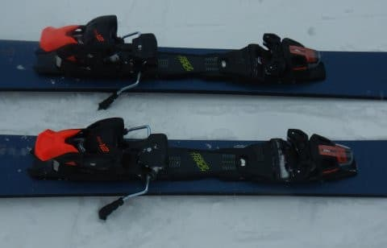

# 2023シーズンモデルのスキー板，試乗レポートその12…FISCHER RANGER 102

📅 投稿日時: 2022-06-13 03:32:39

🏷️ カテゴリ: [スキー板試乗](c0bd8048615710cee890e403a36cc9a2b.md)

やっぱり昨日月山に行ってるような状況では

無かったのか…

ちょっと仕事が終わらないので，月山詳細

レポートはまた明日に書きます！

ってなことで．

今日は書きためてあった2023シーズンモデルの

スキー板の試乗レポートを掲載しますが…

今回で，3月上旬の雪がいい状態でおこなわれた

エキップさん試乗会で乗った板のレポートは

終了です．

次回からは3月下旬の雪が悪い状態で

試乗した板のレポートになります…

今回はフィッシャー編．

今回もファット系ですが，

3月下旬の試乗会では，基礎・競技用ばっかり

乗ってファット系に乗っていないので，

これで2023シーズンモデルのファット系の

試乗レポートはラストになります…

では，どうぞ～！

○FISCHER RANGER 102 183cm

パウダー＆ゲレンデ用ファット

前回，この板も同じシリーズの

[RANGER 96を試乗して，レポートしました](e21e4ced731d37812db12cfa98bda25d9.md)が．

今度はもっと幅が広い，センター幅102mmの

RANGER 102 になります．

サイドカーブは19mと，ゲレンデロングターン用

くらいの半径ですね…

ただ，センター100mmを超えてくると，

ちょっと圧雪整地で滑る板ではなくなって

きますか…

エッジを喰わせてカービングで整地を

滑れなくはないけど，ちょっとスピードを

だしていくと，エッジがズルズルと

逃げていく感じがあります．

だもんで，板に圧をかけて，小回りっぽく

回ろうというのはちょいと厳しい感じ．

かなり縦目に落とすラインなら，

ずれることなくカービングにもって

いけます．

あと，傾きを大きくしていくにつれ，

板のセンター幅が太い分，足裏が

だんだん持ち上がっていくような感じに

なっちゃっうのもあり，

「パタン，パタン」と切り替わるような

感じになっていきます．

うーん．

やっぱり圧雪ゲレンデを快適に滑る…

という板ではないですね．

ただ，縦目に落とせばしっかりグリップして，

エッジに沿って板が切れていくので，

センター100mm越えとすればゲレンデ適性は

高いほうかも…

この日は10cmほどの新雪が積もったので，

新雪を滑ってみたけど．

さすがセンター100mm越えってだけあって，

新雪での浮力はいい感じ．

かなり板が軽く感じるので，新雪の中での

浮力の受け方・取り回しやすさは問題なし．

まぁ，圧雪ゲレンデをメインで滑るには

辛い感じだけど．

新雪メインで，時々圧雪も滑る…

ってくらいの板でしょうか．
