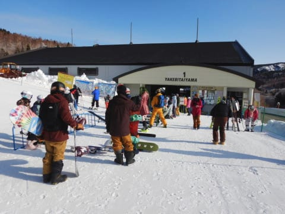
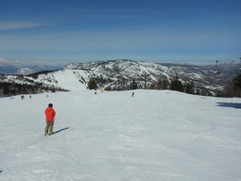

# 2021/3/7(日)も，志賀高原へスキーに行った夢を2日連続で見たようだ…晴天なのはいいけど，日差しで雪が緩んだ一日

📅 投稿日時: 2021-03-08 02:18:27

🏷️ カテゴリ: [2021スキー滑走日記](c2b0fc073d6357d3b786f6ca655147f7d.md)

えー．

スキーに行けない禁断症状がつのってしまった結果．

どうやら2日連続で，

志賀高原へスキーに行った夢を見たようです…

いや．

すごいリアルな夢だった…

しかし．

夢から覚めた今．

なぜかこんな時間になっても，必死で

明日の朝までの仕事をやっている

自分がいて．

夢を見てる場合じゃなかったのかも…

ってなわけで．

今日の夢の中身を説明すると，

まず，朝からすっきり晴天！

…曇り空の予想だったんだけどなぁ…

で，いつも通り焼額第1ゴンドラの

営業開始前に並ぶわけですが．

…結構人がいますね…

そして，山頂の気温は-4℃と…

うむ．

意外と冷えてますね！

冷え冷えの晴天となれば，

いいバーン状況を期待してしまいますが…

昨日の雨で雪が緩んだ後の冷え込みなので．

ガチガチバーンになってるんじゃ

無いかな…（恐怖）

ということで，シマシマバーンへ

飛び込んでみまたところ．

一見きれいなシマシマですが．

ガチガチではないにしろ，固まった表面が

崩れていくような，コロコロ発生バーン（涙）

惜しい…

こんなにいい天気なのに．

昨日，雨さえ降らなければ…

ってなことで．

殺人コロコロというほどではないものの，

ところどころコロコロで，ちょっとエッジが

流されるのが怖くてあまり傾くことができない

残念なバーン状況（ちょい涙）

で…

正月前と変わらず，

8人乗りのはずの第1ゴンドラは，

感染対策で4人乗車に制限されているので，

9時ごろにはもうかなりの列が…（泣）

うーん．

ゲレンデはそんなに混んでないのに．

ゴンドラ待ちとコロコロバーンが，

ちょっと惜しい…

…だもんで．

と，あっさり一の瀬へ移動！

いや…夢だから，焼額の呪いは無いはず…

ファミリー正面バーンは，かなり固めに

締まった，アイスバーン気味のフラットバーン．

エッジを研いでない人はきついかな？

という感じの斜面．

…雲海が向こうの方に見えてますが．

うーん．

曇り予想を外して晴れたけど．

あの雲がもう少し高いところまで

上がってきてたら，予想通り

曇っていたはずなのに…

と，思ったりしつつ．

…昨日，寺小屋は雨じゃなく雪だったので．

ガチガチコロコロになってないんじゃないか…？

と，寺小屋へ移動！

…すると．

案の定，寺小屋は雪質がいいじゃないですか！

下地は硬めながらもエッジが食い込む雪で．

その上はいい感じの冷えた雪が覆ってます！

晴天で気温が上がり，標高の低い西館

より下や，焼額の日当たりの

いいバーンは緩み始めてきたのに．

寺小屋は締まったフラットバーンを

気持ちよくかっ飛ばせます！

…これはいい！

…ただ．

ここが一番コンディションが良かったので，

ちょっと人が集中してリフトが混むときが

ちょくちょくあったけど…

でも，午後になっても全く雪が

緩む気配が無く．

…ついつい，午前10時過ぎから3時過ぎまで，

ひたすら寺小屋をグルグルしてしまいました…

そして，午後3時過ぎに一の瀬経由で

焼額へ戻りますが…

一の瀬はツルツル下地の上にモサモサ

雪が乗って荒れた，ちょっと手ごわい

バーン状況で．

…そして，焼額は．

気温がプラスに上がって日差しが

良かったというのもあり．

完全に春の雪になっていました…（涙）

そして，なぜかコース上の人も結構多く．

夕方の焼額は，緩んだ雪が大勢の

スキーヤーでちょっと荒らされた，

かなり手ごわい感じのバーンでした（ちょい泣）

そして，営業終了時間の頃になると…

非が陰って，荒れ荒れバーンがそのまま

かたまっていくという，さらに厳しい

バーン状況に…（完全泣）

とはいえ．

せっかくスキーの夢を見ているんだから…と，

いつも通り営業終了まで，

しっかり滑り続けたSkier_Sだったのでした…

いや．

でも．

バーンがよかろうが悪かろうが，

雨が降ろうが槍が降ろうがミサイルが降ろうが．

やっぱり，スキーは楽しい．

また次の週末も，スキーの夢を見たいものだ…

## 💬 コメント一覧

### 💬 コメント by (オオスギ)
**タイトル**: Unknown
**投稿日**: 2021-03-08 10:16:56

いい夢でしたね！

来週も、見れると良いですね。

(夢の中の、新作スキー板レポートもお待ちしています)

来シーズンモデルは、殆どカラーリング変更だけかなぁ…

### 💬 コメント by (レインボー73)
**タイトル**: Unknown
**投稿日**: 2021-03-08 12:11:44

お借りします。

初の妙高杉ノ原です。上は晴れ、下は濃霧の別世界。視界が良ければとばせるのに。

半日券シニアプリンスカード提示で2900円。安い。

評判のラーメン屋やすらぎ食堂で本日の業務終了します。

先日の嵐でラスリフまで滑りつづけた仲間は、このあとも志賀で滑るそうです。

初めてのスキー場に目を白黒。腹ならずっと黒いままなんですが。

### 💬 コメント by (越後屋善兵衛悪座右衛門（腹黒）)
**タイトル**: Unknown
**投稿日**: 2021-03-08 18:47:08

妙高の帰りに戸狩スキー場に寄ってチェック。3月28日まで、おとな4200→2000円 55歳以上3800→1800円 小学生1500→1000円。なんか魅力。

善兵衛は62歳万座デビューで、志賀、野沢、八方以外よそを知らない。いつも間近にそびえ立つ妙高にやっと行けて、雪質の良し悪しはともかくも、コースがさっぱりわからない楽しさ、目新しさに興味津々。どんなスキー場にも、何かしらの魅力があるんですね。あちこち行った人に聞くと、最終的には志賀がやっぱりいいと、なるみたいですが。

さて、私の最凶の、いや最強の仲間は、妙高のあと志賀に瞬間移動して、いつものようにラスリフまで堪能したようです。寺子屋とパーフェクタが良かったようですが、最後のサウスはボッコボコだったとか。

今はエス様御用達のヤケビは、朝のうちしか持たないようです。明日は、朝はやっぱりヤケビのシマシマ狙いかなあ。そして、パーフェクタ、寺子屋。

### 💬 コメント by (群馬のスキーヤーT)
**タイトル**: Unknown
**投稿日**: 2021-03-08 18:47:46

先シーズンから志賀高原にハマっているTです。

いつもブログを見て楽しんでいます！

なんと昨日S様と同じ夢を見ましたので、

初めてコメントさせていただきました！

S様と同じ舞台でスキーができたことが

とても嬉しく、そして目一杯志賀高原を

楽しめた夢でした。

またS様とスキーを楽しむ同じ夢が見れる日を

楽しみにしています。

### 💬 コメント by (越後屋)
**タイトル**: Unknown
**投稿日**: 2021-03-09 05:58:25

訂正です。

最凶の→最狂の

でした。

### 💬 コメント by (Skier_S)
**タイトル**: コメント回答むちゃくちゃ遅れました
**投稿日**: 2021-03-11 03:09:00

＞オオスギさま

いや…いい夢でした．

また見たいものです…

＞レインボー73さま

妙高杉ノ原，楽しめたようですね．

でも，妙高と志賀のはしご，すごすぎます…

＞越後屋善兵衛悪座右衛門（腹黒）

妙高→戸狩のはしごですか(笑)．

でも，やっぱり志賀がいいですよね…

そして，最凶ならぬ最狂の仲間，まさに最終兵器感がありますね！

凄すぎる…

＞群馬のスキーヤーTさま

同じ夢を見ていただきありがとうございました～！！(笑)

夢であえたようで，良かったですね(なんかの歌みたいですが…）

また志賀高原にお越しください．

みんな大歓迎しますので…！！

### 💬 コメント by (うえいと)
**タイトル**: Unknown
**投稿日**: 2021-03-11 19:00:16

なかなかの夢ですね。

先日は竜宮城にてご挨拶させていただきました、今後ともよろしくおねがいします！

### 💬 コメント by (Skier_S)
**タイトル**: ＞うえいとさま
**投稿日**: 2021-03-12 01:19:35

コメントありがとうございます～！

そして，竜宮城ではありがとうございました(笑)．

今後ともよろしくお願いします！！

