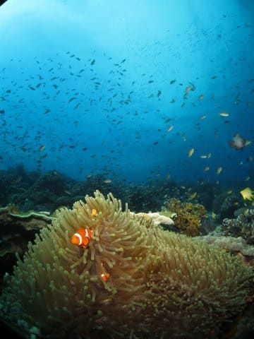

# 2019年8月，4度目のモアルボアル・小6の娘Cカード取得1周年！その16…午後2本目はぺスカドール…って，今日4本も潜ってますよ？

📅 投稿日時: 2020-08-19 01:05:17

🏷️ カテゴリ: [ダイビング日記](ce3a7a8d424d112fce83ee85c81a0e344.md)

ということで．

本日午後の3本目，濃密なダイビングが

終わって．

3本目はショップ目の前のハウスリーフ

だったので，Exitしたのはショップ目の前．

だもんで，ボートはすぐにショップ前に

到着しますが…

本日，午前潜らずに，午後だけ潜るお客さんが

いらっしゃるようで．

いつもは午前2本，午後1本のスケジュールの

ところ，今日は午後も2本目の

ダイビングボートが出るようです…！

小見山さん「Sさん，午後もう1本ボートが出るんで，

　4本目に行きたかったら行けますが…

　どうしますか？」

私＆娘「…行く！」

ということで，3本目終了後，そのまま

ボートに残り，本日4本目のダイビングに

向かいます！

向かう先は…

ぺスカドール島！

今日は3本目で終わりだと思っていて．

4本目に行けるだけラッキーと思って

いて．

時間を考えると，4本目はそんな

遠くない近場になるだろうなぁ…

と，思っていたら．

ぺスカドール島に行けるとは！

今日はぺスカドールを潜ってなかったので，

4本目にぺスカドールを潜れるなんてラッキー…

ってなことで，到着後のブリーフィング開始！

4本目も，浅めコースの我が家は1チームで，

小見山さんガイドのようです．

ってなことで．

本日の4本目にエントリー！

…いや～．

夕刻のぺスカドール島．

時間も遅めで，他のダイバーもいないので，

魚の密度がいつもより濃い気が…

天気もいいし，いい感じの

写真が撮れますね～！

さすがぺスカドール島…

この魚の密度を見よ！

途中，カクレクマノミがいるのを

無条件に撮影してしまいますが…

なぜ，クマノミは見慣れているのに

ついつい無条件に撮影してしまうのだろう…

カクレクマノミを見た後も，

ハナダイ・ハナゴイ・チョウチョウウオ類が

大量に群れるサンゴの上を流して

行くと…

途中，なぜこれを撮ったのか今となっては

思い出せないけど，ソメワケヤッコを

撮ったりして…

さらに流していくと…

サンゴの周りだけじゃなく，

頭上もいっぱい魚に囲まれて

来ましたよ…！！

細いカマスっぽいのは，ホソカマスかな…

そして．

私にとって，フィリピンと言えば

パープルビューティー．

この紫が，海の中ではきれいですね…

このパープルビューティーが

大群になると，結構写真映え

しますよね(笑)．

手前のキンギョハナダイの黄色と，

向こうのパープルビューティーの

紫がいい感じ…

ってな感じで，

パープルビューティーエリアを

抜けると…

今度は，クモウツボらしいウツボが

いましたが…

…このウツボ．

頭の周りを隠してたけど，

身体の後ろ半分，完全に岩から

はみ出してます(笑)．

…これで，隠れたつもりなんで

しょうか…

ってな感じで．

夕方に近づき，捕食タイムになって

きたのか，魚たちの活動が

さらに活発になり…

周りじゅう，魚に囲まれる

ダイビング！

いや…この魚の密度．

さすがぺスカドール島…！

この，濃密な魚の中のダイビング，

…今日，4本目にきて良かった…

ってなことで．

ダイブタイムもそろそろ45分になり．

ざんねんながら，このシアワセダイビングも

そろそろ終わりの時間ですね…

ツバメウオの若魚のペアなどを

浅瀬で眺めながらの安全停止の

あと…

本日4本目，Exit!

いやーーー．

さすがぺスカドール島．

満足のダイビングでした…！
