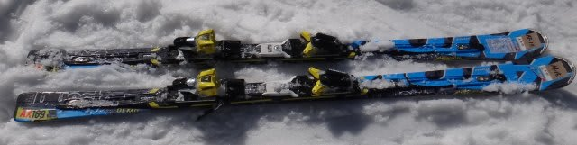
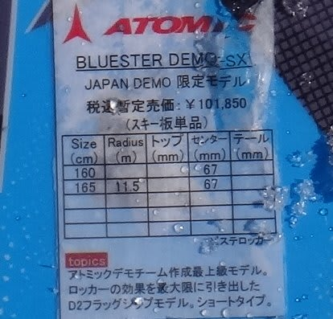
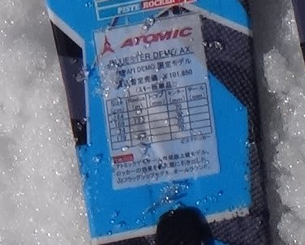
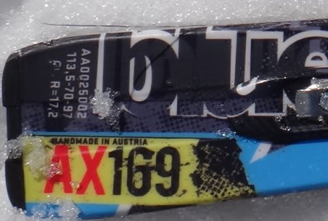

# まだ続く！2014シーズンモデルのスキー試乗レポートその6…ATOMIC編パート2

📅 投稿日時: 2013-04-02 00:13:13

🏷️ カテゴリ: [スキー板試乗](c0bd8048615710cee890e403a36cc9a2b.md)

…読者はそろそろ飽きてるかもしれませんが…

試乗レポート，まだまだ続きます．

…2週間も前に乗った板のインプレッションをよく書けるなぁ…

って，思われるかもしれませんが．

乗った直後に，デジカメ動画モードでインプレッションを録音してて．

それを元に書いているんですね～

＃試乗会でデジカメに向かってぼそぼそ話している人がいたら私かも(笑）．

今度はアトミック編その2です．

どうぞ～！

-----

○ATOMIC BLUESTER DEMO SX 165cm 

ATOMICのデモライン，小回り用の最上位機種です．

私がいつも履いている今シーズンモデルからの変更は，コスメチェンジだけらしいんですが．

あーー．

やっぱり，これは，安心できる．

トップからテールまで，しっかりエッジグリップして，きれいにたわみます．

このたわみに沿って，かなり小さめの半径のターンをスパンと決めることができます．

たわみ量のコントロールは傾きの出し方で乗り手が自由に決めることができる感じ．

無理やり踏んでたわませる量をコントロールする必要はなく，傾き量と旋回半径が

リンクしている感じです．

傾きを大きくしてたわみが大きくなっていくと，板にかなり圧がたまるので，

それをテールにすっと抜いてやると，気持ちよく加速しつつターンができる感じ．

エッジグリップは強く，かなりのスピード耐性があります．

普通の感覚で乗れば，かなり板が回り込んでくるので，小回りスペシャルに感じますね．

＃慣れてくると，大回りもできるんですが…

あと，他の板と乗り比べて思いましたが，荒地での振動吸収性に驚きを感じます．

荒地でも雪面と足の間にクッションが入っているかのようで，バタバタびりびりした

感じが伝わってきません．

持った重さは重いけど，履いてみると軽く感じます．荒地で飛ばされても

狙ったところにトップを差し込んでいけます．

…普段乗りなれているから，特性を引き出せる乗り方がわかっているので

評価が甘くなってるのかも知れませんが…

でも，やっぱりこの板，いい板だわ．

しかし．

なんだか，今シーズンモデルより，ちょっと安定感やエッジグリップが

増したような気が…

…まさか，私のBluester SXが，もうヘタリはじめているのか…っ！？

と．

恐怖を感じましたが．

ATOMICの方曰く

「メーカーはコスメチェンジだけって言ってますけど，私もやっぱり

今シーズンモデルより安定感としっかり感がわずかに増してる気がします…」

とのこと．

とりあえず，ほっと一息（安心)．

○ATOMIC BLUESTER DEMO AX 169cm

ATOMICのデモライン，大回りベースの最上位機種になります．

…SXに乗りなれてからAXに乗ると…

この板，SXと性格がまったく同じですね．

トップからテールまで，しっかりエッジグリップして，きれいにたわむし，

たわみ量のコントロールは傾きの出し方で乗り手が自由に決めることができる感じ．

無理やり踏んでたわませる量をコントロールする必要はなく，傾き量と旋回半径が

リンクしている感じ．

エッジグリップは強く，かなりのスピード耐性があります．

比較的元気な張りの強さがあり，返りをうまく使ってターンからすっと抜け出せます．

荒地での振動吸収性も抜群．

…SXと唯一違う点といえば，傾き量に対する旋回半径が，SXより大きい，ってくらいでしょうか．

169cmだと，得意領域はミドルターンですね～．

傾きを大きくするとショートターンになりますし，ゆっくり動けばロングになります．

荒れた斜面でのコントロール性も問題ないので，コブも突っ込めます．

＃ピッチの細かい深いコブはつらいかも…．

オールラウンドに使うなら，AXの169cmはベストな長さでしょうね～．

やっぱりいい板です．この板．

…が．最大の欠点が．

お値段，高すぎるよ…
