# 2019年8月，4度目のモアルボアル・小6の娘Cカード取得1周年！その7…ダイビング初日3本目は，ぺスカドール島！

📅 投稿日時: 2020-08-01 03:04:42

🏷️ カテゴリ: [ダイビング日記](ce3a7a8d424d112fce83ee85c81a0e344.md)

なに！？？

8月！？？

…もう，8月に突入するというのか？？

マズいっ！

なんという事だっ！

Skier_Sには，単体での8月突入能力は無いのだ…！

夏休みという精神安定シールドが無いまま

8月に突入すると，

仕事との激しい摩擦熱で，8月を突破する前に

燃え尽きてしまうのだ…っ！！←なんのこっちゃ

締め切りを大量に抱えたまま，すさまじい

スピードで8月に突入してしまい，

仕事からの最大限の圧力と摩擦にさらされる

ことになる，この8月．

…沖縄に行くのもヤバい感じになりつつある

状況で，果たして無事突破して，

9月に着地することができるのか…？

あるいは精神安定シールド無しで，

途中で燃え尽きてしまうのか…？

とりあえず．

無事突破できるよう，昨年の夏休み精神安定シールドの

レポートを見て，無事に9月に着地するイメージ

トレーニングをしておこう…

ってなことで．

本題のダイビング旅行記へ，Go!

ーーー

ということで，

本日ラストとなる3本目は，

ぺスカドール島へエントリーしますが…

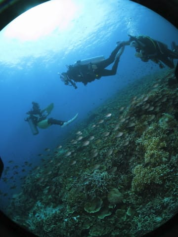

うーむ．

ちょっと雲が出てきたので，海の中に

日が射さず，ちょっと暗めなのが残念…

でも，さすがぺスカドール島．

きれいなサンゴの，その上に群れる

スズメダイの群れがいい感じ！

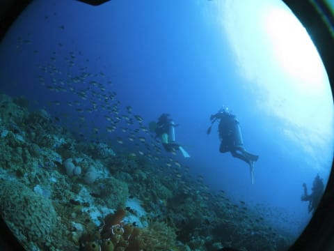

この，ハナダイやスズメダイ類が

ぶわーーーーっと周りを取り囲む，

このキラキラした感じ…

そう，これがぺスカドール島ですよっ！！！

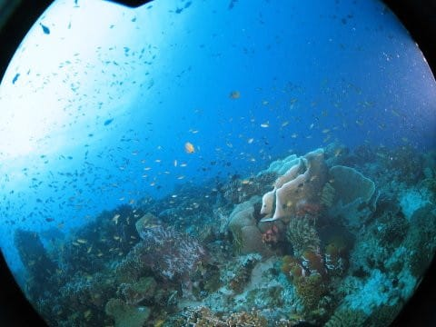

フラッシュが光らなかった1本目と違って，

ちゃんとフラッシュが当たってるので．

今度は写真もきれいに写ってます…

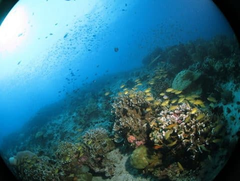

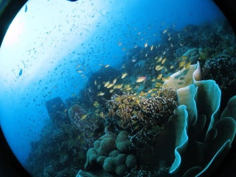

娘もサンゴのきれいさと，魚の密度に

ご満悦の様子…

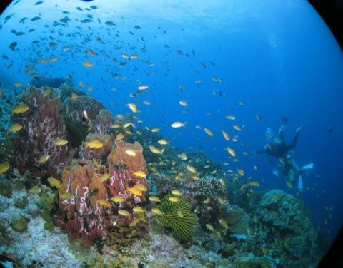

やはり，ぺスカドール島はいい！

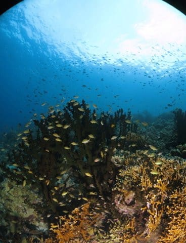

いつもはもう少し深いコースを取るんだけど，

今回は最大深度12m制限があるので，

アサミさんも気を使って，浅めながら

楽しめるコース取りをしてくれている

ようです…

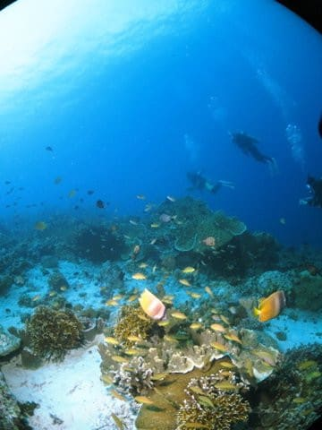

浅いながらも，しっかり魚影が密な

ところを流して行ってくれて…

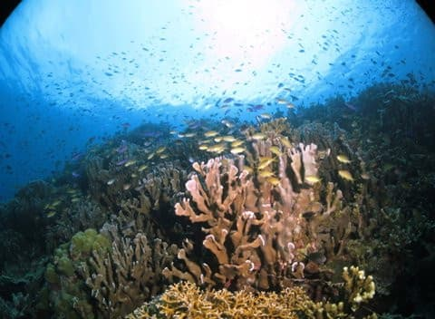

そして，娘にもいろんなものを見せて

くれているようで．

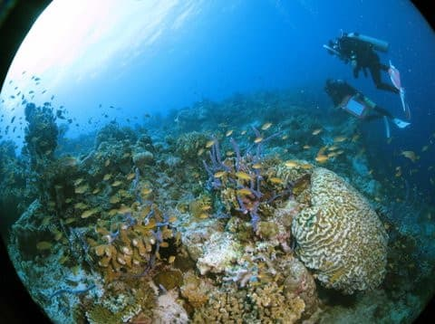

あぁ…

いい．

ぺスカドール島，いいよなぁ…

「水中風景写真」的な写真が好きな

ワイド派の私にとっては，すごい

満足なダイビング…

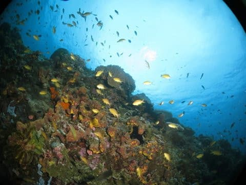

おっと．

また，アオウミガメさん登場．

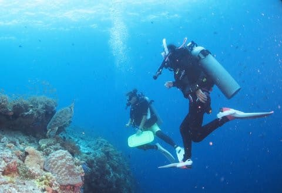

…ってな感じで．

癒しの景色を眺めていたら．

あっという間にダイビングタイム45分超え…

残念ながら，ダイビング終了時間が

近づいたので，深度を上げていきます…

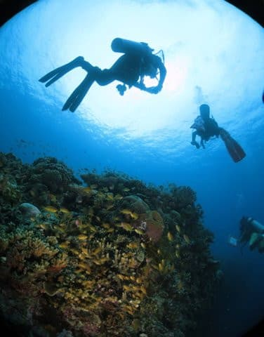

そして，安全停止の後，エグジット．

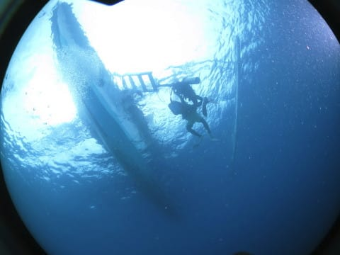

これにて本日のダイビング，すべて

終了です…

あぁ…まだまだ潜っていたいんだけど…

## 💬 コメント一覧

### 💬 コメント by (ikkun)
**タイトル**: Unknown
**投稿日**: 2020-08-04 11:00:26

いやぁきれいだあ❤️ 思わずオヤジがハートマーク使いたくなります 別世界です

### 💬 コメント by (Skier_S)
**タイトル**: >ikkunさま
**投稿日**: 2020-08-05 00:41:06

いや，モアルボアルの海，きれいですよ～！

ぜひ，ダイビングしに行ってみてください（笑）

