# 3月30，31日の週末の志賀高原スキー場の天気は？…土曜は重めの雪がぱらつき，日曜はこの時期としては冷え気味の曇り空かな

📅 投稿日時: 2019-03-28 06:14:54

🏷️ カテゴリ: [スキー天気予想](c6554f5c3c106093b511a8daae23757e8.md)

本日の志賀高原の朝も．

5cmとはいえ，雪が積もっていたようで．

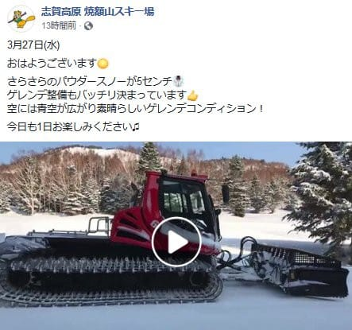

（[焼額山FB](https://www.facebook.com/yakebitaiyama/posts/2100569233371745)より）

天気も良く，気温もそれほど上がらず．

コンディションが良かったようですね…

うーむ．

このコンディションが，週末までもってくれれば

いいんだけど…

そして．

本日．

いつもの定番の焼額山スキー場のホームページを見て．

衝撃の事実が…っ！！

焼額山スキー場の今週の営業案内を見ると…

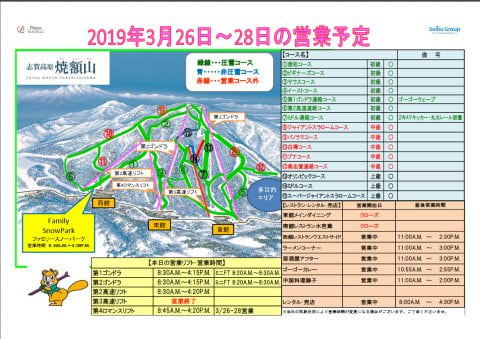

（[焼額山スキー場HP](http://www2.princehotels.co.jp/ski/shiga/files/pdf/springmap_1_21.pdf)より）

うむ？？？

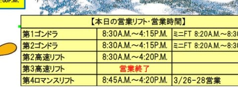

ええええええ！！！？？

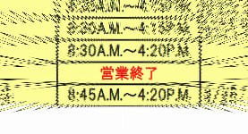

第3高速，今シーズンもう営業終了なの！？？？

単に運休の場合は，「運休」と書かれていたので…

ここに「営業終了」と書かれているということは．

どうやら今シーズン．

第3高速はもう動かないようです…（涙）

あぁ…シーズンが終わっていく…（泣）．

とりあえず．

気を取り直して．

今週の志賀高原の天気予想に

行きましょう…

その前に．

明日28日(木)の850hpa図を見てみると．

ううううーーむ．

微妙だけど．

赤い0℃線は志賀高原より南に

あるかな…

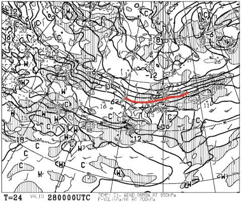

そして，地上天気図を見ると．

水色の降水域が，しっかり日本海側に

かかってますね…

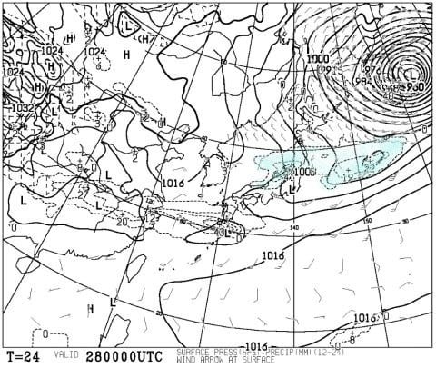

これは．

夜中の降りはじめはみぞれっぽい

かもしれないけど，すぐに雪に変わって．

明日の午前中は，重い雪が降り，午後に

は止んでくる感じの天気になりそう…

次の29日（金）は．

850hpa図を見ると，水色の-6℃線が

志賀高原に近づいているほどで．

この時期としては，結構冷え冷えな感じ．

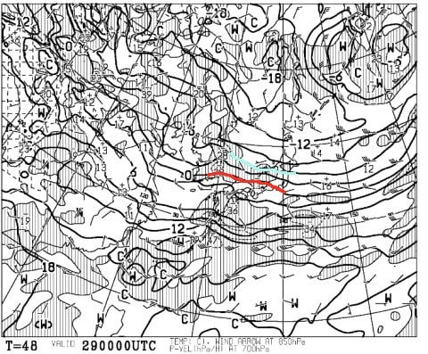

地上天気図を見ると，高気圧に覆われて

晴れそうなので．

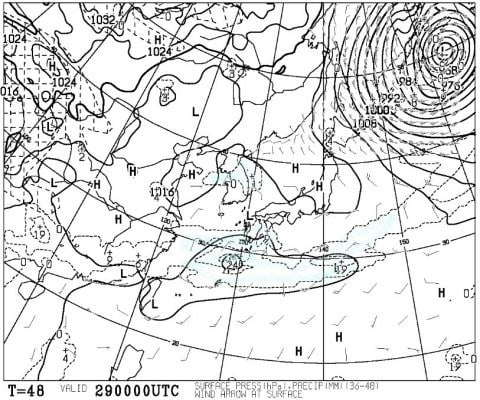

うーむ．

金曜は，前日降った雪が圧雪されていて．

青空のもと滑れる，まぁまぁの

コンディションの一日かも…

そして．

肝心な週末，30日（土）の850hpa気温を

見ると．

うーむ．

この日もぎりぎり，赤く印した0℃線が

志賀高原にかかる程度か…

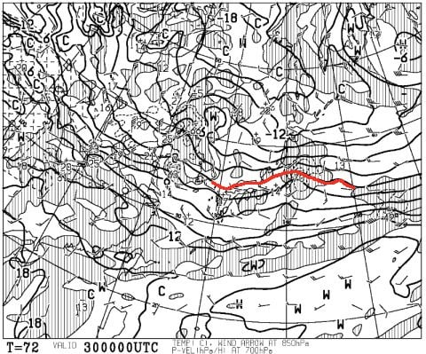

そして．

30日土曜の地上天気図は．

うむ．

志賀高原は，水色で塗った降水域にすっぽり

入ってますね…

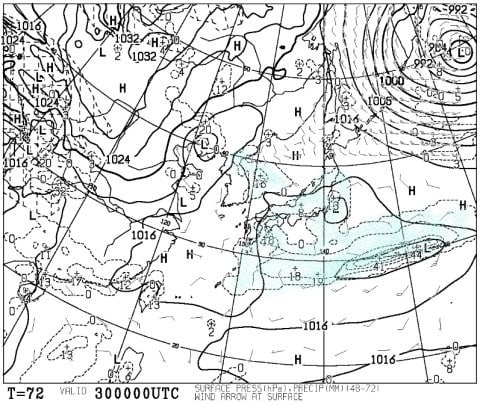

うーむ．

きわどいところ，志賀はギリギリ雪に

なりそうですが．

すごい湿った，ウエアやゴーグルに着くと

濡れるような雪が一日ぱらつく

天気になりそう…（涙）

まぁ，雨よりマシですか…

で．

31日日曜の850hpa気温図は．

…この日は0℃線は太平洋まで下がり．

志賀には-3℃線がかかってるので，冷えそう！

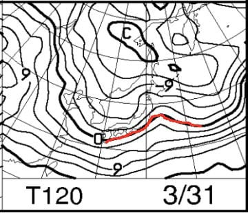

地上天気図は…

うーん．

低気圧に囲まれてるので．

この日も晴れ間はなさそうだけど…

降水域もギリギリ志賀にかかるかどうかだから．

雪はそんなに降らなさそうかな…

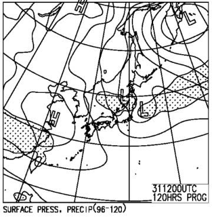

ってことで．

まとめると．

30日土曜：朝から湿った雪がぱらつく．

　朝の気温は-2℃程度か．

　ゲレンデは重い湿雪が積もり，

　ちょいと滑りにくいかも．

　昼間は0℃近くまで上がり，

　ゴーグルやウエアに着くとびしょ濡れに

　なるような，微妙な雪が降ったりやんだり．

　サンバレーとか標高が低いところは

　みぞれ，もしかすると限りなく液体かも…

　ゲレンデ全体を湿った雪が覆い，

　重い雪で，午後はちょっと荒れぎみに

　なりそう．

　

31日日曜：朝は-5℃程度かな？

　朝イチは締まった圧雪バーン．

　もしかするとうっすら数cmの

　積雪があるかも．

　終日曇り空．時折雪がぱらつくか…

　昼間も気温はほとんど上がらず，

　終日-5℃程度をキープ．

　結構寒いよ！

　昼間の雪は，グラニュー糖っぽい

　ザラメになり．

　急斜面はごく一部，アイスバーンまで

　いかないけど，下地が硬めのところが

　あるかな．

ってな感じで．

絶好のスキー日和！

って感じではないけど．

日曜はこの時期にしては冷えた，

明日から4月と思えない感じの

ゲレンデではあるかな～．

でも．

来週月曜からは…

うむ？？

1日月曜と，2日の火曜．

平年比-6℃くらい冷えそう！！

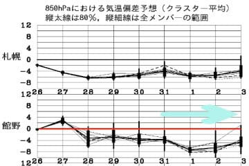

そして，1日にうっすら雪が積もり．

2日は晴れそうなので．

来週の月・火はいいコンディションで

滑れそう…

あぁ…なぜ週明けに…

とりあえず．

今週末で，志賀高原も．

サンバレー，丸池，蓮池，西館，東館，

ジャイアント，ブナ平，

そして，寺子屋も終わってしまいます（涙）

そうか…寺子屋も終わっちゃうんだ…

あぁ…春だなぁ…

## 💬 コメント一覧

### 💬 コメント by (かず)
**タイトル**: Unknown
**投稿日**: 2019-03-28 19:26:38

本日まさかの予想以上のパウダーで最高でした　人も少なく朝から16時15分まで休憩無しでしたよ　土曜の天気気になりますね

### 💬 コメント by (Rikoriko)
**タイトル**: Unknown
**投稿日**: 2019-03-28 19:52:58

こんばんは。週末の予報ありがとうございます。

今日は熊の湯に行きましたが、フカフカのパウダー三昧でした〜❤

この時期にしては軽くて底づきもせずイベントコースをホイホイ滑りました〜。

ただ11時頃からは霧が出て視界ゼロ状態になってしまったので仕方なく緩斜面で内足ターンの練習をチマチマやってました。

明日（金曜日）はお天気も良さそうで圧雪バーンを気持ちよく滑れそうですね。

でも土曜日はウエアーが濡れる程の重い雪？？ゲゲゲ〜。

土曜日は休憩日に決めました！！

ところで今週末で終了するゲレンデが多いんですね。

こんなに雪が積もっているのにもったいないですねぇ。

週末は奥志賀・ダイヤモンド・ファミリー・熊の湯あたりに人が集中するのかなあ。

そろそろシーズンも終盤戦。寂しいかぎりです。

### 💬 コメント by (Skier_S)
**タイトル**: 水曜も良かったみたいですね…
**投稿日**: 2019-03-29 01:39:39

＞かずさま

いいコンディションを楽しめたようで良かったですね…

ってか，そんなに滑って膝大丈夫ですか！？？

＞Rikorikoさま

明日は冷えて晴れて，最高だと思いますよ～！！

今のところ，土曜はまだ微妙な予想なので．

土曜に休むのは正解だと思います．

しかし，今週末で志賀全山滑れるのも最後です．

GWまで営業予定だった寺子屋まで終わるとは

思いませんでした…（涙）．

来週以降は，スキー客もぐっと減るので混まないとは思いますが．

寂しいです…

