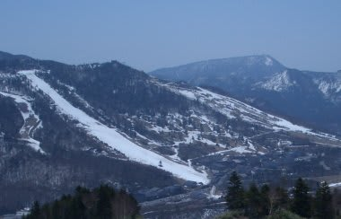
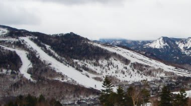

# やっぱりこのGWは雪が少なかったのか？…過去7年間の志賀高原を比較してみる

📅 投稿日時: 2012-05-09 01:05:17

さて．

またGWネタが続きますが．

このGW，かつて経験したことのないスピードで雪が消え．

前の週まではたっぷりあった雪が，4連休最終日にはかなり

寂しい状態となったわけですけど．

今年のGW，例年に比べ，雪が少なかったのかな？？

…ってところが気になったので．

過去7年間のGW最終日の写真を比較してみました．

＃過去7年，毎年必ずGW最終日は志賀高原にいたってことだな…

2012年

一の瀬ファミリー

一の瀬ファミリー上部からダイヤモンド方面

焼額から一の瀬＆高天ヶ原方面

GW最終日には，一の瀬ファミリー正面＆天狗，高天ヶ原NHKバーンが営業．

タンネの森，ダイヤモンドはクローズでした…

2011年

一の瀬ファミリー

一の瀬ファミリー上部からダイヤモンド方面

この年は，地震の影響で焼額の営業が4月上旬に終わってしまったので，

焼額から一の瀬＆高天ヶ原方面の写真は無しです．

…この年は4月に冷え込み，GW最終日まで一の瀬エリアは

ダイヤモンドまで全面滑れ，高天ヶ原のコブも滑れましたね～．

寺子屋もまったく土が出ず．雪が多かった年でしたね～．

2010年

一の瀬ファミリー

一の瀬ファミリー上部からダイヤモンド方面

焼額から一の瀬＆高天ヶ原方面

…この年も比較的雪が多く，一の瀬はほぼ全面可能．

高天ヶ原はNHKバーン側に雪だしして正面はクローズだったけど，

コブ側もまだ滑れるところが残ってたんですよね…

2009年

一の瀬ファミリー

一の瀬ファミリー上部からダイヤモンド方面

焼額から一の瀬＆高天ヶ原方面

この年は，雪が少なめで4連休前にダイヤと山の神が

終わっちゃったんですよね…

一の瀬ファミリーは最終日までぎりぎりクワッド動かしたけど，

上のほう結構やばかった感じでした．

2008年

…この年は，一の瀬ファミリーの写真がないですね…

一の瀬ファミリー上部からダイヤモンド方面

焼額から一の瀬＆高天ヶ原方面

…携帯で撮った写真なので画質は悪いですが，

この年も雪は多めで，GW最終日まで一の瀬＆高天ヶ原は

全面OKだったようです…

2007年

一の瀬ファミリー

ダイヤモンド

焼額から一の瀬＆高天ヶ原方面

…この年はかなり悲惨．

今年より悲惨でした．

一の瀬ファミリーのクワッドが4連休の最終日までもたず，

最後の2日間は下半分のペアだけ…

当然，ダイヤや山の神も動かず．

高天ヶ原のクワッドは動いたんだったかな．

奥志賀の下半分も廊下だった思い出が…

2006年

一の瀬ファミリー

一の瀬ファミリー上部からダイヤモンド方面

焼額から一の瀬＆高天ヶ原方面

この年は一の瀬はダイヤ・山の神含めて全面OK,

高天ヶ原もコブ側でもまったく土が出てなかったようです…

っていうか，確かサンバレーがGW営業したんじゃなかったっけ？？

これ以前は写真がないんですが，2005年は奇跡の大雪の年で

東館～ブナ～ジャイアントまで滑れたようですね～．

東館は一部廊下状だった思い出がありますが．

2004年，2003年も一の瀬はほぼ全面可能だったようで．

…という感じで．

過去10年間を振り返ると．

今年より少なかったのは，2007年だけかな？？

2009年が今年とおんなじくらいだったのかな～．

やっぱり，今年のGWは雪が少なかったんだなぁ…

その前の週までは，例年より多かったくらいなのに…
