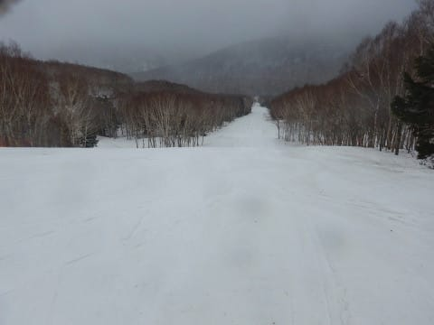
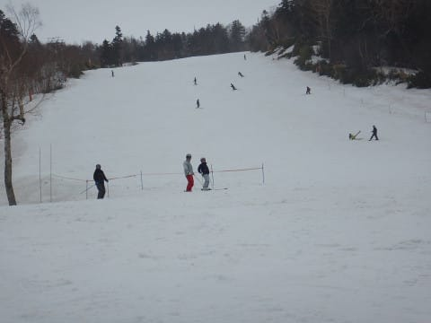
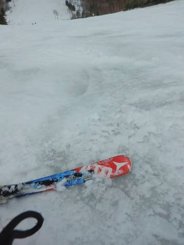
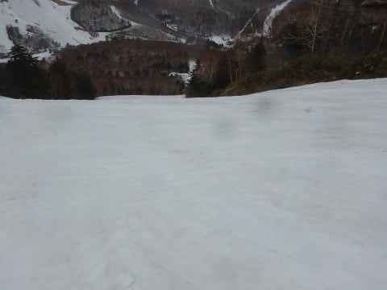
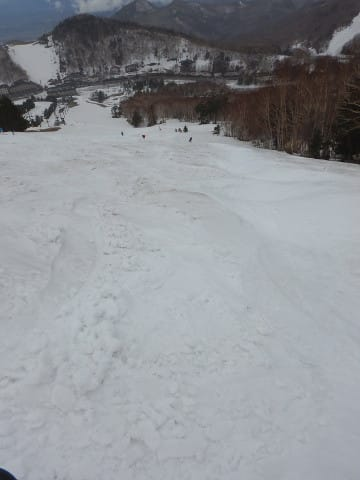
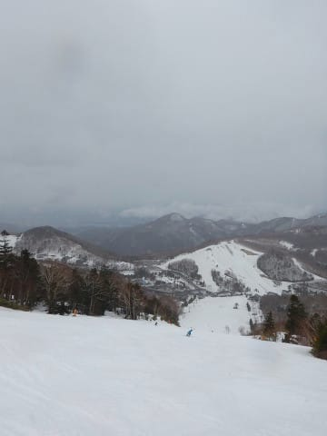

# 2019/4/30(火)，平成最後の志賀高原スキー場は…小雨ポツポツ．風が強く焼額1ゴン＆奥志賀全て運休（涙）．雪は重い春の雪

📅 投稿日時: 2019-05-01 04:34:39

🏷️ カテゴリ: [2019スキー滑走日記](c3e4496fc0fb7f9c17ff21214a35b1ace.md)

ということで．

本日一旦帰宅していますが．

いろいろ寄って帰宅すると，

もうこんな時間…（涙）

でも．

今日は頑張ってレポートを書くのだ！

まず．

朝．

早朝営業，行けそうかな…と．

朝6時ごろに外を見てみると，

どしゃ降り（涙）．

…早朝営業に行く気力を失い，２度寝して．

朝8:30の通常営業から参戦しますが…

ええええええ？

強風のため第1ゴンドラ運休！？？

なんと…

雨の日に，ゴンドラが動かないとは…っ！！（涙）

早朝は減速ながら何とか営業していたのに．

風速20m超えということで，

通常営業からは運休になってしまったようで（泣）

だもんで，本日は第2高速リフトからの

スタートです．

で．

天気は．

朝8:30の営業開始時には，青空も

覗いていたというのに．

なのに，雨がぱらつくという

よくわけの分からない天気で．

そのため，朝から雪はシマシマなんだけど…

でも．

朝から水を吸ってずっしりと重い雪で．

それなのに，日差しのせいで，朝イチから

滑りの悪い雪になっているという…

雨はポツポツといった程度で．

それほどひどく濡れるような雨ではないけど．

この天気と雪のコンディションなので．

さすが朝のゲレンデは誰も滑ってませんね…

こんなシマシマの貸し切りゲレンデって，

なんてゼイタクなんだろう…！←何とか自分を鼓舞してみる

と，自分をだましてみたものの．

重くて滑りが悪い雪で．

イマイチ楽しくない…（涙）

ゴンドラ運休なので．

朝9時すぎ，臨時で第4ロマンスリフトが

動きだし，

サウスコースが滑れるようになりましたが…

…コースは貸し切りだけど．

雪が滑らないので，ほぼ直滑降で

滑り降りなくては…

うむ．

残念ながら，楽しくない（泣）．

…ということで．

ダメもとで一の瀬方面へ様子を見に

行ってみますか…

今シーズン，GWにも山の神リフトを

営業してくれるので，ありがたい

ですね～！

で．

やってきました，一の瀬へ！

一の瀬ファミリーの正面バーンは…

やっぱり，焼額と変わらず．

激烈に重い雪ですね（泣）

でも．

ほぼ貸切に近い焼額と比べると．

さすが，人がいますね～．

とはいえ．

リフトは待ちなしの飛び乗りです．

だけど…

なんだか，正面バーンの中央部分…

ええ！？？

なんだか雪が解けて．

雪が透明になってきた部分があるんですが…！

これは…

もう結構雪が薄くなり始めているのかな？？

うーん．

まだ数日は穴が開かないでいて

くれるとは思うけど…

例年より雪が残ったこの春でも，

こんなになっちゃってるってことは．

今シーズン，正面バーンの人工雪の打ち方．

ちょっと気合が足りなかったのか…

ちなみに，こんな風になっているのは．

まだ，正面バーンのごく一部．

これだと分かりにくいので，

印をつけるとこんな感じ．

まぁ，わずかなエリアではありますが．

なんとか穴が開かずに，GW最後まで

もってほしいところ…

そして．

正面バーンがこんな状況だという

にもかかわらず．

まだパーフェクターコースが滑れると

いうことで，見に行ってみますが…

うーん．

コースのとりつき部分，土が出てますね…

この土を避けていくと．

奥の方は雪があるんですが…

でも，圧雪されて無くて．

そして，パーフェクターの急斜面部分．

残念ながら，ブッシュが出始めて

ます…（涙）

…しかし．

まぁ，GWのこの時期に，まだ

パーフェクターコースが滑れるって．

そうそうないことなので．

やっぱり今年の春は，雪が多いん

だと思います…

で．

ここまで来たついでに．

高天ヶ原まで行ってみましたが．

高天ヶ原も，結構雪がありますね～！

雪が少ない年なら，NHKバーン側に

雪を寄せるために，GWには滑れなくなって

しまうこの上部のメインバーン．

今年はまだまだ行けそう！

そして，コブ斜面側は，

取りつき部分に多少土が出ているけど…

コブ斜面自体は，コブ溝にも土が出ている

様子は無くて．

GW後半も行けそうですね～！

…しかし．

高天ヶ原も雪が重くて．

ガラガラでしたね…

で．

ラストは一の瀬ファミリーに

戻ってきますが…

午後になっても時折ぽつぽつと

雨が降る天気にも関わらず．

このゲレンデのみ，なぜか人が多めで…

そのせいで，午後にはバーンは結構な

荒れ荒れになっていきました…

ということで．

朝から夕方まで，時折雨がポツポツと

降ったりやんだりという天気だった本日．

幸いざーざー降りになることは無く，

雪はそれほど解けなかったものの．

風が強めで，焼額第1ゴンドラは結局早朝しか

運転されず．

奥志賀に至っては，全リフト＆ゴンドラが

終日動かないという．

ちょっと残念な天気でした…

明日…

というか，もう今日ですが．

この日も残念ながら，昼前から夕方まで

雨になりそうです…

でも．

雪はまだまだあるので，

GW後半も，楽しめますよ～！

## 💬 コメント一覧

### 💬 コメント by (大阪のS)
**タイトル**: Unknown
**投稿日**: 2019-05-02 08:25:48

平成最後の日の30日はお昼頃に志賀高原に着きましたが、2ゴン前に驚きの告知が！「1ゴン運休、4ロマ営業」仕方ないので2ゴン前に駐車し、滑走開始しました。サウスコースと唐松コースを１時間ほどぐるぐるしましたが、S様の気配なし。「ならば奥志賀か？」と車で奥志賀に移動するも全面運休。1ゴン前にも2ゴン前にもS様の車はなく「ということは一ノ瀬か？」と一ノ瀬に移動しました。一ノ瀬はヤケビより賑わってましたね。寺子屋の休止に凹みつつ、16:30の営業終了までファミリー正面バーンとパーフェクターを交互に滑り、タンネの様子も見に行ったりしてましたが、最後までお会いできませんでした。ごめんなさいね、ストーカーみたいで。そして令和最初の日となった昨日、8:30から横手山〜渋峠で滑り、11:00に焼額山に移動しました。雨とガスのせいか、ガラガラでした。ゴンドラも12時頃からは一人乗りが続きました。途中、奥志賀も滑りました。エキスパが特に楽しくて５本ほどグルグルしました。最後は焼額山に戻り、GSとパノラマを交互に２本ずつ滑って営業終了の16:00を迎えました。ガスで視界が悪く、雨で全身ずぶ濡れでしたが板は良く滑ったので楽しくて夢中で滑走し、お昼ご飯も食べそびれ、気がつけば終わりの時間となっていました。

例年であれば3月末でシーズンアウトですが、今年は3月下旬にS様とGoku様から「志賀はGWまでやってますよ」とのお言葉を頂いたのが心に残り、諦めきれずにこうしてやって来ました。結構な雨でしたが、お陰で板も滑り楽しく滑って今シーズンを締めることができました。きっかけをくださったS様とGoku様に感謝しています。

一つ意外だったことがあります。もう世間はとっくに春が来てるこの時期に滑りに来る人なんて、マニアみたいな人ばかりだろうと思っていましたが、家族連れや初級者グループの姿も割とあったのは意外でした。来年は、私も家族を連れて来たいなあと思いました。

今季は、初めてS様とお会いでき、またGoku様にもお会いできて、とても良いシーズンでした。また来季も志賀高原に行きますので、よろしくお願いします。

### 💬 コメント by (Skier_S)
**タイトル**: >大阪のSさま
**投稿日**: 2019-05-02 21:27:31

30日は，一の瀬の宿スタートで，12時ごろまで第2高速をグルグルしていたのですが…

おそらくレインウェアを着ていて，いつものウェアと違ったので

発見できなかったのではないでしょうか(汗）．

12時から3時ごろまでは，一の瀬＆高天ヶ原を

滑ってました．

ウェアが違うということを知らないと，見つけられなかったと思います…

今シーズンラストにご挨拶できず残念でしたが，

GWまで楽しめたようで良かったです．

私も，GW前半は家族連れで来てましたので，ぜひ今度はご家族でもお越しください．

でも，まだGW後半も滑れますよ．

GW後半にご家族でお越しください…(笑)

