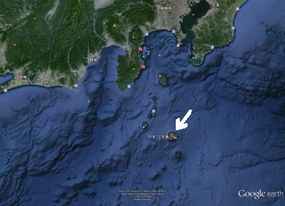
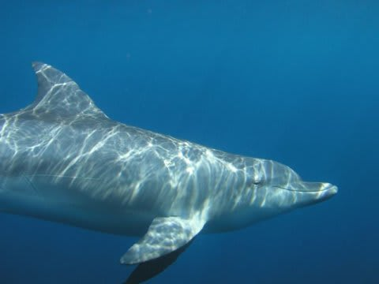
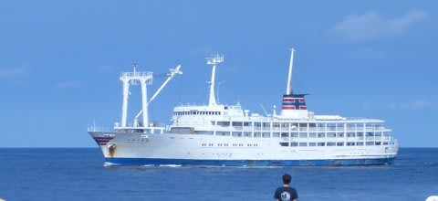
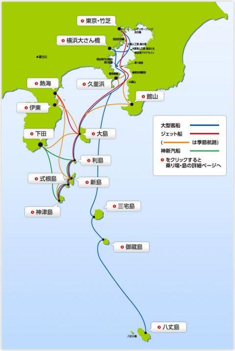

# 2007年8月　三宅島ドルフィンスイム＆ダイビング旅行記　プロローグ1

📅 投稿日時: 2013-09-05 00:14:27

えー．

この文章は，2007年の旅行直後に書いているので．

現在は，もう古くなっている情報もあります…

とりあえず，当時の文章のまま，

時々突っ込みを入れつつ，掲載！

--

それは出発から1週間ほど前．

ようやっと仕事の都合がついて，夏休みが取れる日程が決まったので．

日程調整待ちだったスケジュールがばたばたばたと確定していき．

あっという間に初スキーに行く前の週の10月末まで，

週末の予定がほぼ全て埋まってしまったのでした…

(子供が生まれた今と，あんまり変わってないなぁ…）

で，予定が埋まってしまったカレンダーを眺めていると…

10月までの週末で唯一，8月25，26日の週末だけ

なんと．何も予定が入っていない週があるじゃないですか！

そのとき．

天の声が

「三宅島～！」

と囁いたんです．

三宅島．

かつてから行ってみたいと思っていた島．

しかし，2000年に雄山（「おやま」と呼ぶ．「ゆうざん」と呼ぶと美味しんぼに

出てくる山岡士郎の父になるので注意）が噴火し．

立ち入り禁止になってしまったのは記憶に新しいところ…

そのため，行きたいと思いながら果たせなかった島．

2005年から，一部地域を除き避難解除になり，ぼちぼちと

民宿やダイビングショップの営業が始まっているという

話を耳にするようになって来ました．

さらに三宅島といえば…

ドルフィンスイム！

三宅島から船で御蔵島まで遠征して，野生のイルカと一緒に泳げるわけですが．

海外を含めても，野生のイルカと泳げる場所はそれほどない気がします…

日本でできるのは，御蔵島と小笠原くらいかな？

それも，御蔵島ではイルカ遭遇率100%．

確実にイルカと一緒に泳げます．

こんな魅力的な島が，東京竹芝桟橋からわずか6時間程度，

往復1万円ちょっとでいけるなんて！

これは，行かずばなるまいっ！

…しかし．

しかーし．

夏休み，混むんですよ．

三宅島行きの船が…

この船．

東京⇒三宅島⇒御蔵島⇒八丈島と人気の島々を回るため，

これら全ての島に行きたい人々の予約が集中します．

(東海汽船HPより拝借)

そのため．

夏休み期間中の東海汽船は，予約開始日に

ほぼ満席になってしまうというプラチナチケット．

出発まであと1週間を切ってます．

いくらなんでも予約できるはずが無いよね～．

…しかし．

念のためWEBで空席情報をチェック…．

すると．

さすがに2等は埋まってるけど，1等なら空いてる！

…だけど．

1等はお値段が2等の倍っ！

往復3万円はかなり激烈に痛～い！！！

安い沖縄行きチケットが買えるじゃないかっ！

どうしようかなぁ…

(続く)
