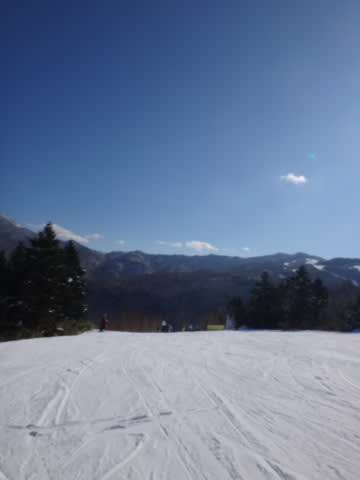
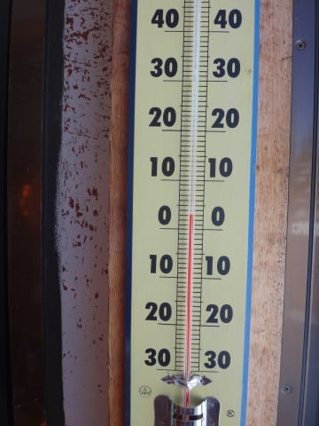
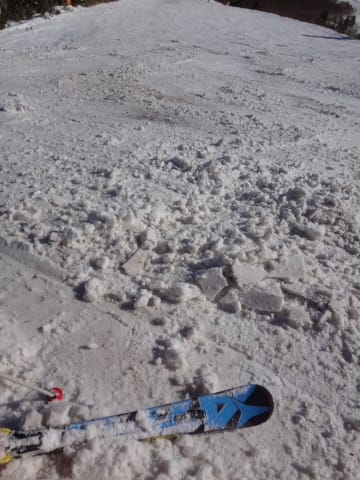

# 1月3日の志賀高原，速報モード…晴天，高温．ダメだこりゃ（泣）．

📅 投稿日時: 2016-01-04 02:26:42

🏷️ カテゴリ: [2016スキー滑走日記](c70c67ed5248e9432b899dcd5747048bb.md)

えー．

本日．

長きに渡った志賀高原滞在の最終日でしたが．

…ついさっき帰宅したばかりなので．

本日は速報モードで…

なぜか．

本日も．

憎らしいばかりのすっきり晴天…

当然，積雪は1mmも増えてません（泣）．

ええ．1mmも．

…晴れなくていいのに…．

さらに

昼間は山頂でも+3℃と，志賀高原の1月で

あるまじき気温となり…

なんだー！この気温はっ！！！

暑い！暑いよ！

おかげで，1月というのに．

積雪が増えるどころか．

かなりの勢いで雪が溶けて…

…この，溶けかけた感じ．

まるで3月の雪なのですが…っ！！（激しい涙）

…ダメだ．

ダメだよ…

当然，ゲレンデの土エリアはかなり広がりまくってます．

人工雪を付けていない，焼額の第1ゴンドラ側の

ジャイアントスラロームコース，このままだとマズいです…

次の週末，三連休までに雪は回復してくれるのか…？？

とりあえず．

また明日，詳細レポートしますので，

お楽しみに…←いつものツッコミだけど…楽しみにしている人なんているのか？？

…明日から仕事なので，今日はもう寝ます．

おやすみなさい…

## 💬 コメント一覧

### 💬 コメント by (山)
**タイトル**: Unknown
**投稿日**: 2016-01-04 06:52:30

5日間ありがとう。また毎週。

### 💬 コメント by (デーコン)
**タイトル**: Unknown
**投稿日**: 2016-01-04 20:23:06

こんばんわ。

こちら京都もあったかいです。

3連休雪乞い。

### 💬 コメント by (Skier_S)
**タイトル**: 雪不足の年末年始でした
**投稿日**: 2016-01-05 01:20:12

＞山さま

5日間，お疲れ様でした～！

「また来週」じゃなく，「また毎週」ってところが

いいですね（笑）．

次は，また3連休に…！！

＞デーコンさま

京都もあったかかったですか…（涙）．

雪乞いの踊りを踊らないといけないかと

感じつつある今日この頃．

この週末の寒気に期待っ！！

