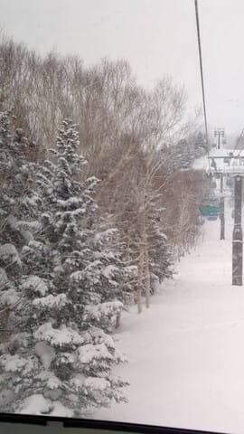
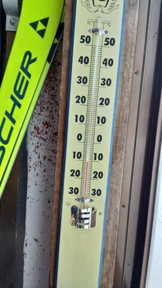
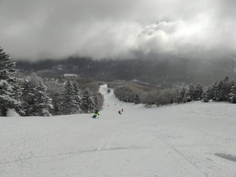
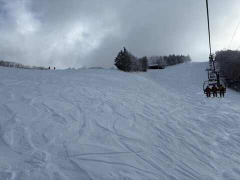
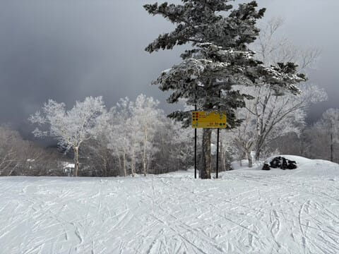
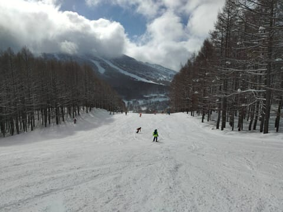
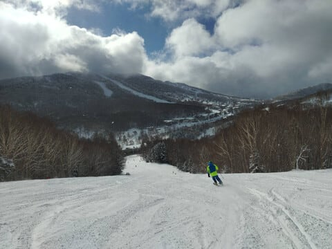
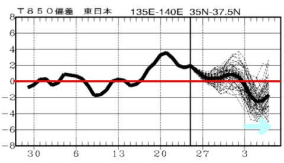

# 日曜もスキーには行けなかったので，1月26日(日)は志賀高原特派員情報にて…そして2月に入ると冷え込みそう！

📅 投稿日時: 2025-01-27 03:55:32

ということで．

今日も一日泣きながら仕事をして，

そのあと娘の勉強も見ていたら，

日曜というのに，いつも通り

深夜4時前…（泣）

まぁ，今日はスキーに行かなかったから

久しぶりに8時間も寝れたので，

まだマシだけど．

あと4時間ちょい後に会社に

行かねばならんのですが…

なんで日曜にこんな遅くまで

仕事してなきゃいけないんだ…（涙）

とてもじゃないけど，今日日帰りで

スキーに行けるレベルじゃなかった

ですね（泣）

あーーー．

滑りに行きたかった．

…というか，週末にリフレッシュせず，

このあとまた1週間仕事を続ける

気力がもつのか？？？

かなりヤバい気がする…

あぁ…明日から仕事行きたくない…

ってなわけで．

今日も志賀高原へ行けなかったので，

特派員からのレポートに頼るわけですが．

…日曜の志賀高原，猛吹雪で雪が吹き付け

風は唸り，雷鳴轟き地が割れ天が落ちる

ようなすごい天気にはならなかったよう

ですね…

うーん．私のスキーに行けない怨念が

志賀高原に届いていたと思ったけど．

ちょっと弱かったか？

とりあえず．

朝は雪降り，山頂付近はガスという

天気で始まったらしい日曜日ですが．

朝の山頂の気温は-10℃と，結構

しっかりと冷えた感じですね…

朝までの積雪は10～20cmほど

あったようで，朝イチは圧雪

コースもうっすら軽い新雪が

乗っていたようですが…

気温が冷えてたので，結構軽い

雪だったようです！

ちなみに，サンバレーに行った特派員からの

写真を見ると．非圧雪部分はこのくらいの

積雪だったようで…

圧雪コースはこんな感じ．

圧雪の上に1-2cmほど軽い新雪が

乗ってる感じでしょうか．

そして，10時過ぎには空がちょっと明るく

なるタイミングもあったようだけど．

基本的には曇り空～小雪が舞う一日で．

午後3時くらいから，また青空が見える

ようになってきたみたいですね…

でも，新雪が乗った柔らかいバーン

だったので，午後はちょいと荒れ気味

だったようですが．

でも，そこまでひどく荒れず，荒れても

雪が軽く柔らかかったので，そこまで

ボコボコで飛ばされるって感じじゃ

なかったようです…！

…まぁ，すっきり晴れのまっ平バーンが

ラストまで続いて超最高だった先週

ほどの激烈グッドコンディションじゃ

なかっただけ，うらやましさは薄まった

ものの．

冷え冷え雪が積もって，時折日も射し，

悪くない一日だったようですね…

…

…やっぱりうらやましい…

ってなことで．

いいコンディションが続いている志賀高原．

この先の天気を見てみると…

今週金曜まではそこそこ冷えて，

29日はちょっと雪も降りそうですね！

（西風なので志賀高原はドサドサ積もら

ないけど…）．

2月1，2日の土日はちょっと気温が上がり

気味だけど，志賀なら液体が降ることは

なさそうだし．

まぁ，今週末までコンディションは

もってくれそうな感じです…

で．

週末が終わった2月の3日あたりから…

なんだこれは！！！

なんだかすごい冷えそうなんですが！？？

…2月の一番冷える時期に，平年比で

これだけ冷えたら，ヤバいくらいかなりの

雪が降りそうな気配…！！

たぶん，2月3日の週は積もります．

数日間降り続けます．

2月5日あたり以降，再来週の2月8，9日の

週末までは，結構パウダーねらい目の

日が続きそうな予感…！

とりあえず．

その前に．

今週末以降は週末にちゃんと休めて，スキーに

行けることを願わなくては…

（こんなことを願わなくてはならないレベルなのが悲しい）

## 💬 コメント一覧

### 💬 コメント by (レインボー77)
**タイトル**: Unknown
**投稿日**: 2025-01-27 19:59:34

月曜日の志賀高原情報

朝の蓮池-6℃。ずっと曇り空。

まずは白樺は快適フラットバーン。唐松も然り。オリンピックもGSも快楽。パノラマもイーストもパラダイス。

ファミリーも最高。

初の大勝軒1300円ラーメンが甘めの絶品。

寺子屋は強風向かい風で最悪。タンネも普通。ダイヤが今日のベスト。最後は間違いないイースト。

かくして今季初めてのレインボー(２時あがり)に到達しました。

私らは毎日滑っているのが日常なので、昨日は非日常を求めて、大掃除やらで休場したのですが、これが功を奏して、本日はレインボー超えの偉業達成。

明日からの反動が心配ですが、エス様の分まで滑っておきますので、どうぞ来週も思う存分お仕事に邁進されてくださいませ。

### 💬 コメント by (副院長)
**タイトル**: Unknown
**投稿日**: 2025-01-27 21:46:58

Sさま、今日は焼額は、下地に、やや硬さ残りましたが、goodでした。奥志賀ゴンドラが、搬機が、以前よりたくさん出ており、ご機嫌でした、早くSさまが焼額に戻って来られることを期待しております。

### 💬 コメント by (Skier_S)
**タイトル**: 水曜から雪降り！
**投稿日**: 2025-01-28 02:53:52

＞レインボー77さま

そんなに良かったんですね…

うらやましい…

私の分まで滑っておいてください！！

＞副院長さま

志賀高原，いいコンディション続きますね…

来週日曜は雪降りのモサモサになりそうですが，昨シーズンみたいな

雨で溶けちゃうとか，雨の後のアイスバーン地獄に悩まされずに済みそうです…！

