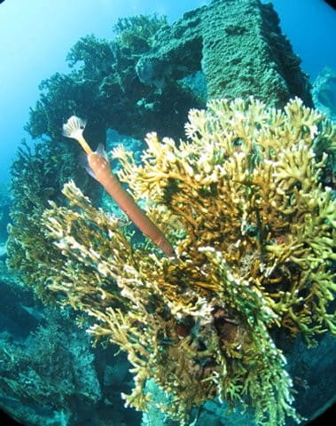

# 2023年8月，座間味で親子3世代ダイビング！その15…旅行4日目，早くも今日がダイビングラストデー！

📅 投稿日時: 2023-10-02 07:14:27

🏷️ カテゴリ: [ダイビング日記](ce3a7a8d424d112fce83ee85c81a0e344.md)

この土日も泣きながら家で仕事してましたが…

ここ1週間の睡眠時間がヤバいことに

なってますね（涙）

Garminさんによると，週末含めた

週の平均睡眠時間が3時間58分…

平均睡眠時間が4時間切ってるんですが…（泣）

そして日曜深夜…というか，月曜朝も

こんな時間までPCの前で資料作ってます（激泣）

平日は忙しくていいから，せめて

土日は仕事しなくていいくらいの仕事量に

なってほしい…←平日は深夜勤務が続いてもいいのか？？

それなのに．

ここしばらく週末も家に籠っていて，

身体を動かしてないので．

メンタル的に

「うがーーーー！！気分転換しないと死ぬ！！」

とばかりになってきたので．

土曜の午前中だけ，さっくり山に登って

こようと．

なぜかこんな山に登ってきました…

それも知っている人は知っている，

こんなルートで登って…

このルートで降りてきました．

いや．

かなり高度感があるルートなので，

視界が良ければ面白かったんでしょうが…

残念ながら，視界は全くなし（涙）

せっかく睡眠時間を削ってここまで

来たのに…（泣）

（写真だと斜度感がわからないけど，

　急斜面に張り付いて写真撮ってます）

でも．

ちゃんと午前中に下山できたので←いや，午前中って言っても11:53で，午前って言えるぎりぎりですが？

全力で帰宅，午後から家で仕事してました…

まぁ，気分転換にはなったのはよかったけど．

結果的に日曜もこんな時間まで仕事してるし…

土曜午前も素直に仕事すべきだったのか…

早く寝たい…←良い子は平均睡眠時間4時間で山登りしちゃダメだぞ！！（説得力無し）

でも．

そんな中，ちゃんとBlogを更新する自分…えらい！！

今日はダイビング日記，[前回からの続き](e218ba2805c64c9a0f5b5069ed1fb72fa.md)です…

ーーー

そして，旅行4日目の朝…

早くも本日，ダイビング最終日になります．

あぁ…

楽しい時間はどうしてこんなに早く

終わるのか…（涙）

とりあえず．

今日も朝から晴天ですね！！

貸し切りテラスから朝日が差す座間味港を

眺められるって，ぜいたく…

そしていつも通り，朝7時から

食堂で朝食タイム！

昨日の朝食は和食だったので…

今日は洋食の日ですね．

ワンプレートでシンプルに見えますが，

4枚切りのトーストが1枚分ついて

さらにガーリックトーストがあったり，

結構量があります…

朝からかなり満足度が高いです．

で．

今日も3本潜る我々は8:15に乗船なので．

朝食が終わったら，いつもの道を港に向かい…

ティンガーラ号へ乗船！！

いやーー．

今日もいい天気だわ…

乗船したら，まず器材をセットして…

器材セットが終わったら，出港！

1本目のポイントへ向かいますが…

港を出て10分ほどの，座間味港の向いに

位置する安室島のそばに船を止めましたね…

到着したら，ブリーフィングが始まりますが．

ホワイトボードに漁礁の絵が描かれていて…

今日の1本目のポイントは「安室漁礁」

のようです．

…座間味では有名なポイントですが，

ザマミセーリングさんではあんまりこの

ポイントを潜らない気が…

今回は珍しい！

ってなことで．

１本目にエントリー！

ポイントは，見ての通りコンクリートで

作られたブロックが漁礁として沈められている，

漁礁ポイントです…

漁礁ポイントですが．

エントリー後の最初は漁礁に入らず，

その周りをまわります…

この漁礁．

周りは見事なサンゴの群生なんです…！

このサンゴだけでも，十分見ごたえが

あります…！

ただ，ちょっと魚が少なめかな．

ってなことで．

サンゴの上をしばし漂った後は，

漁礁のほうへ戻ってきて…

漁礁の中の散策タイム！

…いきなり，大きなアカククリが

何匹か固まってますよ…！！

結構大きなアカククリが7匹．

全部同時に写すのは無理だったけど…

大きなアカククリは，写真映えしますね！

そのほか，わかりにくいけどアカメハゼやら…

ミノカサゴ．

そして，なぜかサンゴに頭を突っ込む

ヘラヤガラなど…

…しかし，なんでこいつサンゴに頭を

突っ込んでるんだろう…？？

ってな感じで．

漁礁の周りをフリーで見て回っていると．

ガイドから浮上のサイン…

残念ながら，漁礁から離れて．

ラストデーの1本目，終了です！！

（[続く](e318d7d929a95ff4f65d5e35fcbc44e9a.md)）

## 💬 コメント一覧

### 💬 コメント by (mae)
**タイトル**: Unknown
**投稿日**: 2023-10-02 14:25:58

赤岳は桜平から登りましたが県界尾根も面白そうですね。

Sさんには機会があれば、剣岳の早月尾根日帰りをぜひお勧めします。

立山側からの登りと比べても達成感が半端ないです。

ケラマも何度見ても透明度とサンゴが素晴らしいですね。ホント、命の洗濯ができましたね。

### 💬 コメント by (Skier_S)
**タイトル**: ＞maeさま
**投稿日**: 2023-10-02 23:31:14

桜平から赤岳ですか…

結構長めなルートですね．

剣岳早月尾根は…さすがに標高差2700mの日帰りは，私には無理な気がします（笑）．

