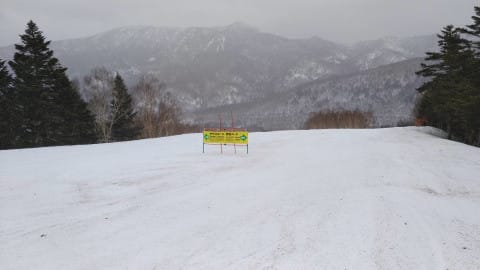

# 2021/3/21(日)の志賀高原スキー場は…朝は雨が降らなかったものの強風．昼前から本格的に雨．そしてまた次の週末も…

📅 投稿日時: 2021-03-22 03:01:24

🏷️ カテゴリ: [日記](cc4b5682fb7b8b144980957a978653fb0.md)

えー．

本日も家で泣きながら仕事をしていた，

Skier_Sです．

さて．

予想なら，本日は激烈な悪天候になり，

スキーヤーにとって精神鍛錬の修行の日

になる予想でしたが．

果たして，何人の特派員が最後まで

生き残ったのか…？？

まず，日曜の朝は…

やはり，予想通りの強風で，

焼額ゴンドラは運休．

焼額の案内を見ると，

第1，第2ゴンドラだけじゃなく，

第3高速も強風のため動かせなかった

ようです…

([焼額山Facebook](https://ja-jp.facebook.com/yakebitaiyama/)より）

…って，これ．

ちょっと本題から離れるけど．

この案内の下の方を見ると…

ええ！？？？

第3高速，これで今シーズン営業終了！？？

これからもう動かないの…？？？

うーん．

これから春休みに向けて．

まだ第1ゴンドラが混む日が

あると思うんだけど…

今後は，第1ゴンドラが混んでも

第3高速に逃げられないようです(涙）

ってなことで．

本題へ戻ると．

明け方まで降っていた雨は朝には止んで，

薄日が射すスタートだったようですが…

生ぬるい強い風が吹く天気で．

今日はおこみんがちょっと寂しそう

です…←いや，いつもとおんなじ表情だと思う

他のスキー場も，ダイヤモンド，寺子屋が運休．

ファミリークワッドなどのリフトも減速運転，

東館ゴンドラ運休…という状況だったので．

運転しているリフトにすごい列がついたようで．

午前中は一の瀬ファミリーが大盛況．

その他，西館フーディーも…

分かりにくいけど，矢印で示す

タンネの森のリフトまで，混んでいた

ようです…！

ゲレンデは，早朝に降った雨のために

朝から重めの雪だったようで…

朝9時ごろに一瞬雨がぱらついたものの．

午前中は，11時ごろまで時折日が

さすような天気で．

多少混んだものの，ゲレンデ自体は

そこまで最悪のコンディションでは

なかったらしく．

午前中は，かなり多くの特派員が

生き残っていました…

…ただ．

午前11時を過ぎると空から悲しみの液体が

降り注ぎ始め，12時半ごろには本格的な

雨になったようです…（涙）

おかげで，ゲレンデの雪も解け，

一部に穴が…（泣）

この雨のおかげで，特派員は次々

戦略的撤退をしていったようで．

最後まで生き残ったのは，

[この方](https://mousetyu.blog.fc2.com/)と，

[「長い戦いは終わった」の迷言](ebad5fbe487532f1c34f089b11b85b828.md)を残した

某氏だった…

と，隠れ20000mゴールド保持者の

四天王の方が報告してくださったので．

この方もこの激しい戦いを生き残った

一人だったようです（笑）．

しかし，さすがこの天気だったので．

午後は誰も滑ってませんね…

残念ながら，雨で雪が溶けてしまい．

雪の表面は，かなり汚れた感じに

なっちゃったようです（泣）

ということで．

結果を見てみると．

いつもの特派員の生存者は0だったようですが．

選ばれし民とでもいうべき，元Skiline

トップランカーの方々は，この中でも

生き残っていたようです…

…さすが，20000mな方々は違う…

ってなわけで．

悲惨な天気だった本日ですが．

これから明日の朝にかけて，

めちゃくちゃ冷え込み，雪になる…

はずなのですが．

完全西風のため，志賀では積もらなさそう

です．

明日までに5cmも積もらなさそう…

ヘタすれば1cmかも？

…明日は，西風なので，午前中は雲が

残ったとしても，昼前には晴れそう

なんですが．

昼間も最高気温が-3℃程度と冷え冷えの

一日なので．

明日の月曜は一日中，激烈なガチガチバーンを

味わい続けることになりそうです…

火曜の23日も，朝は冷えてガチガチバーン．

昼間は晴れて，22日より気温が上がるので．

日が射す斜面はちょっとエッジが嚙むように

緩んでくれるか…

日が射さない斜面はいい感じのアイスバーン化

しているでしょう．

と，これからしばらくの天気図を見ていると．

ふむ．

来週日曜，28日は…

うげげげげ．

水色の-9℃線が志賀にかかるって…

昼間の気温が，志賀高原でも+10℃を

超えそうなんですが…

…これで降ったらヤバい．

120％の確率で液体だよ…！！

さて，地上天気図は？？？

…（即死）

ダメです．

ダメダメです．

皆様，次の週末も雨になりそうなので．

4週連続の週末の雨

を覚悟しておいた方が良さそうです…（涙）

なぜ，週末をねらって…（泣）

## 💬 コメント一覧

### 💬 コメント by (northfox)
**タイトル**: Unknown
**投稿日**: 2021-03-22 12:53:32

昨日は人生初の雨中スキーとなりました…

でも滑ってみると何とかなるもんですね。良い経験になりました。

しかし、雨でどんどん人が帰って行くのに（ダイヤはほぼ無人に）一の瀬ファミリーは結構な数の人が楽しげに滑っていて驚きました^_^；

### 💬 コメント by (スシネコ)
**タイトル**: Unknown
**投稿日**: 2021-03-22 13:01:38

s様

いつも頭が下がりながらも楽しく読んでます。睡眠不足の体調にはお気をつけください。

３高は終わってしまったのですね。

週末にあのコブをコッソリ練習しようと思っていたのに。

ところで、３高が動いていない時って、最後のアレはどこなのでしょうか？

私も（無茶苦茶な）「兼務」のせいで、年度末の週末が最後のシーズンになりそうです（涙）。

リフトが動く限り、カッパとゴム手袋を用意して豪雨の中でも最後まで楽しもうと思っております　(ﾟ∀ﾟ)ｱﾋｬ

皆様、よろしくお願いします。

### 💬 コメント by (レインボー73)
**タイトル**: Unknown
**投稿日**: 2021-03-22 17:41:08

月曜日の志賀高原情報

朝の上林１℃ 　蓮池ー４℃、山頂ー６℃。搬器凍結のため、2ゴンのみが8時35分運行。九時を過ぎてもまだ他は動かない。圧雪の後には積もってない。でも、雪は快適、ニューブーツも夢のよう。

３本目には、コロコロ発生＆混雑でうんざり。山の神を目指すことに。

ダイヤは相変わらず非圧雪でカリカリ腰に悪いバーン。

パーフェクタは閉鎖。雲上の楽園寺子屋も、今日は気持ちよく滑れない。見切って西たてへ行った仲間も『カッターい』。

そして今日も銀嶺でざる蕎麦。それにしても、１日間もスキーをしないでいると、滑り方を忘れてしまう（ごめんなさい）。

### 💬 コメント by (レインボー73)
**タイトル**: Unknown
**投稿日**: 2021-03-22 17:55:41

世にも不幸な男の物語

不幸な、私とは行動をともにしない友人の物語です。

今日は朝のうちはニゴンのみ稼働。10時近くに二高稼働。11時40分頃に１ゴンが稼働しました。

不幸な友人は、まずはパノラマから一目散にカラマツへ。でも、二高は動いてない。いつも9時始動の山の神を待って、ダイヤモンドへ。

ところがダイヤは非圧雪でカチンカチン。

やむなくバスで１ゴンへ。

１ゴンは勿論凍結で休止。

がっくりした彼は、さらにバスで2ゴンへ。

すっかり疲れ切った彼は、まもなくリタイしたそうな。

ちなみに彼は、10年ほど前に、スキーライン48回りをして２位に入ったツワモノです。

### 💬 コメント by (レインボー73)
**タイトル**: Unknown
**投稿日**: 2021-03-22 19:48:32

月曜日の志賀高原情報２

昼食後は一路真輝、いや、一路ヤケビヘ。

二高乗り場に三高の主、安井さんが。ああ、三高は本当に終わっちゃったんだ！

そこで１ゴン始動との連絡が。

当然行きますよね。ＧＳも荒れてる。毎日毎日ヤケビの極上楽園で教育されている、贅沢に慣れている身としては、楽しくない。一発でリタイア決意。軟弱な特派員です。

帰りのパノラマ、サウスは、笑っちゃいます。ボッコボコ。心置きなく帰って、ふきのとう採取。最高です。

### 💬 コメント by (Skier_S)
**タイトル**: しばらく雪が降りそうにない…
**投稿日**: 2021-03-23 00:47:33

＞northfoxさま

あれ！人生初の雨の中のスキーですか…！！

雨の中のスキーもまた独特の味わいがありますよね←いや，ない

レインウェアをGetすれば，意外と楽しめますよ！

＞スシネコさま

3高が終わると，自然に最後まで営業している2高にみんな集まります．

いや，別に申し合わせているわけじゃなく，みんな自然に

最後まで営業しているリフトに集まるだけです…

＞レインボー73さま

ダイヤ，非圧雪だったんですか！

昨日の雨の後で非圧雪とは…

そして，西舘も硬かったとは．

でも，ニューブーツが素晴らしいようで良かったですね！！

…そして，不幸な方，かなり残念なパターンの行動でしたね(笑)．

