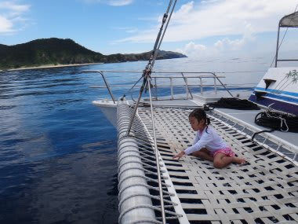

# 2012年7月　子連れ座間味ダイビング旅行記9　娘，4歳のスノーケリングデビュー…なるか？

📅 投稿日時: 2012-08-07 01:35:42

あー．

この週末も夏休みの家族旅行ということで．

車で1300kmほど走ってました…．

[6月の報告](e00116efead93c70858883bdf4f5f563d.md)で走行距離18万kmだったわが車．

すでに18万5000kmを突破．

来週は帰省＠関西某所も控えており．

来月には19万km超えそうな勢いです．

…って感じで．

この週末の旅行のため，少し更新の間が空きましたが．

いやー．まぁ．

「徒然スキーヤー日記」という名前のブログにまったく期待されていない，

ダイビング日記だし．

見てる人も少ないみたいだし．

まぁ，ぼちぼちと更新していきます…

＃このブログタイトルにもかかわらず読者になったダイバーの人って，

＃どういう検索でここにたどり着いたんだろう？？？

-----

さてさてさて．

って感じで．

お昼ごはんを食べてセレブなお昼寝タイムのあとは，

ダイビング3本目の時間です．

ダイビング3本目は…

私は昨日2本潜らせてもらっているので．

＃というより，陸上で子供の面倒を見ればよい昨日の子守番と，

＃海上で子供と泳ぎ続けなくてはならない本日の子守番と，

＃どっちをとるかという壮絶なバトルが昨日行われた結果

私がさっきの2本目に引き続き，この3本目も子守番です．

妻が3本目のダイビングに出る後を追って．

娘と海に繰り出しましょうか～．

今度は，娘はシュノーケルをつけての出陣です．

っつーか．

娘の人生における，シュノーケリングデビューです．

…このシュノーケル．

昨年購入してみたんですが．

さすが3歳児には使うのが難しかったらしく．

昨年はまったく使わずじまい…

あれですね．

3歳児には．

鼻から息をしないで，口だけで吸って吐いて…

ってのは，まだ難しかったみたいで．

今年は「ママと一緒なマスクとシュノーケル使いたい～！」

ってことだったので．

陸上で使い方を練習させてみたところ．

何とか口で息もできるみたいだし．

…肺活量がないのでシュノーケルクリアはできないけど．

プールで顔をつけて泳ぐこともできるようになったことだし．

ライフジャケットもつけることだし．

シュノーケルに水が入ったら，すぐシュノーケルを口から外すということを教え込んで．

シュノーケルデビューを目指してみました．

適当なところで，ちょっと海を覗かせてみましょうか．

…なんか，無事シュノーケルで呼吸ができてるみたいですね．

では，海に漬けてみましょうか…
