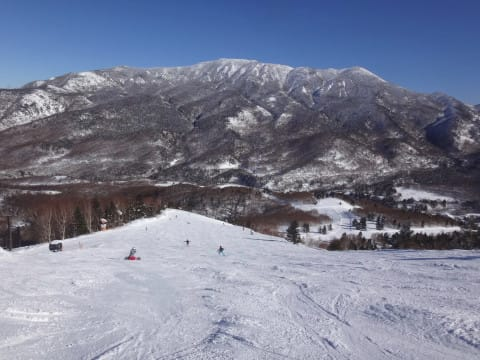

# 2017スキーシーズン終了…今シーズンを総括してみる

📅 投稿日時: 2017-07-14 01:02:03

🏷️ カテゴリ: [スキー板試乗](c0bd8048615710cee890e403a36cc9a2b.md)

とりあえず．

雪がたっぷりあって，かなり長く楽しめた

今シーズンでしたが．

大変残念なことに，

この長かったシーズンも，ついに終わって

しまったので．

シーズン終了時の定番．

今シーズンの総括をば…

○シーズン滑走日数　70日

をを！

さすがシーズン長かっただけあって，

滑走日数は70日越えちゃいましたね…

わが人生最高記録タイですか←とりあえず．社会人として終わってる

日数であることは間違いない

○行ったスキー場

志賀　57日

Yeti　5日

アサマ2000　2日

かぐら　3日

月山　3日

いつも通り，偏ってますね…

今シーズン行ったのは，5か所のみですか…

…志賀高原のシーズン券を買うまでは

かなり数多くのスキー場を行脚していたんだけど…

＃人生これまで行ったスキー場を数えてみると，120か所

もう，シーズン券が使えるうちはひたすら志賀，

志賀高原のシーズン前はYeti＆アサマ2000，

シーズン後はかぐら＆月山

ってことが，完全パターン化してますね．

○ナイター滑走日数　21日

あら．昨シーズンとぴったり同じ日数…

まぁ，滑走日数70日中，3割はナイターまで

滑っていることになりますか．

4月以降はナイターが無いことを考えると，

実質は5割ほどナイター滑ってる感じで．

1泊2日の1日目は確実にナイターに行っている…

と考えると．

まぁこんな感じでしょうか．

○早朝滑走日数　7日

一昨シーズンはヤケビがGWまでやっていたので13日，

昨シーズンは雪不足で早朝営業がほぼできなくて0日…

と，極端に振れましたが．

今年は両者の中間の7日ですか…

ヤケビが早朝営業してくれれば，もう少し増えたかな～．

あ，でも．

さすがに，

早朝からナイターまでぶっ続け

という，某氏が実践したような無謀なことは

やってませんので．

そうです．

早朝に行った日はナイターに行ってませんので．

私はあくまで常識的なスキーヤーですから…（笑）

○トータル滑走標高差　795000m

795km…

これって，横にすると，東京-千歳空港くらいの距離になりますか．

'15…659km

'16…689km，

'17…795km

ということで．

この3年間，着実に増えてますけど．

昨年からは，一気に100km以上増えてるよ…！！！

なんだか．

昨シーズンあたりから，20000mクラブの方々と

一緒に滑るようになり．

着実に，滑走標高差が増えてます…

だんだん危ない方向に行ってるかも（笑）

○一日滑走標高差20000m突破回数　3回

昨シーズンは1回だったのに．

今シーズンは3回も超えていたとは…っ！！

でも．

あれだ．

志賀高原には，2泊3日で滑りに来て，

3日間連続で20000m超えちゃうサイボーグ大御所もいますし．

さらに，今シーズンの3回とも，20000m超えたのは

全てナイター含みなので…

うん．

この程度は，まだ，普通の人だ．

まだ，終わった人じゃないはずだ…

○自動車走行距離　約21000km　

…昨シーズンは2.5万kmでしたが．

スキー場に近い家に引っ越して，走行距離が

減りましたね～．

スキー場が近くになって，素直にうれしい…

＃でも志賀高原まで4時間半～5時間（涙）．

○転倒回数　2回

昨日の記事で描きましたが．

自損転倒1回（涙）

衝突転倒1回の，計2回．

…まぁ，スキーが外れるような転倒をしてないですし．

シーズン70日滑ることを考えれば．

少ないほうですかね…

○かかったお金

…

…

…今シーズンは，計算してみました．

ええ．

計算してみましたが…

…書けません．

ここに，書けません（涙）．

…まぁ．食費と同じく．

これを止めたら生存に影響を与えかねない出費だから，

仕方がないですね…っ！！←違うと思う

ってことで．

名残惜しいですが．

2017シーズン，終了です…（涙）

## 💬 コメント一覧

### 💬 コメント by (まいる)
**タイトル**: 今シーズンお疲れさまでした
**投稿日**: 2017-07-14 06:35:38

Sさん、お疲れさまです。

今シーズンのスキーお疲れさまでした。

私の約2倍滑ったんですね・・・

今シーズン、うまく合わずでしたが

来シーズンは、一緒に滑りましょう！

### 💬 コメント by (タカ)
**タイトル**: いつもみてます
**投稿日**: 2017-07-14 18:13:18

はじめまして❗最近ブログ見始めまして嵌まってます。

ホームはかぐらですが、このブログの影響で来シーズンは志賀にいこうかと思います。

20000mステッカー欲しいですね。もし見かけたら声かけさせて貰います❗

### 💬 コメント by (Skier_S)
**タイトル**: 夏ですねぇ…
**投稿日**: 2017-07-14 23:12:06

＞まいるさま

いやー．

シーズン70日．

子供が生まれてから，こんなに滑るとは

思いませんでした…

しかし，今シーズンはお会いできませんでしたよね…

また来シーズン！

＞タカさま

初コメントありがとうございます～！

このBlog，楽しんでいただけたなら

良かったです…

来シーズンは，ぜひ志賀にお越しください～！！

20000mゴールドシールを貼った人を見かけたら，

私じゃなくても声をかければステッカーもらえますよ．

もし，運よく私を発見できましたら，その時は

よろしくお願いします～！

### 💬 コメント by (Goku)
**タイトル**: Unknown
**投稿日**: 2017-07-14 23:37:17

これでは板が１シーズン持たない訳だ（笑）

### 💬 コメント by (はなげ親分)
**タイトル**: お暑うございます
**投稿日**: 2017-07-15 00:00:16

シーズン初めのアクシデントにより、滑走日数は減りましたが1日平均標高差は４割増しとなっていました。

今シーズンはたくさんの方とお会いすることができ、妻には申し訳ないのですが大変楽しいシーズンでした。

来シーズンは鋼鉄の右足首を装着した妻と楽しみます～

### 💬 コメント by (Skier_S)
**タイトル**: 楽しいシーズンでした…
**投稿日**: 2017-07-15 22:59:49

＞Gokuさま

もたなかったですね…1シーズン（涙）

さらに，新しい’17SXももう寿命の半分が終了…

いろいろまずいです（泣）

＞はなげ親分さま

いやーーー．

シーズン初めのアクシデントは，ちょっとびっくりしましたが…

雪がたっぷりで，シーズン自体は恵まれた感じでした．

来シーズンは，奥さんとゲレンデでお会いできるのを

楽しみにしていますので，しっかりリハビリ（スキーに向けての

筋力回復）を進めてくださいね～！

再受傷を避けるためには，筋力の復活が重要ですので…

奥さーん！

焼額への復帰をお待ちしています～！！！

### 💬 コメント by (しんちゃん)
**タイトル**: Unknown
**投稿日**: 2017-07-16 08:36:42

いろいろなグッズが壊れてくるはずですね(笑)

### 💬 コメント by (Skier_S)
**タイトル**: しんちゃんさま
**投稿日**: 2017-07-17 03:11:43

壊れます．

いろんなものが…（涙）

まあ，持ち主の人間自体が

いろんな意味で壊れた人なので（笑）

