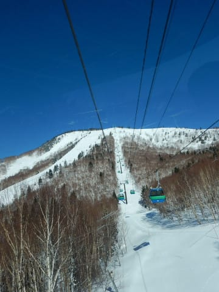
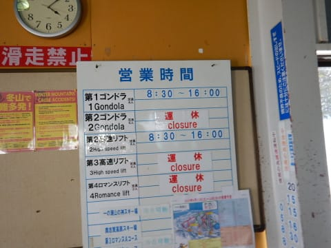

# 2019/4/13(土)の志賀高原スキー場は…ぴかぴか晴天！朝は2月か？と思うほどの最高バーン，午後は緩んだけど4月としては良かった！

📅 投稿日時: 2019-04-14 00:13:11

というわけで．

水曜の天気予想の段階から．

本日の午前中は最高になるんじゃないか…

と思ってましたが．

朝は予想通り最高でした．

いやーーー．

この4月．

奇跡の4月ですね．

焼額の積雪量がこの時期になっても

全く減っておらず．

ピーク時の積雪220cmをまだキープ

しているんですから…

とりあえず．

朝．

志賀高原へ登ってくるわけですが．

…営業終了したサンバレー，

まだ全然滑れそうですね…

そのほかの営業終了したスキー場も．

まだまだ積雪たっぷりで．

終わっているのがもったいないん

ですけど…！！

ってな感じで．

スキー場に近づくと，4月中旬と思えない

積雪路になっていて…

いつもの焼額に到着すると．

もう，ピカピカ晴天です！！！

山頂も，ビューティホーな快晴！

そして，山頂気温は-3℃と

朝のうちは冷えていて．

…とても4月と思えない雪なんですけど！？？

今日は通常営業から参加だったので．

早朝営業でシマシマはもう結構荒らされて

いたけども．

まだところどころにシマシマは

残っているし…

それでいて，

「今日は2月か？？？」

と思わせるような．

柔らかい雪が圧雪されて，

しっかりエッジが食い込む，

超快楽バーンっ！！！

いや，4月ですよ！？？

いいんですか？？

2月でも，これだけ晴れて，雪がいいこと

そうそうありませんよ！！？？？？

いや．

こんなに天気が良くて．

柔らかい最高圧雪が滑れるなんて…！！

と，感動しつつ．

早朝営業をやっていなかった，パノラマ

コースへ行ってみると…

うはーーー．

まだシマシマっ！！

驚くべきことに．

コース脇にはまだ柔らかい新雪も

うっすら残っていて…

それも，4月と思えない柔らかさ！

あぁ！

なんということでしょう！！

これは…

アイスバーンガリガリだった，2月よりも

ずーーーっといいよ！！！

信じられないっ！！

こんな晴天ぴかぴかで．

ガラガラで．

エッジガンガン食い込みまくりの，

好き放題傾き放題の最高雪質が

4月中旬に滑れるとは…！

って感じで．

朝のうちは天国だったのですが．

さすがに4月の晴天の日．

10時近くになると，ちょっと雪が

ダマダマに固まり始めて来ました…

それでもまだ，3月中旬並みの雪質かな．

ただ，さすがに12時近くになると．

気温もプラスにあがってしまい（涙）

雪も，かなりしっとりした，重い感じに

なってきました（泣）

でも，まだ4月と考えると全然いいコンディション

なんですが…

ただ，もしかしたら奥志賀の方が

コンディションいいかな？

と，ちらっと奥志賀を覗きに行くと…

（奥志賀定番，パトロール小屋前の文字は「令和」でした）

奥志賀の第3ゲレンデは…

うはーーー！

まだ全然いい感じ！！

そして，エキスパートコースは…

朝のうちは良かったようですが．

ちょっと昼過ぎにはもうダマダマの

重めの雪になってました…

でも．

普通ならこの時期．

水を含んで，板が潜っていくような

ザブザブ雪になるところが．

そこまでになっていないので．

多少重くて滑りにくいものの．

すっきり晴天の4月中旬としては，

恵まれてますね…

板も張り付くことはないし．

ゲレンデ全面板が滑らなくなった

先週に比べれば，ずっとマシ！！

そして．

今日は終日晴天で，景色も良く…

エキスパートコースは午後もずっと

こんな感じで．

かなり重い雪になって荒れてきたものの，

水を吸ったざぶざぶ雪になることはなく．

第3ゲレンデは，午後3時過ぎまで

とても4月と思えない，エッジがガッツリ

食いつく，いい感じで締まったフラットな

圧雪が滑れて…

いや…

4月中旬で，こんなにいいゲレンデで

滑れていいんだろうか…！

恵まれている．

この4月，恵まれてるよ！

ってことで．

ラストはホームゲレンデの焼額に戻ってきましたが．

うーむ．

焼額は，午後は結構荒れてたみたいですね…（涙）

ちょっと滑りにくい…

そして．

夕方になると．

このまま固まって来たんですが（涙）

ってな感じで．

夕方の荒れ荒れゲレンデを．

今日もお約束通り，ゴンドラストップまで

滑り倒したのでした…

…しかし．

春営業になって．

ゴンドラ＆リフトは16時に終わっちゃうのね（涙）

これまでより20分早いんだ…（泣）

ってなことで．

本日は，私の予想がもう素晴らしく

100%ぴったり当たった一日で←しっかり強調しておくところ

今日は4月中旬としては恵まれていたのですが．

明日はやっぱり朝から気温が高そうで…

早朝一発勝負です．

午前中には，もう雪が緩んじゃいます．

滑らなくなってきます．

そして，低気圧の接近が，当初予想より早くなって

しまったので．

思ったより早く降ってきそうです（泣）．

もしかすると，営業時間中にぱらついてくるかも…

それも，液体が（涙）

あぁ…せめて営業時間の間は，天気が

もちますように…！！（祈）

PS.本日，焼額で怪我をされた某氏の早期完治を祈ります…

## 💬 コメント一覧

### 💬 コメント by (ほっぽ)
**タイトル**: 4/13　志賀高原
**投稿日**: 2019-04-13 22:18:35

Ｓさん

私も本日の滑走日記をアップしました。

流石、ナイターを滑らないとアップが早いですね。

今日は３回もゴンドラご一緒させて頂き、ありがとうございました。

最後の１本は、Ｓさん若かりし頃、ご活躍された話も聞けて、

何時もとは違う一面を見させて頂きました。

私は午後は一の瀬ファミリー、パーフェクターを

回してましたが、ヤケビより締まった雪で快適でした。

とても４月とは思えないコンディションに大満足です。

最後に、夕方のダイヤモンド駐車場からサルが２匹、

レヴォーグの屋根に乗ったまま発進された方を見かけましたが、

Ｓさんでしたね。(^^;

車、大丈夫だったでしょうか？

明日も奥志賀スタートでヤケビに滑りこみます。

何とか１日液体が降らないことを祈りたいです。

http://www2.tokai.or.jp/nana_hoppo/

### 💬 コメント by (Goku)
**タイトル**: 羨まし過ぎる
**投稿日**: 2019-04-13 23:32:17

いくら雪質自慢の志賀でも、４月中旬でこのコンディションは奇跡的ですね。

長野市内から見える志賀高原はとても眩しかったです。

滑れない私はスキーシーズンに入ってから初めて、明るい昼間に洗車してきました。

### 💬 コメント by (Skier_S)
**タイトル**: 今日はイマイチの一日
**投稿日**: 2019-04-15 00:37:59

＞ほっぽさま

そうです．

お猿さんを乗せたまま出発してしまいました（汗）．

今日は無事（？）焼額でお会いできましたね．

午後2時過ぎに液体が落ちてきましたが…

何時ごろまですべってらしたのでしょうか？

＞Gokuさま

土曜の午前は奇跡と思えるコンディションでした…

午後はちょっと残念な感じでしたが．

今日は全然ダメダメな感じでした（涙）

長野からの志賀，眩しかったんですね…

反対方向から撮った写真見ました(笑)．

足の調子は良くなってきましたか？

GW後に，かぐらもありますよ～！

### 💬 コメント by (ほっぽ)
**タイトル**: Unknown
**投稿日**: 2019-04-15 08:22:34

Sさん

昨日は結局16時ちょい前まで滑ってました。

第三クワッド下でランチしてリフトに乗ったらパーフェクターを

滑ってきたSさんを見かけ、多分カレーバイキングランチに行ったのを見届けて？寺小屋へ。

寺小屋では雪が降ってきて一時間ほど滞在。

ヤケビに戻ってゴーストタウンだなぁとゴンドラから眺めてたら、

オレンジのカッパ着たSさんが滑ってました。😅

夕方、雨が小降りになったこともあって、

最後は奥志賀第三高速回して、ダウンヒル滑って終了しました。

一ゴン駐車場でSさんとくにーさんが片付けてる所を見て、

やはり最終族はこのコンディションでも滑り倒すんだなぁと

妙に感心して帰宅しました。

私も昨日の滑走日記を簡易アップしました。

http://www2.tokai.or.jp/nana_hoppo/

### 💬 コメント by (yumi)
**タイトル**: Unknown
**投稿日**: 2019-04-15 10:30:28

Ｓさぁ～ん🙈🙊🙉

お猿🐒さんの くだりが 気になるぅ～～～

その後、２匹の お猿さんは どうなった？

🍌🍌🍌🍌🍌

