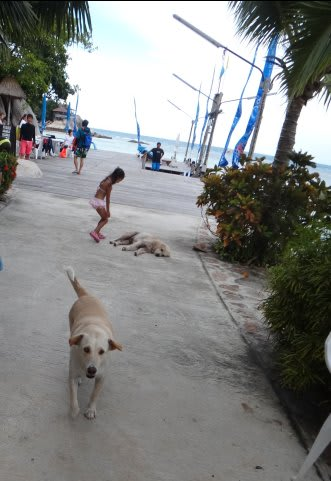
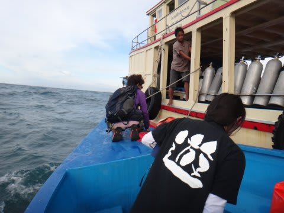
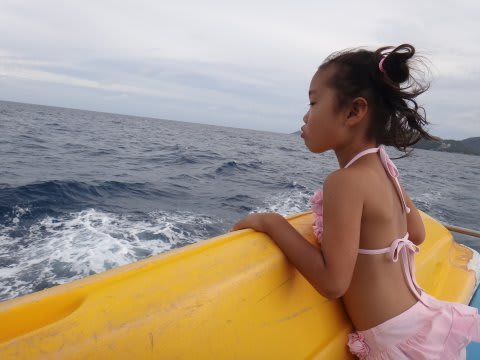
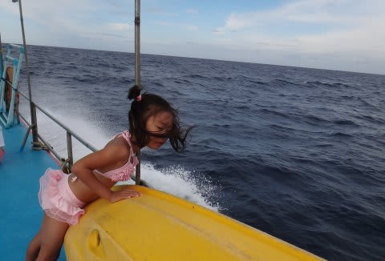
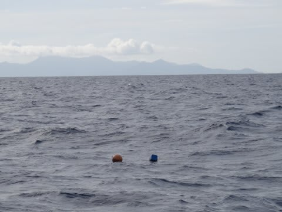
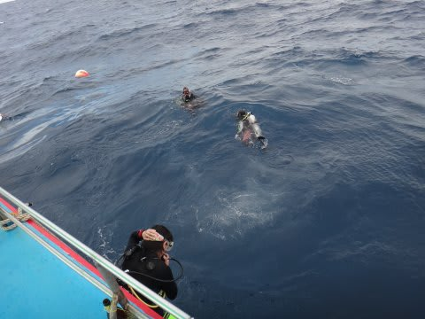
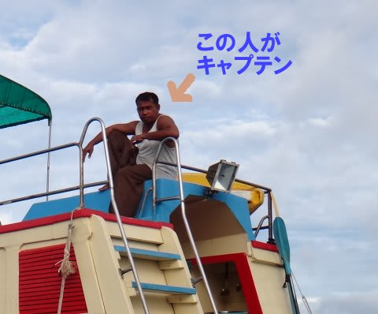
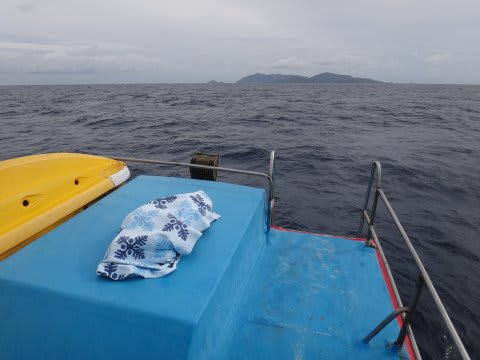
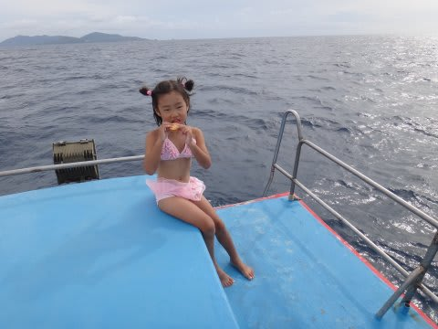

# 2013年9月　子連れタイ・タオ島ダイビング旅行記　その16　3日目スタート

📅 投稿日時: 2013-10-30 00:21:24

「季節感を失う」と，もっぱらのうわさのこのブログ．←誰がうわさしてるんだ？

昨日までは雪国だったのに．

今日はまた，南国のレポートに行くのだ…

---

…3日目の，朝．

うーむむ．

今日も，天気は良くないですな…

いつも通り，朝8時にダイビングの桟橋に集合．

そしていつも通り，水上タクシーで本船へ向かいますが…

うーむ．

うーむ．

今日も波が高いんですが…

高い波のせいで，3日連続で外洋に出れなかったら，

残る滞在期間はあと2日．

…ジンベエを見に，わざわざここまでやって来たと言うのに．

このままジンベエを見れずに帰ることになるのか？？？

と，思っていたところ…

ガイド「今日はぎりぎり，外洋に出れそうです～っ！！」

をををっ！！！

やったーっ！

ガイド「サウスウエストピナクルに向かいます～！」

…って．

…うーむ．

確か，タオの外洋のポイントは．

セイルロック，チュンポンピナクル，サウスウエストピナクル

…っていう3ポイント．

その3つのポイントのうちで，サウスウエストピナクルは，

最もジンベエが出る確率が低いポイントのような気がするのだが…

まぁ．

外洋に出れるだけラッキー！

…と，前向きに捕らえよう．

3日連続内湾のポイントだったら，暴れだすところ．

ガイド「外洋に出れるぎりぎりの天気なので，揺れま～す！」

…言われなくても，こんな感じで強風で揺れてますので，分かってますが…

…まぁ，外洋に出れるなら，許そう．

ってことで．

波しぶきを上げながら，激しく荒れる海を進むこと1時間弱．

周りに何もないところで，船は停止しました．

…うーむ．

ブイが浮かんでいるので，どうやらここが潜るポイントのようです．

で．

1本目は，私が留守番で，妻が潜りに行くことに…

妻「いってきまーす！」

ってことで．

留守番の娘に見送られて，妻は潜っていったわけですが…

…そういえば．

今回．

娘が，船のスタッフに慣れてくれれば，

娘をボートスタッフに見てもらって，夫婦で潜りに行ってもOK！

…って，ショップの人から言われていたけど．

今回，残念ながら娘は慣れてくれなかったんですね～（涙)．

いや，タイ人のスタッフはみんなやさしい人だったんですよ．

特に，キャプテンは娘にお菓子をくれたり，すごく優しく

してくれたんですが…

…このキャプテン．

見た目がかなりイカツイ感じだったので．娘はなぜか

怖がってしまって…

ホントにこのキャプテン，いい人だったんだけどな～．

…残念っ！

ということで．

私が娘と揃ってお留守番なわけですが．

…今日は，ちと波が高くて，小さな娘が船の周りで泳ぐのは

「泳いで遊ぶ」

というより，

「命をかけてのチャレンジ」

になってしまうので．

ひたすら船の上で暇をつぶすしかありません…

だもんで．

お昼寝したり…

お菓子食べたりして過ごしますが．

あーーー．

ヒマだ…
