# 志賀高原中央エリアの春営業情報が出たよ…そして3月17日(金)の志賀高原スキー場特派員情報は，雪解けが進んだっぽい感じ(涙)

📅 投稿日時: 2023-03-18 02:24:07

えー．

今週末も，当然のごとく志賀高原に行く

つもりでいたのですが．

ええ．少なくとも水曜日までは，

行く気マンマンだったんですが…

仕事がご無体のため，今週末は

スキーに行けません

繰り返します．

仕事がご無体のため，今週末は

スキーに行けません（涙）

ただでさえ忙しい年度末に，昨日・今日で

謎のレポートやら雑誌記事やらの仕事が

突っ込まれて…

今週末の志賀高原，諦めました…(激泣)

それどころか，21日も無理っぽい（涙）

あまりにも時間が無くて，講演や原稿は

全て断っていたのに，このくそ忙しい

年度末に限って，狙ったように

断れない系がやってくるとは…

とりあえず，心が狭い私としては．

この週末の志賀高原に，

天気が悪くなる念波

を最大出力で送りたいところ…

だけど．

志賀高原，今は雪が降ってるみたいです！！

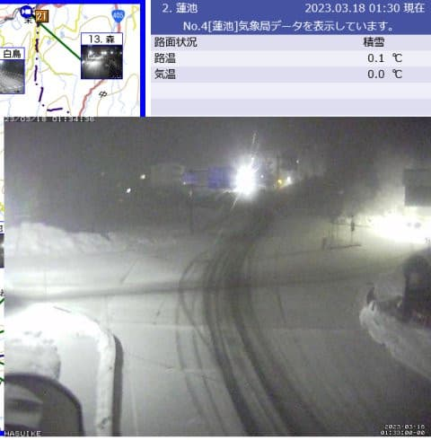

（[北信建設事務所道路気象情報カメラ](http://hokushin.pref-nagano-roadcamera.jp/)より）

…これ．

気温がちょうど0℃程度なので，かなり

重い湿った雪ですが…

明日の朝までに，10~20cm積もります．

そして，明日は一日雪降りで，

昼間だけでも10cmくらい積もるかな？？

土曜は結構重い雪が降り続け，土曜は

荒れ荒れゲレンデになりそうだけど．

日曜は晴れて，土曜の雪が圧雪された

最高バーンになるんじゃないかな…

…いや．

大丈夫．

私が念波を送るから，日曜は突如台風1号が

発生して，志賀高原を襲うんじゃないかな…←ありえないから

ってなことで，本題へ…

行く前に．

本日17日金曜の，志賀高原特派員情報！

今日も志賀高原へ忠誠を誓った特派員が，

レポートを送ってくれました～！！

まず，あさイチはガスで始まったらしい焼額．

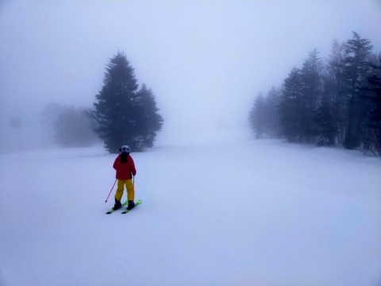

あさイチは一応マイナス気温．

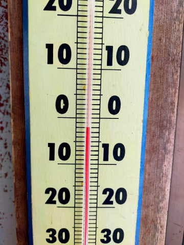

…でも，夜中に雨が降ったのか，朝から

緩めながらも，滑りやすく板が走る

ザラメ雪だったようで…

そして，すぐにガスも上がって，日が射す

ようになってきたようです！

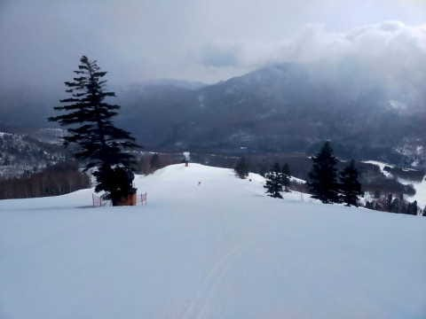

ただ，午前中から気温はプラスになっちゃった

ので，雪はすぐに緩み始め…

日当たりの良いゲレンデは，重いザブザブ雪に

なっていったようです（涙）

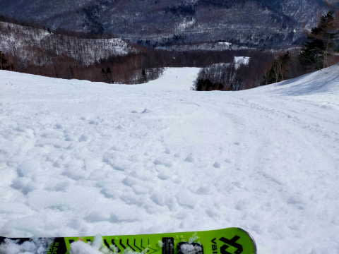

そして…

ついにコースのところどころに，

偉大な大地が顔を出してきました…（激泣）

これは，焼額のブナコースみたいですが…

まだ3月ですよ！？

3月半ばに，早くも土が出始めちゃったん

ですか…???（涙）

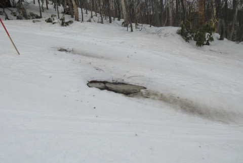

でも，標高が高い寺小屋は，多少緩んでは

いたものの，昼過ぎくらいまではフラットで，

板も走るいいコンディションだったみたいで．

楽しめたようです…！

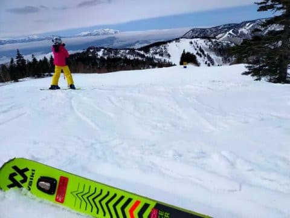

">

結局，今日も昼間はずっとプラス気温で．

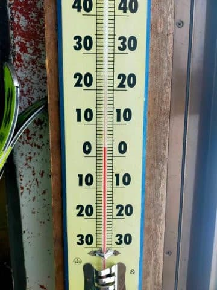

やはり夕方はザブザブ雪が荒れた凸凹バーン

になっちゃったみたいですが…

今日は貼りつき雪にはならずに済んだようです…！

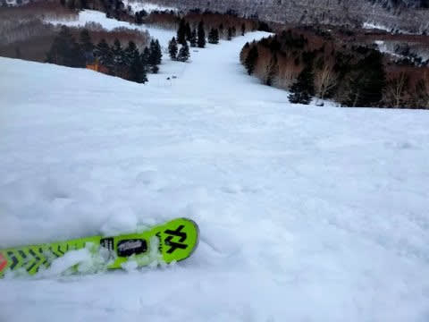

…しかし．

とても3月中旬の志賀とは思えない雪質…

普通は3月17日前後なら，志賀高原は

[こんなコンディション](ef020c2ed0e0e4b9d501faff5e3c7eb57.md)で滑れるはずなん

だけどな～…（涙）

だめだ…

今シーズンはダメっぽい…

ってな感じで．

志賀高原にも，悲しいことに春の雪解けが

着実に迫ってきてますが．

この春の志賀高原中央エリアの春営業

案内が出てました～！！

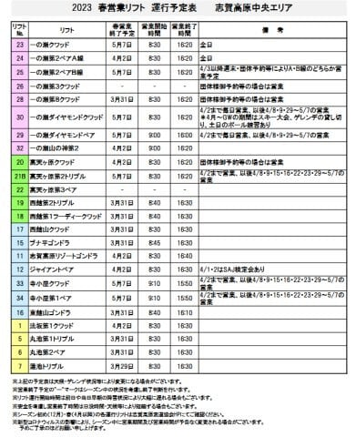

（[志賀高原中央エリアホームページ](https://shigakogen.co.jp/archives/14880)より，以下同）

まずは，標高の低い蓮池・丸池エリア．

サンバレークワッドが4/2の週末まで

営業しますが，それ以外は3月末で

終了ですね．

まぁ，例年通り．

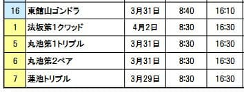

そして，西舘・ブナ・ジャイアントエリアは…

ジャイアントとパルスゴンドラ（リゾートゴンドラ）は

4/2の週末まで，

それ以外は3月末で終了．

これもだいたい例年通り．

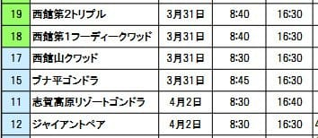

ってなことで．

一の瀬より下のエリアは，例年通り，

サンバレークワッド・ジャイアント・パルスゴンドラ以外は

3月いっぱいで終了

です…

で．

寺小屋は，GW終了の5/7まで営業．

ただ，4/2以降は週末とGWのみの

営業で…

ここも例年通り．

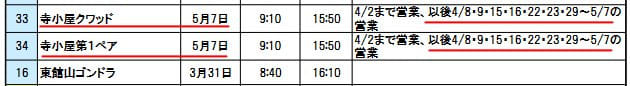

一の瀬エリアは，

一の瀬のクワッド＆ペアと，ダイヤモンドのクワッド＆ペアが

GWまで営業です…

ダイヤは4/2以降は週末のみです．

そして，山の神は4/2に終了．

今年も焼額と一の瀬が行き来できるのは，

4/2で終わりです…（泣）

で．今年はタンネの森の第8クワッドも，

3月末で終わっちゃうのね…（涙）

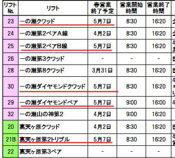

と，見ていたところ…

…

え！！？？？

なに？？？

高天ヶ原クワッドも，4/2に終わっちゃうの！？？

そして，GWまで動くのはトリプルだけ？？？

え？？

昨シーズンまでは，GWまでクワッド営業

してくれたよね…！？？？

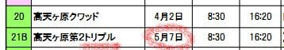

…これ，間違いなんじゃないかな？？

高天ヶ原クワッドがGWまでで，

トリプルが4/2まで営業の

間違いじゃないかな…？？？？

うーん．

ホントにクワッドが4/2に終わると，

かなり痛い…

でも．

それ以前に．

ホントに今シーズンは，GWまで滑れるのか？

という，限りなくリアリティが高いリスクを

目の前にして．

とりあえず，

5/7まで動く予定のリフトが，予定通り

最終日まで営業できますように

と，全力で祈り続ける，Skier_Sだったのでした…

## 💬 コメント一覧

### 💬 コメント by (レインボー75)
**タイトル**: Unknown
**投稿日**: 2023-03-18 16:02:30

土曜日の志賀高原情報

湯田中は朝から雨。ニゴンパークはベタベタの雪20センチ。重そう。勿論太板。

ストップ雪を心配していたけど、朝イチの白樺は意外と滑る。唐松も快適。えきっぷさんの試乗会で時間を潰していたら、一気にぼこぼこ雪に！

昨夜の宴会で睡眠不足の老人は、いさぎよく早期終了。あんな雪は身体に悪い。

明日です。

### 💬 コメント by (3年前から読ませてもらってるものです)
**タイトル**: Unknown
**投稿日**: 2023-03-18 19:51:54

明日志賀に行く予定で、子供とSさんを探そうと言っていたので残念です

### 💬 コメント by (Skier_S)
**タイトル**: 今日は良くないコンディション
**投稿日**: 2023-03-19 03:06:36

＞レインボー75さま

今日は残念なコンディションだったみたいですが，宴会は盛り上がったみたいですね．

明日はいいコンディションになりますよ！！

＞3年前から読ませてもらっているものですさま

残念ながら，明日は志賀高原にいません…

ホントに残念です…

またの機会に志賀にお越しになることがあれば，その際はぜひ！

