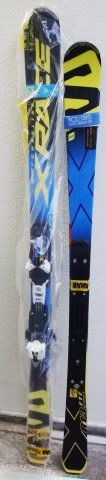

# 物欲選手権の裏側…2016モデルのSALOMON X-RACE 175cmを買っちゃった心境とは？

📅 投稿日時: 2016-10-04 01:40:22

🏷️ カテゴリ: [スキー雑談](c1f9d2cb7478308da16419928ea3945e9.md)

えー．

みなさんご存知のように．

ええ．

負けましたよ．

物欲に．

[見事な完敗](e7e02015f03823884a3522a56c651a398.md)っぷりでしたよ．

ってことで．

なぜか，今．

わが手元に，昨シーズンモデルの

X-RACE 175cmがあるわけですが．

いや，

大回り用の板．

昨シーズンまで2シーズン，X-RACEの165cmを履いていて．

かなりの張りの強さと異常なほどにしっかりした

エッジグリップで．

スピードをガンガン上げていっても

「板が逃げていく」

「板が叩かれる」

「板が窒息する」

ような感じがなく．

普通の板だと

「これ以上，スピードを上げられない…」

と思うようなスピード域でも，ばっちり安定していて．

どこまでもスピードを上げたくなるような．

そういう，かなりハイレベルなスピード耐性を

備えた危険な板だったわけで．

…チョ～気に入っていたわけですね．

で．

普段履きのSXに比べ，出動頻度が低い大回りの板．

「まぁ，3シーズンは持つよね…

　持つ．

　いや，持つはずだっ！！！！」

と，強く自分へ暗示をかけて．

…来シーズンもこの板を大回り用で

活躍させる予定だったんですが…

ただ．

いつものお店で，メイン板であるSXをチューンナップに

出したついでに．

昨シーズンモデルのX-RACEの175cm，在庫があるかどうか

確認したところ…←ここですでに負けの予感

店員さん「175cmですか？あと1セットありますよ」←…極めて危険な一言

…

…あ，あと，1セット…？？（ぴくぴく）

でも．ビンディング無しで売ってくれないよな～．

今のX-RACEからビンディングを移植すれば

安く上がるんだけど…

他の店では全部断られちゃってるし…

店員さん「ビンディング無し？いいですよ

　だと，○×▼◇円ですね～」

…！！！！！！

…な，な，なんと！！！

他の店ではすべて断られた，ビンディング無しで

買えるとはっ…！！！！

今のSXも，他の店ではすべて断られた

[ビンディング無しでの購入](e6abe5073a6309ba96beb83bbb4b9aa25.md)を逆にお店から提案され，

予想以上に安く買えたという経緯で，

このお店で買ったんだけど…

やっぱりこのお店…

ビンディング無しで売ってくれるんだ！！

…ってことで．

旧モデルということもあり．

ビンディング無しで，板だけの定価の半額近く，

ビンディング付きの今シーズンモデルから

考えると，ありえないくらい安いお値段を

提示されてしまったので．

ついつい，1秒で即決してしまったのでした…

まぁ．

…2017シーズンモデルのX-RACE SW．

いい板だけど，

ビンディングも板の張り・強さを感じられる

X12LABを選べず，弱いZ12しかつけられないなど．

「どこまでスピードを上げても耐えられる」

過激さがなさそうな感じで．

うーむ．

今シーズンは大回りの板を買うことはないだろうなぁ…

でも．来シーズンに買うとしたら．

X-RACE GS LAB MASTER 175cm＋X12LABか？？

…でも，定価16万円コースで，買えるわけないし…

…とか，つらつらと考えていて．

今回．

むしろ欲しかった旧モデルがビンディング抜きで

安く買える…とあれば．

もう，

在庫のある今のうちに買ってしまえっ！！

ということで．

想定外に買ってしまったのでした…←いや，繰り返し言うけど．

　想定外だったのは自分だけだってば…！！！

ってことで．

2シーズン履いた2015モデルのX-RACEから

ビンディングを移植しました～！

いやーーー．

でも．

気のせいでなければ．

2シーズン使った，旧X-RACE．

なんだか，新品の時のグリップ．高速耐性が

落ちてきているような気がして…

最近，大回りも引っ張れなくなってきたし．

まぁ，買い替え時だったのかな～！

…いや．きっと．

買い替え時だったに違いないっ！！！←と，自分に言い訳してみる

ということで．

物欲選手権の舞台裏，

「その時，Skier_Sは何を考えていたのか？」

の解説でした～！

## 💬 コメント一覧

### 💬 コメント by (まいる)
**タイトル**: 私はまだですが、
**投稿日**: 2016-10-04 17:06:02

Sさん、お疲れさまです。

私は、物欲選手権にまだ未参戦で、登山モードのままです。そろそろ、神田スポーツ祭りがあるので、覗きに行ってみようと思います。

スノーボードの場合、テクニカル用(moss、オガサカとか)は、あんまり売ってないのですが

### 💬 コメント by (Skier_S)
**タイトル**: まいるさま
**投稿日**: 2016-10-05 02:47:17

おっと．

もうすぐシーズンインですよ！！

準備しないと…

しかし，今年は登山モードも，

雨ばっかりでたいへんじゃなかったですか？？

