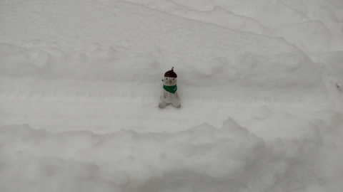

# 今週末も志賀高原で滑ってます～！28日(土)は冷え冷え終日雪降り，29日は雪が降ったり晴れたりかな…

📅 投稿日時: 2023-01-28 00:20:35

本日の志賀高原ですが．

あまり積もらないかな，と思ったところ．

朝は駐車場で7～8cmくらい積もって

いたとの特派員情報が送られて

きました～！

そして，あさイチの気温は-10℃と，

ここは予想ぴったり！！

天気は曇り．朝9時過ぎに一瞬日が

さしたみたいですが…

後は基本的に曇り，時折雪も

ぱらつくこともあったようですが．

まぁ，

　朝は曇り．もしかしたら　

　朝のうち一瞬晴れてるかも？？

というのも，ほぼ予言レベルで

当てたのかな…（自画自賛）

そして，午後は予想通り雪も降る

天気になってきたみたいですが…

西舘なんかの標高が低いところでは，

下地の硬いところの上に，新雪は

薄っぺらくしか積もってない感じで，

うーん．

火曜から結構積雪があったみたいですが，

そこまで新雪は深くないのかな…

でも，一の瀬より標高が高いところは

そこそこ積もってるはず…

ってなことで．

明日からの週末．

こんな時間ですが，何とか無事仕事は

終わったので．

今週も，土日とも滑りに行けます～！

（来週はヤバそうだけど…）

で．

深夜12時現在．

上信越道は坂城から北でチェーン規制に

なっているようで．

昨日，

　高速道路も，横川あたりからチェーン

　規制って程は降らなさそう．

　坂城ICから更埴付近からチェーン

　規制かな…

と書いたのが当たってますね．

おそらく，このまま坂城からのチェーン規制が

伸びも縮みもせず，明日の朝まで続くんじゃ

ないかな…

中央道は小淵沢からチェーン規制ですが．

西日本はヤバいよ…と言った通り，

名神高速は八日市～関が原ですでに

チェーン規制．

京都東から大津も，積雪が始まっている

ようなので…

チェーン規制はさらに伸びていきそう．

西日本からお越しの方はご注意を！！

で．

明日の土曜は概ね予想通り．

28日（土）朝は20cm～40cmの積雪，

　圧雪バーンでも朝は10cmくらいの軽い雪が

　圧雪の上に乗っている状態．

　あさイチは-15℃まで冷えるよ！

　そして，昼間も-10℃を上回らず，

　雪が降り続けそうなので…

　午後はちょっと雪が弱まりそうですが，

　根性の無いスキーヤーはふるい

　落とされる天気．

　午後はバーンがモサモサに

　荒れてくるかな…

29日（日）朝は積雪10cmほど？

　あさイチは-13℃程度．

　圧雪バーンは柔らかシマシマ！

　もしかすると圧雪の上に1cmほど雪が

　被ってるかも．

　昼間は基本的に曇りだけど，

　雪が降ったり晴れたり

　目まぐるしい天気．

　バーンは柔らかめだけど，トップ

　シーズンの志賀高原らしい，

　雪質最高のいい日．

って感じです～．

さて．あと3時間後に出発．

また2時間半しか寝れない…（涙）

とりあえず，志賀高原でお会いしましょう～！

## 💬 コメント一覧

### 💬 コメント by (副院長)
**タイトル**: Unknown
**投稿日**: 2023-01-28 08:16:15

S様西日本情報ありがとうございます。24日の10年に一度？を経験しても全く懲りずに明日、また上がります。

### 💬 コメント by (スキーヤーT)
**タイトル**: Unknown
**投稿日**: 2023-01-28 19:34:12

エキップさんはテックビンディング対応の山ブーツあるんですね。このブログを見てアルペンのブーツをエキップさんで購入しまして、いつも情報ありがとうございます！

### 💬 コメント by (かず)
**タイトル**: Unknown
**投稿日**: 2023-01-28 20:03:21

今日も会えず  ウェア変ったとブログ見たような  それは分かりません  僕は上は同じです

### 💬 コメント by (Skier_S)
**タイトル**: 今日は予想よりいい一日だったよ！
**投稿日**: 2023-01-28 23:26:21

＞副院長さま

明日は今日よりはましな状況かと思いますが…

まだチェーン規制も残ってますし，気を付けて来てください！

＞スキーヤーTさま

そんなに種類があるわけではないですが，テックビンディング対応ブーツもあるようです…

エキップさんのブーツ，かなり良かったんではないでしょうか．

気に入ってもらえたらいいのですが…

＞かずさま

ウェア変わってます～！！

でも，動きを見ればすぐわかるようです(笑)

ほとんどの人がすぐに発見してくれてます

