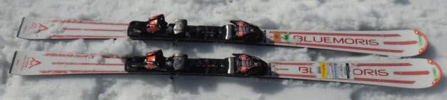
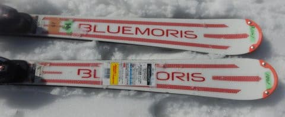
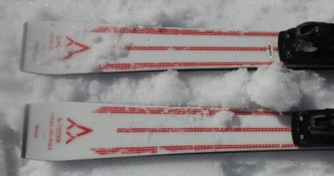
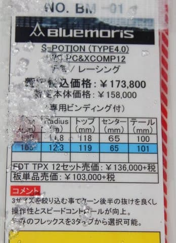
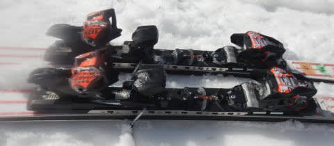

# 2023シーズンモデルのスキー板，試乗レポートその33…Bluemoris S-POTION TYPE4.0

📅 投稿日時: 2022-07-27 01:36:46

そろそろスキーシーズンも終わり．←もう終わって一か月以上経ってる．

ほとんどの人はすでにスキーシーズンは記憶の彼方だから

スキー板試乗レポートもこれがラストになります…

ってなことで．2023シーズンモデルのスキー板試乗レポート．

最終回は，ブルーモリスです．

では，どうぞ～！

○Bluemoris S-POTION TYPE4.0 Marker WC PC & XCOMP12 165cm

基礎小回り用

どうやらこの板，フレックスが4.0，4.5，5.0から選べるようで．

数字が小さいほうがフレックスが硬いらしく．

さらにビンディングが

チロリアのWC PCプレート付きのXCOMP12か

FDT TPX12化を選べるようで．

（ビンディング無しも可能）

…この板は，フレックス4.0で．

さらにごついピストンコントロールプレート

（PCプレート）がついてるので…

S-POTIONでは一番強い組合せに

なりますね．

ってなことで．

滑ってみると…

結構芯がつよい，ガッチリした感じの

板に感じます．

さすがにフレックス最強，WC PCプレート

付きって組合せだけあって，

板の硬さを感じます．

そのため，板が谷回りで勝手にたわんで

自動的にターンに導入されていく…

というよりは，自分で板を動かして

谷回りのきっかけを作っていくという，

上級者の熟練の技が必要な板です．

春先の柔らかくて足元が崩れるような

雪だと，板がたわませられず，山回りも

単にサイドカーブに乗ってまわって行く

だけのような感じに近くなっていきますが…

雪がしっかりした部分だと，ぐっと

圧をもらえて板の性能が発揮されます．

ただ，そこでも板が勝手にまわって行くと

いうより，しっかり板の上に乗って，

板を正しく踏んであげればググッと

回ってくる感じ．

あまり圧をかけなくても，サイドカーブで

それなりにまわって行ってくれますが…

この板の本領を発揮させるには，

しっかり正しい方向で強い圧をかけて行く

必要があります．

それができれば，ズレ・キレのどちらでも

板が雪面からの圧を受け取ってくれて

コントロールできる，玄人好みの板です．

カービングギンギンの板ではなく，

正しく踏んで行けば切ってもずらしても，

板が雪面の圧を受け取って回って

行きます．

ある意味，かなり攻めのズレも使えそうな板．

お気楽板ではなく，かなり玄人好みの

職人的な板だと思います．

ただ…

フレックス4.0だとかなり乗り手を

選びそうだし．

フレックスを選ぶ時は注意した方が良さそう．

春雪で乗った感じだと．

私はフレックス4.0より，もう少しお気楽な

板がいいかな？
