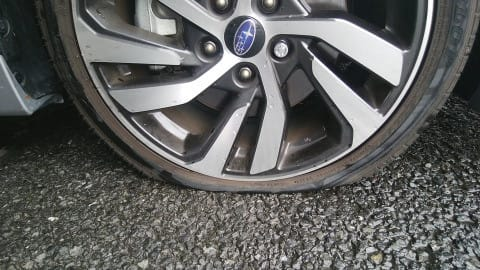
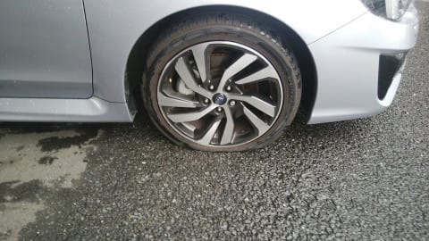
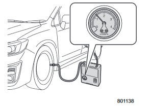
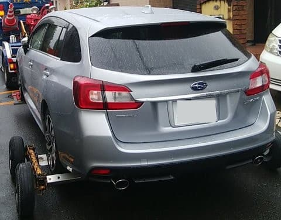
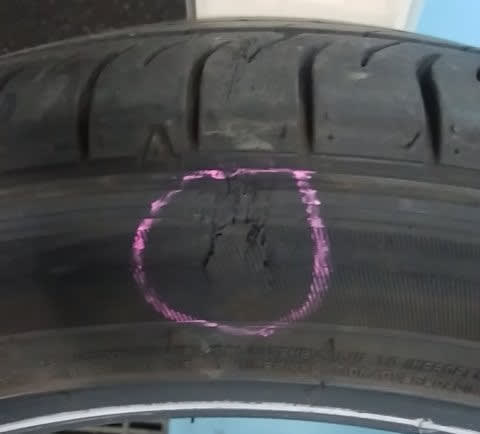
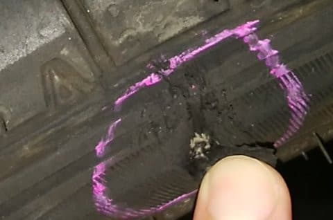
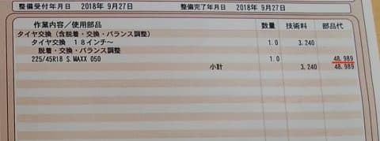
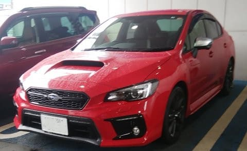

# うぎゃーーー！購入わずか2か月で，LEVORGのタイヤをパンクさせちゃった…！！（涙）

📅 投稿日時: 2018-09-28 03:41:24

えー．

そうです．

そうなんです．

やっちゃったんですよ．

いや，通勤で毎日走っている，VMG LEVORG君．

我が家近辺は狭い道が多く．

すれ違いが困難な道をしばらく通るのですが…

向かってきた対向車を避けるため，

路肩に乗り上げたその時．

路肩の段差に，タイヤのサイドウォールが

当たったなぁ…

と思いながらも．

段差を乗り越える際には仕方のないことで．

いつも通り，何気なく対向車をやり過ごしてから，

走り始めたところ．

そのあと，数100mも走ったところで．

「あれ？ハンドルが取られる…！」

これは．

もしや．

パンク？

さっき縁石に乗り上げた時？？

とりあえず．

すごい狭い道で，途中で止まると車が詰まって

大変なことになってしまうので．

ハンドルが取られる車をだましだまし，

ちょっと車が止められるところまで走らせて．

で．

車を降りてみたところ…

…がびょーーーーーーーーん．

もう，完全に空気圧0，

パーフェクトなパンクチャーです（涙）

なんてこった～～～っ！！！！！

見たところ，サイドウォールも傷ついてないし．

トレッド面も無事っぽい．

でも，一気に空気が抜けてるから．

さっき縁石乗り上げた時，リムでもぶつけて

ビード外れかけたとか？

うーむ．

そんなことは無いだろうなぁ…

うーん．

運が悪い…

さらに運が悪いことに．

この車．

スペアタイアレスじゃないか！

スペアタイヤを積んでたら．

なにも悩むこともなくスペアタイヤに履き替えるんだけど…

パンク修理キットしか積んでないよ（涙）．

パンク修理キットのパンク修理剤って．

これ使うと，タイヤの再利用不可能になるんだよな…

穴埋めで修理できるようなパンクの場合でも．

パンク修理剤を入れたタイヤは，捨てる

しかなくなるんだよな…

おそらく．

数100m走っただけで空気が抜けるレベルだと．

パンク修理剤では直せない穴が開いたか，

パンク修理剤でどうのこうのというトラブルでは

無い気がする．

ここで何も考えずに，パンク修理剤を入れると

修理剤もタイヤも無駄にするだけだな．

とりあえず，パンク修理剤を入れる前に．

パンク修理キットに着いてきたコンプレッサーで

空気を入れてみて．

どのくらいのスピードで空気が漏れるかを確認して．

漏れ速度が遅いようなら，パンク修理剤を

使ってみようか…

と，パンク修理キットに入っているコンプレッサーで

空気を入れてみたけど．

（パンク修理キットのコンプレッサーの図…[LEVORGマニュアル](https://www.subaru.jp/afterservice/tnst/levorg/pdf/A1730JJ-A.pdf?downLoaditemRadio=&downLoaditemRadio=pdf%2FA1730JJ-A.pdf)より引用）

もう，漏れ速度云々というより．

全く空気が入る気配がありませんな（激涙）

こんな状況だったら．

パンク修理剤はなんの役にも立たないよな…

この時点で．スペアタイヤレスのこの車．

自走不能決定（泣）

あぁ…

これまで乗ってきた車，全てスペアタイヤが

着いてきたのに．

スペアタイヤがあれば，自走できるのに．

まさかスペアタイヤレスの車に乗ってわずか

2か月で．

こんな目に会おうとは…

と，自分の不幸を嘆きながらJAFを呼ぶ私．

そして，会社へ遅刻の連絡やら仕事の電話やらを済ませ．

待つこと1時間．

JAFさんが到着！

JAFのサービスカーに乗っていた強力な

コンプレッサーで空気を入れてみたけれど…

やっぱり全然空気が入らず．

確認してみたところ…

タイヤ内側のサイドウォールから

盛大に空気が漏れていることが判明．

う，内側かっ！！

それは気づかないわけだ…（涙）．

サイドウォールの穴ってことは…

穴埋め修理不可能ですね（激泣）

タイヤ交換確定ですね…

ってことで．

この車を買ったスバルディーラーへ

引っ張られていく，我が車…

今回やってきたサービスカーが

車両積載車じゃなく，普通のレッカー牽引車

だったので．

センターデフ付き4WD車をどうやって牽引していくんだろう？？

と気になってたけど．

後輪をこんな台車に乗っけて，4輪浮かせて

牽引していくのね…

ってことで．

不幸中の幸い，自分が車を買ったディーラーから

わずか1kmほどのところでパンクしたので．

直ちにディーラーへ送り込まれた，我が車…

外したタイヤを見てみると．

内側のサイドウォールに，

かなりひどいヒット傷が…

この傷．

単なる傷じゃなく．

ゴムがめくれてしまっていて．

下地のカーカスが見えちゃって

ます…（泣）

もう，パンク修理剤で自走できるレベルの

傷じゃなかったですね…

ディーラーさん「これは修理不能ですね…」

私「まだ4000kmしか走ってないタイヤなのに…（泣）」

ディーラーさん「まだそれほど走ってなくて，他のタイヤも

　減っていないので．1輪だけ交換をお勧めしますが」

私「そうですね…まだ新しいタイヤなので，

　さすがに4輪交換は無いですね」

ディーラーさん「1輪交換のお値段は，このようになります」

！！！！！！！！！！！！

タ　イ　ヤ　1　本　4万9000円　っ！！！

がーーん

がーん

がーん

...

高い…

純正タイヤ，高いよ…（激烈な勢いであふれ出る涙）

かといって．

1輪だけ違うタイヤを履くわけにもいかず．

安いタイヤ4本買いかえたとしても，これより

高くつくわけで．

…これが一番安い解決策なのか…（滝のように流れ出る涙）

ってことで．

ちょいとした不注意で，このくそ忙しい時期に

仕事を半日休んだ上に．

思わぬ出費となってしまった今回．

あぁ…

痛い…

痛すぎる…

しかし．

スペアタイヤレスで．

18インチの45扁平という，すごい高いタイヤの車に

買い替えたとたんに，これだ．

今回は運が悪すぎる…（泣）（泣）（泣）（泣）

せめて．

今回．

車やホイールには傷も何もなくて済んだので．

良かったと自分に言い聞かせよう…

そして．

タイヤは在庫がなく取り寄せで翌日修理となり．

そのための代車としてWRX S4 GT-S D型が借りれたので．

こいつで少し遊んで，気を紛らわせましょうか…

普通はパンク修理では代車を出してくれないらしいけど…

さすがに2か月前に車を買ったばかりなので，配慮して

くれました．

ディーラーさん，ありがとうございます…

## 💬 コメント一覧

### 💬 コメント by (yumi)
**タイトル**: 気持ち分かるぅ～😭
**投稿日**: 2018-09-28 17:49:50

Ｓさぁ～ん😱👻👽

かわいそうなレヴォくぅ～ん😹👾🤖

私も同じような経験が有りました💧

悲しい😢💦ですよね💧

さすがに外側でしたが、会社近くだったので、 がったんゴットンと情けなぁ～く出勤した覚えが・・・

タイヤ一本って、びっくりするほど お高いですよね💧

### 💬 コメント by (つーちゃん)
**タイトル**: (ﾟдﾟ)！
**投稿日**: 2018-09-28 19:30:20

オプションでも良いからやっぱりスペアは欲しいですよね

修理するにしても注入するタイプの修理材は使いたくないですし。。。

それにしても純正タイヤとD工賃はお高いですね

スタッドレス１セット買えそうです

夏タイヤなら工賃込みでお釣りが来そうです(笑)

### 💬 コメント by (kiteholic1)
**タイトル**: Unknown
**投稿日**: 2018-09-28 19:55:33

こんばんわ。

サイドウォールのパンクは痛いですねぇ！

っていうか、タイヤ代高くないですか？

私もサイドウォールヒットでパンクさせた時に補修剤ではどうにもならず、大変な思いをしました٩( ᐛ )و

なので、私のvm4とbs9は夏はスタッドレスを冬は夏タイヤをスペアとして積んでいます。

重量重くなって燃費が違うのかもしれませんが、スペアタイヤが無いのはもう嫌と思い、積んでます。純正のテンパータイヤも無駄に高いし…

ご参考までに。

### 💬 コメント by (Goku)
**タイトル**: 痛～(>_<)
**投稿日**: 2018-09-28 19:59:51

これは不運としか言いようがありません。

確かにあの辺りの裏道はかなり狭いですよね・・・

でも、ボディーやホイールまでいかなくてホント不幸中の幸いだったのかも。

私もフォレスターが今までより少し車幅が広いので、狭い道のすれ違いで結構冷や冷やしますが、左ミラー下に付いているカメラが思いのほか役に立っています。

スペアタイヤがないのも考え物ですね。

それにしても純正タイヤ、高！！！

### 💬 コメント by (はなげ親分)
**タイトル**: あちゃー！
**投稿日**: 2018-09-28 21:48:20

心中お察し申し上げます。

私も以前、1号トンネルでスピンして縁石に当りタイヤがオジャン（古っ！）になってしまい、スペアタイヤに救われた経験がありまして、現在のレヴォーグ購入時に当然のようにオプションにてスペアタイヤを装着しています。

以下の私の残念な過去をみてお気持ちを静めていただければ幸いです・・・

①　初めて新車で購入したスプリンターカリブは、購入後２ヶ月でかみさんを自動車学校に送った駐車場にて右後輪を脱輪、後輪後ろをボッコリへこませました。

②　次に購入したマークⅡクオリスは購入後１ヶ月、立ち食い蕎麦屋の駐車場にて、とまっていたトラックと接触して右ドアミラーが脱落！

③　次のアウディは購入後４ヵ月後にヤケビの駐車場にて、板のテールで（たぶん）引っ掻かれたような傷が左後部に・・・

１年後には、右前のドアに蹴飛ばされたような大きな凹み！

④　現在のレヴォーグは購入後３ヶ月で一の瀬のホテルの駐車場でドアを当てられたようで左ドアに浅いへこみが・・・（泣）

Ｓ様、気が紛れましたでしょうか・・・（笑）

### 💬 コメント by (ノムノム)
**タイトル**: 痛いほどわかります。
**投稿日**: 2018-09-28 22:04:30

Sさん

この度は運が悪かったですね。しかしOEタイヤは高いなぁ。ヤフオクでレヴォーグの純正外しタイヤをGetする方法もあるのですが、今回は時間的に厳しいですよね。スペアなしは考え物…。ちなみにS4はスペア積んでます。

### 💬 コメント by (しんちゃん)
**タイトル**: 心が痛い(+_+)
**投稿日**: 2018-09-29 00:20:11

しかし不運に見舞われましたね。

納車後たったの2か月なのに･･･

でもボディやホイールに大きな傷が無くてよかったですね。

レッカーで運ばれる愛車を見るのは切ない（涙）

### 💬 コメント by (Skier_S)
**タイトル**: みなさん，ありがとうございます…
**投稿日**: 2018-09-29 02:06:47

＞yumiさま

え？パンクしたまま会社まで走ったんですか？？

それはすごい…

でも．

純正タイヤ，予想より2万円ほど高かったです…（涙）．

おそらく，前のレガシィ君のタイヤならここまで

高くなかったと思うのですが…

＞つーちゃんさま

私もあれから気になって，スペアタイヤのオプションを

調べてみたのですが…

ホイールとタイヤセットで5万近くするようです（涙）．

ちょっと高すぎ…

どちらにしろ，LEVORGのタイヤは225/45R18

という

サイズなので，安いタイヤでも1本2万近くしますが．

でも，5万円は想定外でした（涙）

＞kiteholic1

もう，痛かったです…（涙）

純正タイヤ，こんなに高いとは思いませんでした（泣）．

…しかし，タイヤを常時トランクに積みっぱなしに

してるんですか！？？？

トランク，狭くなりませんか…

あと，ゴムのにおいが室内にこもりそうですね…

減りが均一になるように，時々スペアタイアと

他のタイヤを含めてローテーションしてるのでしょうか？

…とか，いろいろ気になります（笑）．

もしよろしければ，そのあたり教えてください．

＞Gokuさま

不運でした…

ってか，家のそばの道路，狭すぎです（涙）．

前のレガシィ君のリアフェンダー周りを擦ったのも

狭い道での行き違いでしたし…

しかし，スペアタイヤはあった方がいいな，

と思いました．

フォレスターもスペアタイヤレスでしたっけ？

＞はなげ親分さま

あ，スペアタイヤをオプションで購入されてるんですか！

調べてびっくりしましたが，かなりいい値段しますね…

でも，あった方がいいと思います．

これまで，50万km以上走って，一度もスペアタイヤを使う機会が

無かったのに．

スペアタイヤ無しの車に買い替えてわずか4000kmで

パンクしたことに，なにか神の悪意を感じるのは私だけでしょうか…

とりあえず，はなげ親分さまのコメントを読んで，気分を落ち着かせます（笑）．

＞ノムノムさま

いやーーー．

ホントに．

高すぎでしょ，純正タイヤ．

どこか安売り店を探そうかとも思いましたが．

緊急事態にはそこまで言ってられませんから…（涙）．

S4は純正でスペアタイヤなんですか？

それともオプション搭載でしょうか…？

＞しんちゃんさま

もう，不運です．

これまで50万km以上運転して，一度もスペアタイヤを使ったことが無かったのに．

まさかスペアタイヤ無しの車に買い替えたら，わずか4000kmで

パンクするとは…！！！

そして，スペアタイヤが常識の人間にとって，

パンクでレッカーを呼ぶことになるとは想定外でした．

JAFに入っていて，良かった～．

### 💬 コメント by (kiteholic)
**タイトル**: Unknown
**投稿日**: 2018-09-29 06:06:23

S様

1.夏タイヤシーズン→スタッドレス

   冬タイヤシーズン→夏タイヤ

   をスペアとして積んでいるので、ローテーションは考えなくて良いです。

2.トランク下部の補修剤やコンプレッサーがある部分の発泡を取り外せばタイヤ1本入りますよ。

隙間が出来るのでタイヤ固定しないとダメかな？と思いましたけど、雑多なものを入れたら動きませんでした。

タイヤは外側を下にして入れないと、コンプレッサー等が入らなくなります。その為、ホイルの傷防止の為にタオルを履いてお痛い方が良いですよ。

3.上記2番でタイヤを積んでトランクの板をすればゴム臭は私は気になりません。

子供達も臭いと言った記憶がないので大丈夫かとおもいます。

4.上記2番の雑多なものは、保険のためのチェーンと牽引ロープ、長いゴム手袋等です。

### 💬 コメント by (ノムノム)
**タイトル**: Unknown
**投稿日**: 2018-09-29 15:31:18

Sさま

S4は標準でスペアタイヤです。

当時のエコカー減税に適合させるため、重量をかさ増しするためにスペアを積んだみたいです。

最初は重量増になるので良い事無いな～と思ってたんですが、今回のSさまの出来事を拝見するとあって良かったなと考えさせられますね。

### 💬 コメント by (Goku)
**タイトル**: あった～
**投稿日**: 2018-09-29 19:58:37

フォレスターはスペアタイヤ付いていました。

それにして、同じメーカーでスペアを付ける付けないはどういう判断なのでしょうかね？

### 💬 コメント by (Skier_S)
**タイトル**: スペアタイヤを積むとパンクしないというマーフィーの法則になりそう
**投稿日**: 2018-09-30 01:17:55

＞kiteholicさま

あ，そういうことですか！

夏はスタッドレスを，冬は夏タイヤを1本，

スペアがわりに積むんですね…！

しかし，あのスペアタイヤスペースに，普通のタイヤが

入るんですね…

ちょっと試してみたい気がしています．

情報ありがとうございました～！！

＞ノムノムさま

あ，S4は標準でスペアタイヤなんですね…

スペアタイヤはあった方がいいですよ．やっぱり（笑）．

いや，私もこれまで50万kmお世話になったことがない

スペアタイヤ．

無くなって3000kmでこんな目に会ってしまったので．

ホントに，いつパンクしても不思議じゃないですから…

＞Gokuさま

さすがにオフロードも走る車は，スペアタイヤ搭載ですか…

だったら安心ですね！

やっぱり，オンロードメインの車は軽量化の意味合いもかねて

最近ではスペアタイヤレスに向かってるんでしょうね…

### 💬 コメント by (さい)
**タイトル**: さすSさん…
**投稿日**: 2018-09-30 18:47:40

こんにちはー

さすがSさんですね

最初、ニュースになってるｋ県ｓ市のタイヤパンク事件に

巻き込まれたのかと思い心配しましたが…

５万円…　板１セット買えそうな値段ですね

ﾂｷﾞﾊﾖｲｺﾄｱﾘﾏｽﾖ…ﾀﾌﾞﾝ

### 💬 コメント by (Skier_S)
**タイトル**: さいさま
**投稿日**: 2018-10-02 01:02:25

いや…今回は悲しい自損です（涙）

しかし．

わずかな不注意で5万円…

いや．ホントに5万円，板買えるのに…

板い．

じゃなく，痛い．

次はいいことあるように願いましょう…（泣）

### 💬 コメント by (ほっぽ)
**タイトル**: 私もパンク
**投稿日**: 2018-10-02 06:52:59

Ｓさん

私も25年以上JAFのお世話になっていない有料会員？でしたが

ここ数年でパンク経験２回、うち１回はJAFを呼びました。

アルファードでＳさんと殆ど同じようなサイドウォールを縁石に擦ってパンク、

スペアタイヤに交換して自走帰宅。

後日、ヤフオクで激安新品タイヤ２本買って交換しました。

私の時は２本で8000円でしたが、1本5万円近くはイタイ出費ですね。

レガシィも道路のイン側縁石に近づきすぎてヒットしパンク。

この時はJAF呼んでスペアタイヤに交換しました。

やはりスペアタイヤはあった方が安心しますね。

ヤフオクで中古のスペアタイヤをGETして積載する、

という方法は如何でしょうか？他の方の投稿を見る限り

タイヤを収納する場所は備えているように思います。

古いスバル車用だとPCDが100なので、

GDB-E型以降のインプレッサSTI用か、

最近のスバル車用を探す必要がありますが。

### 💬 コメント by (Skier_S)
**タイトル**: ほっぽさま
**投稿日**: 2018-10-03 03:17:03

2本8000円ですか…

そのくらいで済んでくれれば良かったのですが（涙）．

とりあえず，パンクして分かりましたが．

スペアタイヤが無いとちょっと辛いですよね…

LEVORGはPCD114なので，普通のスペアタイヤで

行けそうですが．

とりあえず，中古のタイヤが出ているかどうか．

探してみたいと思います…

### 💬 コメント by (Okirakuskier)
**タイトル**: 225/45 18 REVO GZ
**投稿日**: 2018-10-07 14:20:28

いつも楽しく読ませていただいております。

車を替えたので以前のスタッドレスが不要になりました。

12年製のrevo gzで古いのですが、サイズは225/45、18インチで、一万数千キロしか使っていないのでまだ使えると思います。

スペアタイヤとしても使えるかとも思います。よろしければ差し上げますので、廃棄せずにとっておきますが、いかがでしょうか。

### 💬 コメント by (Skier_S)
**タイトル**: Okirakuskierさま
**投稿日**: 2018-10-07 23:58:48

えええええ！

スタッドレス4本セットですか？

これは…LEVORGで履かれたタイヤでしょうか？？

ただ…大変ありがたい提案ですが，やはり12年製はちょっと

時間が経っていますし，LEVORGはスタッドレスが17インチ

