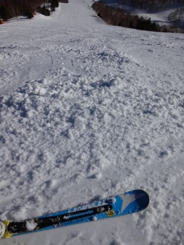
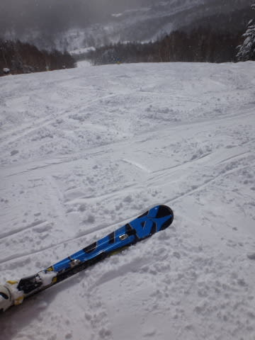

# ATOMIC Bluester DEMO SX（マイルド版）

📅 投稿日時: 2014-02-21 01:09:02

🏷️ カテゴリ: [スキー雑談](c1f9d2cb7478308da16419928ea3945e9.md)

えー．

先週末は，スキーに行ってないので．

スキー場レポートも書けず．

PCネタなんか書いてましたが．

一応．

ほら．

このBlog．

やっぱりスキーヤーBlogなので．

スキーネタを書いておかないと…

…ってことで．

ヘタってしまった…もとい．

今シーズンのフレックス，グリップともに強いBluester DEMO SXに比べると．

[多少マイルドな，昨年度のBluester DEMO SX](ef429e6264e79c420fc0cb4dc41634d6c.md)．

この，ヘタってしまったマイルドな方の板は，

もう，出番がなくなってしまうのでは…？

と，思っていたんですが．

この板．

まー，我慢できないほどズルズルってわけではなく．

「こーゆー板かな？」と思えば．

そのまま気づかず乗れてしまう程度のヘタリマイルド具合なので．

バーン状況が難しく，積極的にずらしを使っていきたいときとか．

娘と低速で滑るときとか．

こぶ斜面を滑るときとか．

…なんだか，ヘタってないフレックス強化版の今シーズンのSXより，

調子がいいんですね～．

いや，ホントに．

ずらしのコントロール性がよくなったSX，って感じで．

ずれるけど，最後の粘りとテールの張りを活かした走りを使えるので．

これはこれで，面白い板として楽しんでます．

うーん．

もとは同じ板のはずなのに．

2セットの板を性格の違う板として使い分けられるなんて．

一粒で2度おいしい感じですかね～←何か間違っている
