# 2月20日，土曜日の志賀高原は…曇り→強風→雪→曇り→雨

📅 投稿日時: 2016-02-20 23:41:23

🏷️ カテゴリ: [2016スキー滑走日記](c70c67ed5248e9432b899dcd5747048bb.md)

えー．

本日．

なんというか．

天気予想，外しました．

というより，予想を大きく超える激動の天気でした…

まず．

朝．

志賀高原に登ってくる朝イチに…

蓮池スキー場前で，すでに+2度（涙）

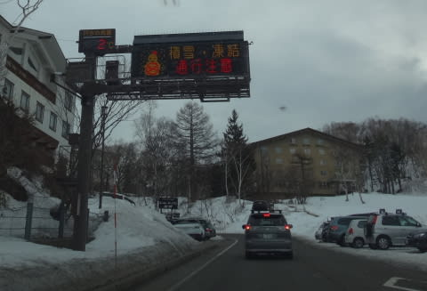

2月の朝イチで，プラス気温ですかっ！？？

路面にほとんど雪もなく，

とても2月の志賀高原の道路とは思えない…

＃いつも通り，トンネル内は凍っているので注意

まぁ，とはいえ．

ここまでは昨日までの予想通り．

で．

焼額に到着すると…

え？なに！！？？

第2ゴンドラと奥志賀ゴンドラ，強風で運休？

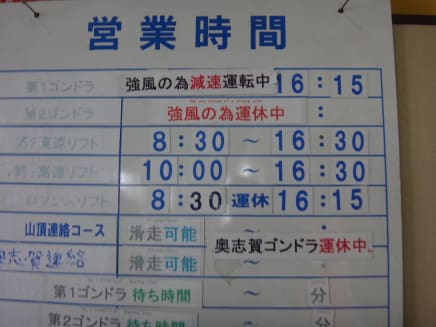

ありゃりゃーっ！

「ゴンドラが止まるほどの風にならない」という

予想は外したか…っ！

残念っ！！

とりあえず，減速ながらも動いている第1ゴンドラで

山頂に出ると…

あら．意外と気温はマイナスなのね．

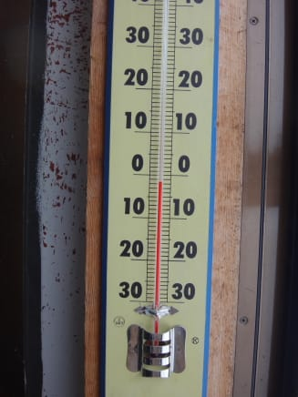

で，山頂の天気は…

ここは予想通り，曇りで薄日も差す程度．

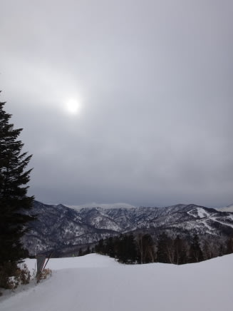

そして，雪は…

をを！シマシマ！

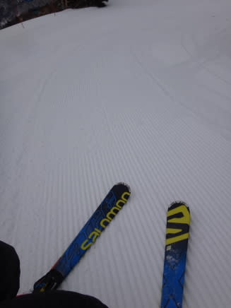

ふむ，意外といいよっ！！

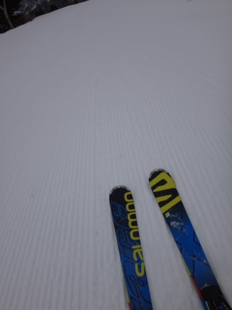

うはははは，気温は高いとはいえ，朝イチはいいなぁ～！

…と，滑っていたところ…

なんと．ゴンドラ2本乗ったところで，

第1ゴンドラも強風で運休…（涙）

ゴンドラ，2本とも止まっちゃったよ…

…予想，大外し…（泣）．

ってことで．

一の瀬へやってきましたが．

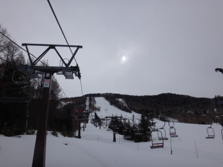

一の瀬正面バーンは，ちょいと固めの雪の上に

柔らかい雪が乗ったコンディション．

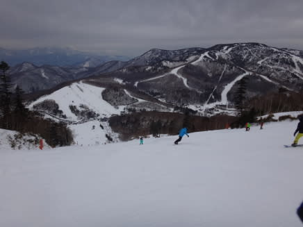

先週末に壊滅的状態になったパーフェクターも，

ちょっとは積雪があったようで，滑れる状態になってました．

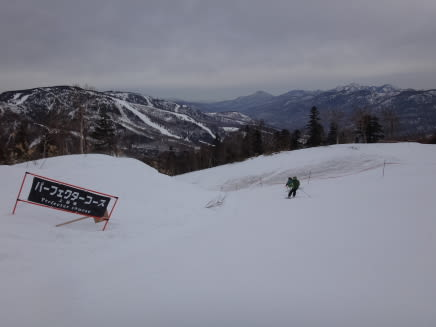

まぁ，2月の週末＆焼額＆奥志賀ゴンドラが止まっている，ってことで

ちょっとゲレンデの人は多めでしたが．

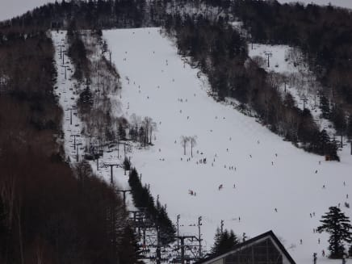

でも，リフト待ちは0～1分．

…普段の2月に比べると，少なすぎる気が…

で．

11時過ぎに，風がちょっと弱まり，

また，焼額ゴンドラが2本とも動き出したのですが…

なんと．

なんとっ！

そのあと．

昼過ぎに…

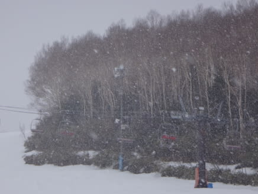

え？

なにこれ？

雪？

雨じゃなくて，雪？？？

この日の昼間，雨じゃなく雪になるなんて…これは…奇跡っ！

どう天気図を読んでも，南風で気温が上がる今日，

雪になるはずがないのに，まさか，雪になるとはっ！！

これは．

やはり．

冷え冷え踊りの効果に違いありませんっ！！

スキーヤーの熱き思いが届いたに違いありませんっ！

素晴らしい，冷え冷え踊りっ！！

ってことで．

昼過ぎにしばらく，ちょいと強めの雪が降って，

ゲレンデにもうっすら積もったので．

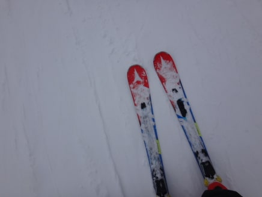

一の瀬正面バーンは，ちょっとアイスバーンの下地が出てきた上に，

もさもさした雪が乗って，ちょっと滑りにくくなってきました…（残念）．

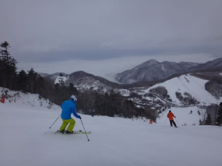

…でも，許す．

雪なだけ，許す．

雨に比べれば，65535倍くらいマシっ！！

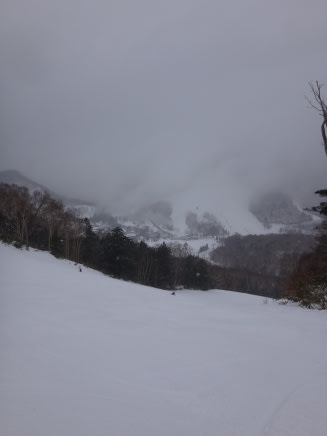

午後1時から2時ごろまで，時折強い雪でしたが，

そのあとはちらちらと雪が降ったりやんだり．

そして，3時過ぎには，また風が強くなり出して…

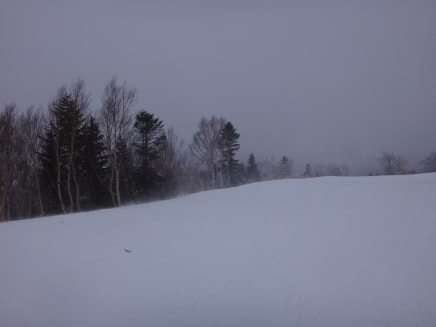

（風で雪が舞い始めた）

また，焼額のゴンドラは営業停止（涙）．

結局，今日は．

第1ゴンドラのみ営業→ゴンドラ2本とも運休→ゴンドラ2本とも運転開始

→またゴンドラ２本とも運休

という，目まぐるしい一日でした…

で．

夕方の一の瀬は．

ゲレンデの雪が風で飛ばされ，さらにスキーヤーで削れて行き．

パーフェクターはところどころ雪が薄くなり…（涙）

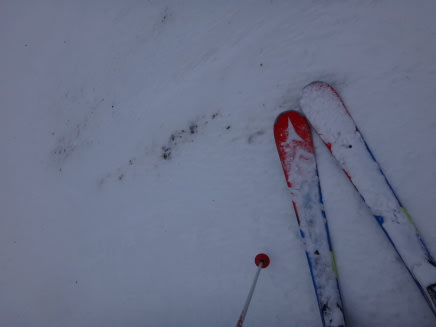

正面バーンも，アイスバーンが広がってきました…（泣）．

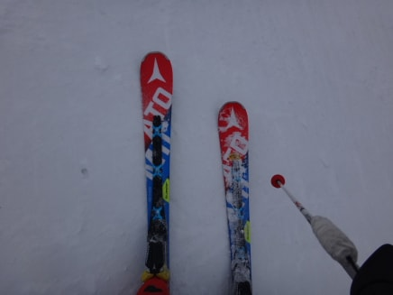

で．さらに追い打ち．

強風悪天候のため，一の瀬ナイター中止（涙）

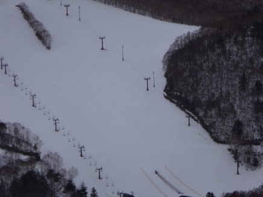

営業終了時，ダイヤモンドのリフト搬器が片付けられている…（悲）．

な，なんてことだっ！

焼額ナイターは営業するらしいとの話で，

出かけようとすると…

なんということだ…っ！！

こ，今度は土砂降りじゃないかっ！！

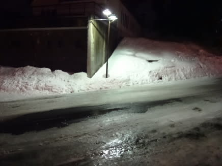

なんと．

なんと．

昼間は雪だったのに…

夜は本降りの雨になるとは…っ！！！（止まらない涙）

…

だめだ．

ダメだよ．

今日，昼間は雨じゃなく雪になってくれなたという点に関しては，

たいへんたいへん良かったけど．

それ以外は，強風＆ナイター中止＆夜に本格的雨という，トリプルパンチを

くらった本日だったのでした…（激烈涙）．

…実は，今日．

昼間に雪が降ったのは．

冷え冷え踊りの効果ではなく．

本日昼間，大変珍しいことに．

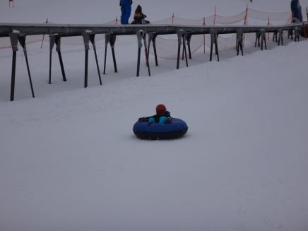

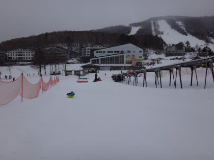

なぜか，キッズスペースのそり遊びをする娘に付き合って，

私がスキーを滑らずに娘とそり遊びをしていた…というのが

原因だという説が…

雪が強く降った時間と，私が娘とそり遊びをしている時間が

ぴったり一致していたため．

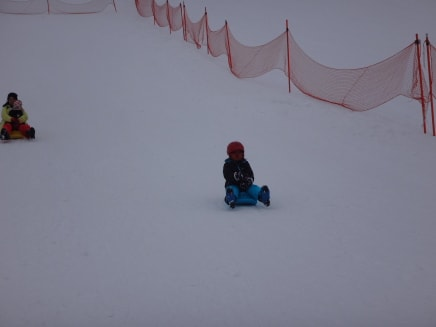

実は，そちらが真実だったのかもしれない…

＃本来気温が高い昼間に雪なって，気温が低くなる夜に雨になった理由は，それで説明がつくな！！←ならば，夜にもそり遊びに行けば良かったのかもしれない…

## 💬 コメント一覧

### 💬 コメント by (べべ)
**タイトル**: やはり
**投稿日**: 2016-02-21 00:04:04

雨になりましたねー(T_T)

今年はほんとに悲惨なシーズンですね…

Sさんが滑ろうとすると天気が崩れる、ということはもしかして日頃の行いが…笑

### 💬 コメント by (aqura)
**タイトル**: Unknown
**投稿日**: 2016-02-21 08:26:12

土曜日は、横手山でパンを食べ、焼額山のゴンドラが動いたので、移動しました。いやぁー、派手な天気でしたね。夜は豪雨(^_^;)))

さあ、日曜日はどうなるかな。今日も、楽しみましょうU+1F3B5

えっ、ソリ遊びU+2754U+2754

### 💬 コメント by (Skier_S)
**タイトル**: べべさま
**投稿日**: 2016-02-21 11:07:56

いや…

私の行いは悪くない！…はずです(ちょっと自信なさげ)

昨日もちゃんと娘と

遊んであげたし。

でも、今シーズンはひどすぎです…(泣)

### 💬 コメント by (Skier_S)
**タイトル**: aquraさま
**投稿日**: 2016-02-21 11:18:30

横手からヤケビに移動ですか！

またゴンドラ止まっちゃったのが残念でしたね。

もう、ドラスティックに変化する天気でした…

今日はもう、ソリはやりません(^_^)

### 💬 コメント by (ゆうこ)
**タイトル**: ありがとうございました。
**投稿日**: 2016-02-21 14:57:36

週末は、お会いできてよかったです。

娘さんとソリ楽しかったです。

今シーズン志賀高原はこれで最後なので、また来シーズン会いましょう。

私は今シーズン残りは息子を旦那に預けて日帰りでかぐらの予定です。

娘さんにもよろしくお伝えください。

来年はもっと息子と遊んでくれると嬉しいです。

### 💬 コメント by (Skier_S)
**タイトル**: ゆうこさま
**投稿日**: 2016-02-22 01:39:10

この週末は，お世話になりました～！

娘の相手をしてくれてありがとうございます．

うちの娘も「また会いたいなぁ」と帰り道に

行ってましたので，来シーズンにでも

またご一緒させてください！

