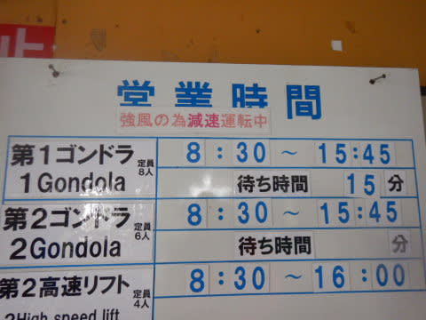

# 2022/3/5(土)の志賀高原スキー場は…意外と終日晴れ~うす曇り！昼間ちょっと緩んだけど，意外と楽しい一日！

📅 投稿日時: 2022-03-06 00:08:46

🏷️ カテゴリ: [2022スキー滑走日記](cc9cb73e4320f6a97af6fccc37587a61a.md)

ってなことで．

今日も志賀高原で滑ってたわけですが…

…誰かが午後は天気が崩れるという

予想をしていたのに．

その予想が外れて，終日晴れ~うす曇りの

一日で．意外と楽しい一日でした…！！

多少風が強かったのが惜しかったですが…

ってなことで．

本日朝は，いつも通り8:30の焼額第1ゴンドラの

営業開始を狙って焼額にやってくるわけですが…

なんと．

到着すると．焼額第1ゴンドラが運休(涙)

やっぱり風で運休なのね…と，第2高速

リフトでスタートでしたが．

1ゴン運休だったので，第2高速リフトの

あさイチはちょいと混んでました…(ちょい涙)

でも．

朝から天気も良くて，風も弱かったので．

なんでイチゴン運休したのかな？

…と，思ってたら．

イチゴンは単に故障で運休だったようで，

第2ゴンドラも奥志賀ゴンドラも，

普通に営業してました…

でも．

あさイチの第2高速リフトに乗って，

唐松コースのファーストトラックに飛び込むと…

うほーーーー！

今日もいい感じで締まった，スピードの乗る

シマシマ！！！

これは…予想外に…

いい感じに晴れてるし，バーンはかなり締まった

最高スピードシマシマバーン！！！

うはーーー！！

予想外に最高だわ…！！！

…と滑っていたら．

営業開始30分遅れで故障が治ったようで，

第1ゴンドラ営業開始！

いつもより30分遅れでのイチゴン

山頂ですが…

暖かいながら-4℃とマイナスキープで，

雪質は結構いい感じ！

これは結構楽しいよ！！！

…と，気持ちよく滑っていたところ…

9時半には，残念ながらゴンドラ待ちも

伸びてきて…

さらに，ゲレンデの人口密度もちょいと上がって

来ちゃいました…(泣）

でも．

曇り~うす曇りの予想を裏切って，

午前中はずっと天気が良くて…

気温が高めながらも，意バーンコンディションが

良くて，楽しいよ！！！

昼間は焼額山頂でもプラス気温まで上がって

しまいましたが（泣）

日当たりが良いバーンはそのせいで

ちょいと雪が緩み気味になったものの．

昼頃にはうす曇り気味になり始め，

ちょうど日差しが弱まったのもあり．

雪が緩んだのは，ごく一部だけ．

バーンのほとんどは，いいコンディションを

キープ！！

…ですが．

大変残念なことに，昼頃から風も強くなり始め…

ゴンドラは運休にならないまでも，

かなりの減速運転に（涙）

減速運転のせいで，ゴンドラ待ちが伸びてきて…

さらに列は短めに見えますが，減速運転の

おかげで，なかなか列が進まず．

これでも10分近い待ち時間（泣）

そして，ゴンドラに乗っても．

ゴンドラが遅いので，山頂に着くまでに

時間がかかります…（泣）

雪質がそれほど悪くないだけに，

ゴンドラ待ちが長いのがおしい…（涙）

でも，第2高速リフトは待ちが最高この程度で，

それほど長くなかったのが救いかな…

ってなことで．

午後は強風の減速のせいで，ゴンドラは混んだものの．

午後も誰かの予想は外れて，全く雪が降ることはなく．

リフト営業終了まで，晴れ～うす曇りの天気が続き…

営業終了までバーンもそんなに荒れず．

凸凹になることなく，大回りしたい放題！

ってな感じで．午後3時からはゴンドラ混雑も

ほぼなくなり，コースもガラガラの中．

日が暮れる営業終了まで滑り倒したのでした…

いや．

今日は意外と気温が上がったけど．

ゲレンデコンディションはそこまで悪くならなかったし．

減速運転でゴンドラは混んだものの，

運休にはならず．

…予想以上にいい一日でした～！！

やっぱり明日は一日寒い雪降りになりそうだけど．

まぁ，昨年は3月第1週の週末にひどい雨だったことを

思い返せば．

この時期にまだ冷え冷え雪が降るのは

ある意味恵まれてると言えるし．

…やっぱり今シーズンの志賀高原，いい感じの

コンディションが続いてますよ～！！

## 💬 コメント一覧

### 💬 コメント by (レインボー74)
**タイトル**: Unknown
**投稿日**: 2022-03-06 15:47:36

日曜日の志賀高原情報

朝の上林-4℃　蓮池-9℃。明け方から降り始めた新雪は数センチ。ニゴンが故障運休で、４ロマが９時からということで、ニゴンから車が消えた。

我々はバスでニ高へ移動。うまくいきました。

今日は私が試乗会に参加。試乗板を安く購入することができました。ありがたいことです。目的は果たしたし、ニ高しは寒いので、早めに撤退しました。

湯田中は14時くらいからかなりの勢いで雪が降ってます。

明日は太板の出番かと。

### 💬 コメント by (Skier_S)
**タイトル**: ＞レインボー74さま
**投稿日**: 2022-03-07 02:12:09

2ゴン，故障運休だったんですか？？

てっきり強風運休だと思ってました．

明日はいい新雪だと思いますよ～！

楽しんできてください．

