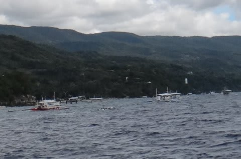
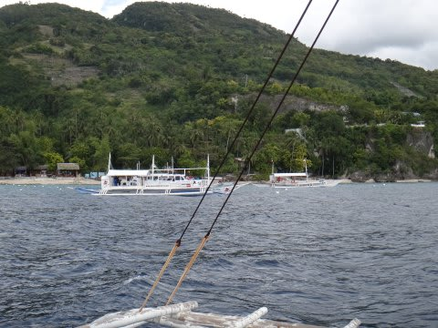
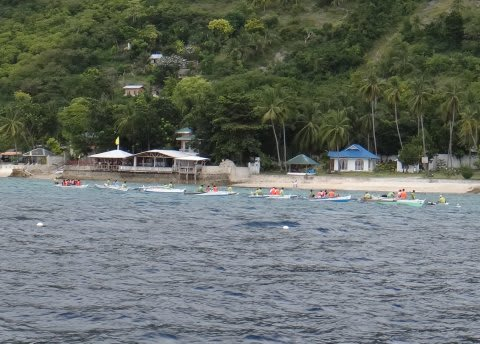
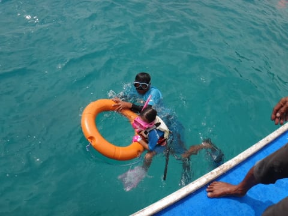
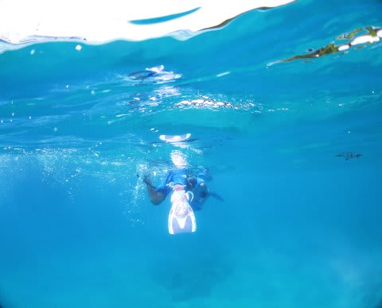
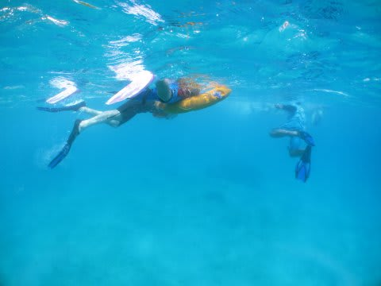
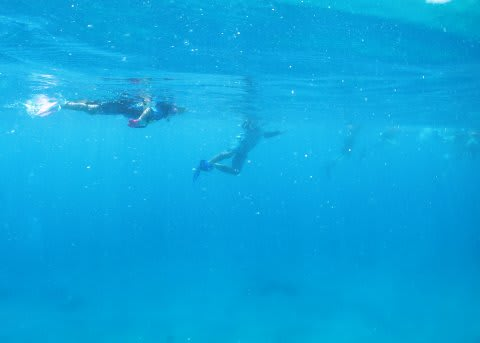
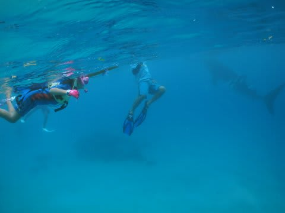

# 2013年11月　フィリピン・オスロブ　子連れでジンベエを見るぞっ！　その6

📅 投稿日時: 2014-07-11 01:31:20

🏷️ カテゴリ: [ダイビング日記](ce3a7a8d424d112fce83ee85c81a0e344.md)

うーむ．

どうやら．

やはり．

8月下旬まで，休みがとれなさそうな予感…

次は8月まで，潜りに行けないかも…(涙)．

ってことで．

今しばし，フィリピン・オスロブ旅行記

続きます…

----

で．

オスロブへ着いたわけですが．

なんだか，もう船がいっぱいいますね～！

おそらく，船に囲まれたエリアにジンベエ様がいるんだな．

…バンカーボートだけじゃなく，車でオスロブに来て，

そこからシュノーケリングする人はこんな船で

アプローチししています．

うーん．シュノーケリングの人，

かなりいるなぁ…

我々を乗せた船は，これらの船の列に

並んで停泊しました．

で，ダイバーが準備をする中，

シュノーケル組は，一足先に，海へエントリーです！

ガイドは娘に気を使って，ちゃんと浮き輪を

準備してくれて．

完全に娘をサポートしてくれる体制でいます．

をを！気遣いがありがたい！

では．

私も，ジンベエの海へ向かって，Go！

って感じで…．

ボートから飛び込んだけど．

まずは．船の合間を縫って，ジンベエさんのいる海域へ

出なくてはならないわけですね…

こんな感じで泳いでいくわけですが．

娘は，ガイドが引っ張る浮き輪に掴まって，

楽してますね～

ガイドさん，ありがとう～！

で．

100mほど泳いでいくと…

他のシュノーケラーが何人かいるエリアに

たどり着きました．

…というところで．

うむ？

うむむ？？

なんだ，あれは？

…あの影はっ！！！
