# 5月17日かぐら詳細…うむ．雪は多めだけど，先週からは結構減ったなぁ…

📅 投稿日時: 2014-05-18 22:34:06

🏷️ カテゴリ: [2014スキー滑走日記](c992167609b6415052179ee69ea1ea7d8.md)

ということで．

昨日，天気予想が外れた言い訳 かぐらの速報をしたわけですが．

＃あれで速報だったんです…

今日は，詳細レポートをば．

えー．

まず．

朝から雨．

駐車場に着いた時から，雨．

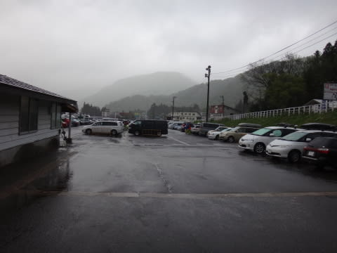

おかげで，駐車場はそんなに混んでないし…

ロープウェーも，営業直前でこんな感じで，

ほとんど列がないという，珍しいすき具合．

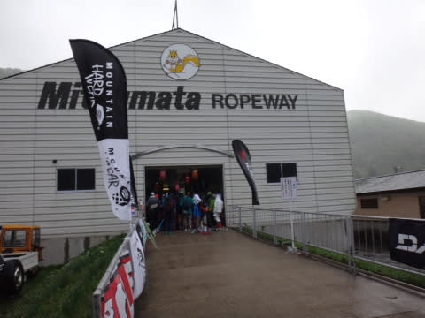

…この時は．

まだ．

「ぐふふふ．今すぐに雨はやむのだ．

晴れてからだと列が長くなるので，

今のうちにゲレンデに上がって

しまったものが勝者なのだっ！！」

と，思っていた，楽観的なSkier_Sだったのだった．

＃この見通しが甘かったのは，あとで思いっきり

＃証明されるのだった．

で，

ロープウェー山頂に登ると．

うむ．

みつまたリフト乗り場も，

まだ雪はいっぱいありますね．

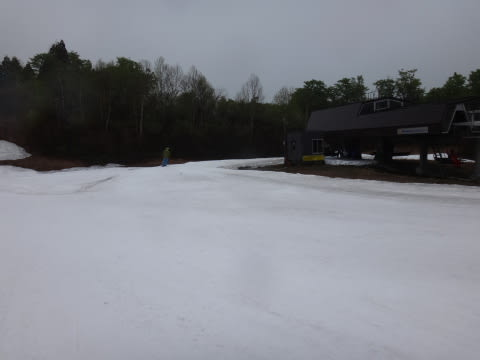

…でも，先週より減ったな～．

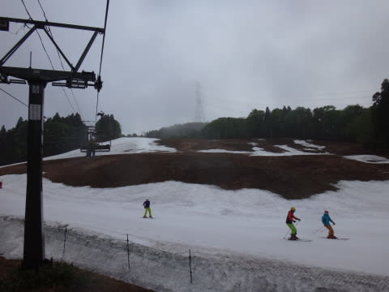

みつまたリフトからゴンドラへの連絡通路は，もう廊下

状態になっていて．

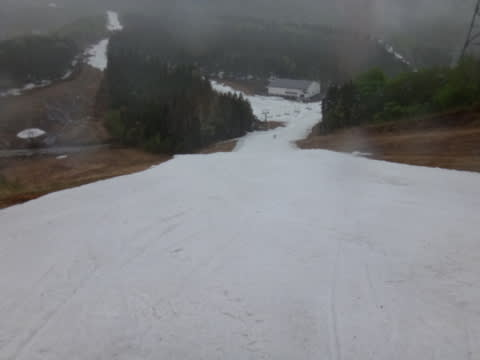

うーむ．

なんとかぎりぎり，営業最終日の来週までは

もちそうかな～．

ゴンドラ前は，まだ雪がいっぱいあって…

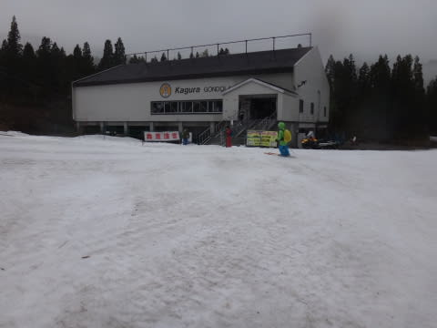

ゴンドラで山頂へ上がると．

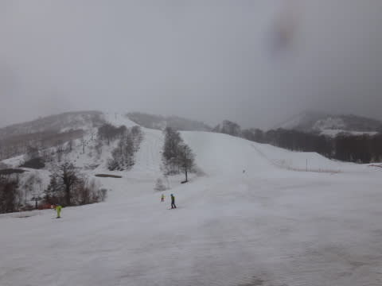

をを！

山頂もまだ，雪がたっぷり！

でも．

誰かの日ごろの行いの悪さのおかげで．

朝イチは，強風でかぐら高速リフトが動かず…（涙）．

ペアリフトに並びますが．

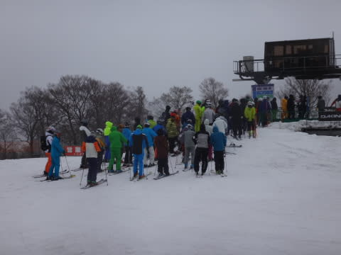

…雨が結構強く，びしょ濡れになりながらの

スキーです（泣）．

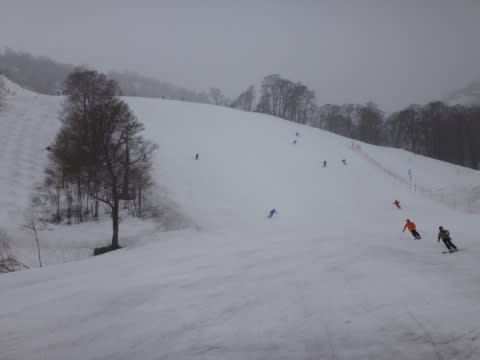

これは…何かの修行ですか？？（涙）．

…って感じで．

1時間ほど雨に打たれつつ滑ると．

9時半に，風が弱まったので，かぐら高速が

営業開始！

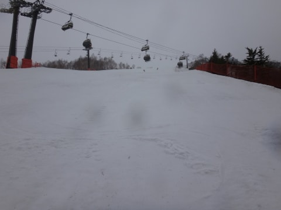

…ビバ！フード付きリフトっ！

フードって素晴らしいっ！

この文明の利器のおかげで，濡れずに

リフトに乗れるよ…（感激）．

雨が降っているので，ゲレンデの人口密度は低く…

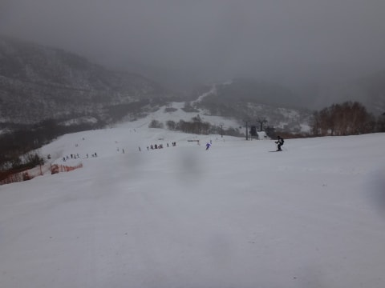

この時期のかぐらではありえない，リフト待ち0！

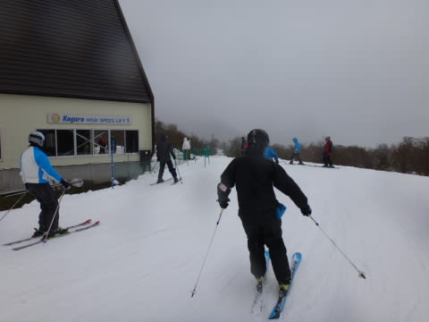

人が少ないので，ゲレンデは午前中はフラットなままっ！

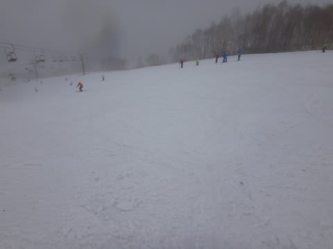

…とはいえ．

ガスで視界が…

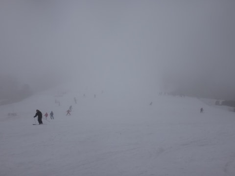

ガスがかかっているのは山頂のみで，

下の方は大丈夫なんだけど．

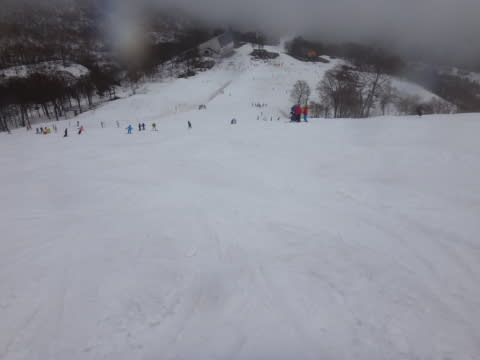

でも．

なんだか．

11時になっても雨があがらないのですが（；_；)

しかし．

雨が降っているおかげで．

11時を過ぎてもリフト1－2分待ち程度という，

先週と比べると1/10の待ち時間なのが…いいねっ！

＃何とかこの天気をポジティブにとらえようという努力をしてみる

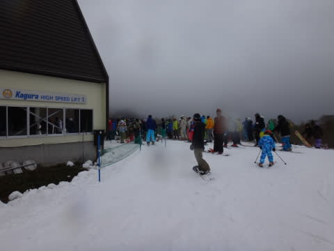

そうそう，

先週は完全に真っ白だったジャイアントコース．

この日は，コブ溝にところどころ土が出ているところが…

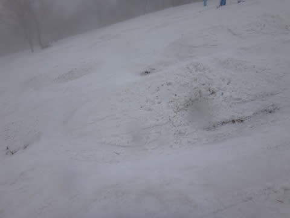

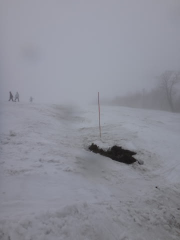

うーむ．

雪，解けたな～．

でも，ジャイアントコース．

一部のコブ溝以外は，まだ大丈夫！

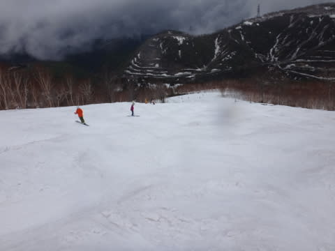

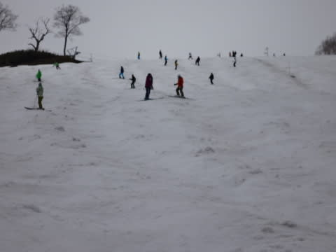

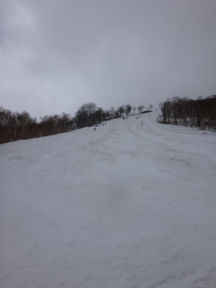

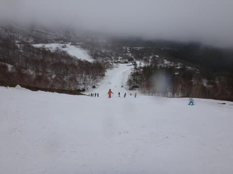

テクニカルコースは，結構土が出てきちゃってます…

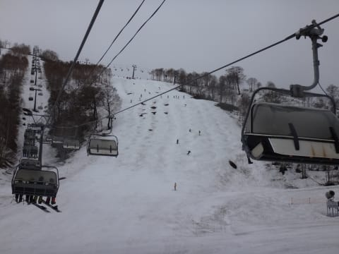

って感じで．

雨の中滑っていると．

11時過ぎには，何とか雨もほとんど上がったけど…．

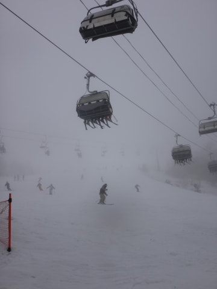

うーん．

山頂付近のガスは上がらない…

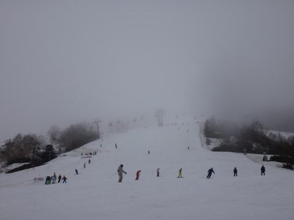

下の方は見えるんだけどな～

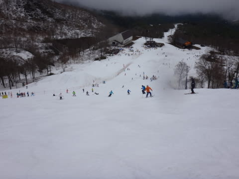

で．

メインバーンも，コースの端っこの方．

コブ溝部分，雪がそろそろやばそうな部分が…．

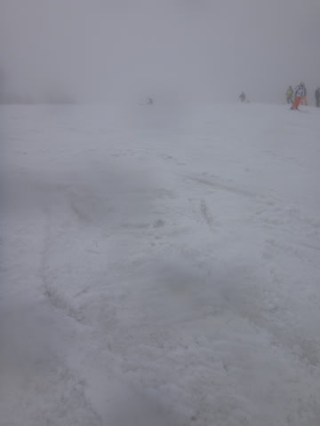

って感じで．

今日はダメダメか…（落胆）

と，思っていたところ．

2時半過ぎに，何とか雲の切れ間が見え始めてきました！

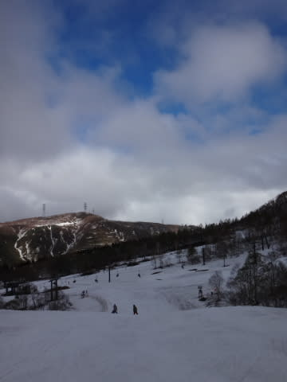

山頂付近も，すっきり見えるように！

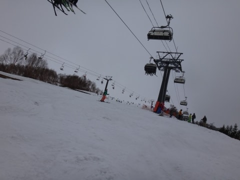

でも…

その代り．

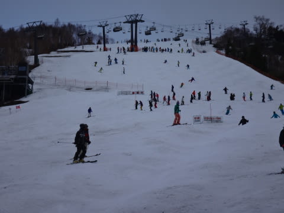

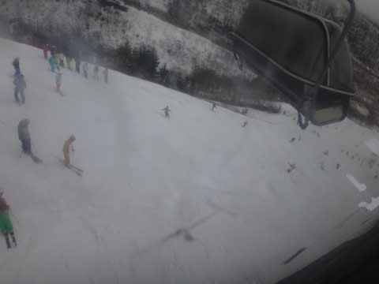

いつもは人が減っていく，午後に向かって，

人が増えていくという…

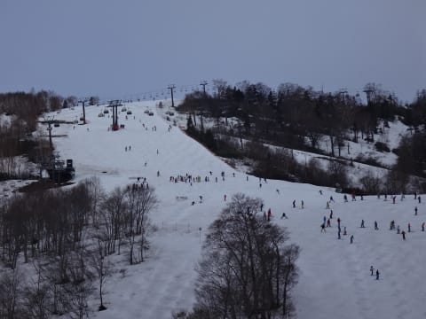

リフト待ちは，午後3時に最高5分待ちくらいかな～．

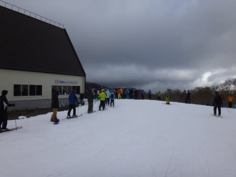

まぁ，でも．

午後のこの時間まで，

殺人的全面コブにならなかったので．

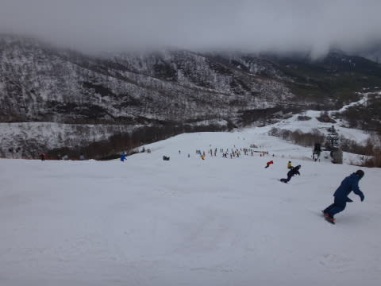

午後3時で，先週の昼前後くらいの感じじゃなかったかな～？

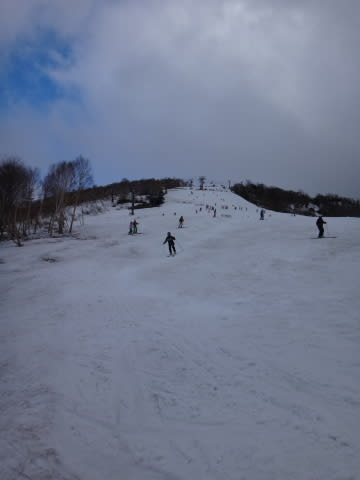

さすがにリフトストップ時には，そこそこのコブが

育ってましたけど…

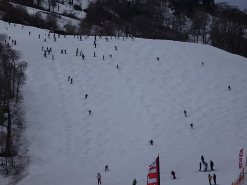

で．

いつも通りリフトストップまで滑ってから，

下山するわけで．

下山のゴンドラコース，まだ雪はたっぷり．

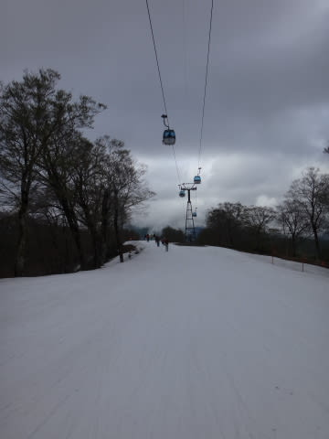

来週まで問題なく滑れそうですね～．

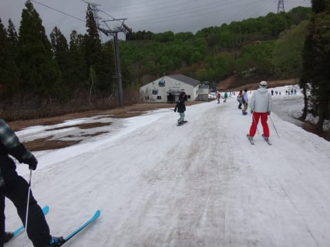

みつまた下山コースは…

うはー．

雪が減ったよ．

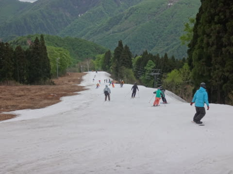

完全廊下化しましたね～．

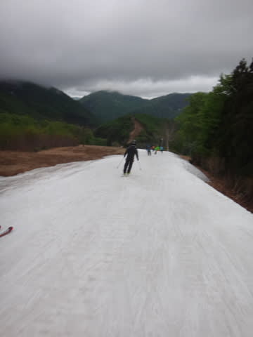

って感じで．それほど待ちがない，ほぼ最後の方の

ロープウェーで下山して．

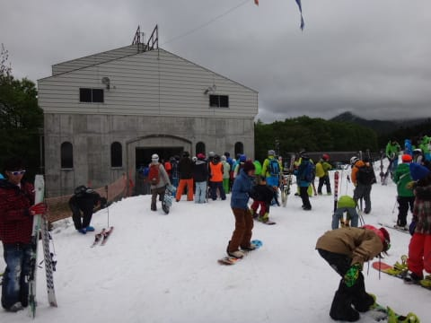

今日も雨の中の1番リフトから最後まで，

たっぷり滑ったのでした…

しかし．

うーむ．

やはり．

視界のいい中，思いっきり滑りたかったなぁ…

天気予想，雨って当てていれば，日曜に

滑りに行ったんだけどなぁ…←天気予想外した自分が悪いんでしょ
