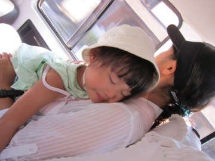

# コドモとコモド！子連れダイブクルーズ4　初日バリ観光の午後

📅 投稿日時: 2011-07-07 00:06:43

🏷️ カテゴリ: [ダイビング日記](ce3a7a8d424d112fce83ee85c81a0e344.md)

お昼ごはんを食べて満足したあとは…

ウブド名物，ライステラスへ．

ここが本日の観光の目玉ですかね～

見事な棚田！

バリ観光ではどこに行こうか悩みましたが，今日はここを見るために

ウブド方面へやってきた，といっても過言じゃありません．

…でも．

娘．

寝てるよ．

おまえ，ホントにいつも一番いいところで寝るのね…

で．棚田をみて満足したあとは，

ショッピングセンターに立ち寄って帰ると，もう午後4時です．

これ，ショッピングセンターの売り場の写真ですが．

なんか，日本製じゃないものも，日本製の高級感を

出すために，パッケージに日本語が書いてあるという…

んで，これだけのガイドつき車チャーターツアー，

ガイドとドライバーの2人つけて，丸一日好き勝手なところに

行っていいというプランで6000円くらい．

インドネシアは物価が安い国ですな～

しかし，娘はツアーの途中から

「プール！プール！早くお部屋かえってプールへ行こうよ～」

と，朝ごはんのときに見たプールを忘れていなかったようで．

…意外と執念深い．父親似か…？？？

で，ツアーから帰ってきて，夕方の1時間ほど，プールに漬けておきました．

娘，大喜び．

チャーターの車で観光の後は，

こんな高級なプールで泳げるなんて…

おまえ，ゼイタクすぎ．

しかし，1時間ちょい泳いでいると，日も沈んで寒くなってきます．

「もう上がったほうがいいよ…」

「いやーーーーー！まだ泳ぐの～っ！！！！！」

プールから引き上げようとすると，号泣！！

娘の手を引っ張って部屋に帰りかけるけど，

手を振り払ってプールのほうへダッシュ！

…娘，そんなにプールが好きか…？？

泣き喚く娘を強引に抱えて部屋に連れて帰り，

いろんなものでごまかしてシャワーを浴びさせます．

で，その後．

今日の夜ご飯は…

明日から乗船する，サザンスターのガイド兼マネージャ，K澤さんが

お誘いしてくれました．

んで，向かったのは前回も行った中華料理のお店．

相変わらず美味いですね．

で，K澤さんから今回のクルーズのお話をいろいろ聞きます．

なに？

娘のために，ベビーシッター準備してくれたの？

ダイビングの間に，娘用にスペシャルボート出して，

泳がせてくれるの？

そ，そこまでしてくれているとは…

んで．ついでに．

前回のクルーズで，宿題のまま残っている項目について

確認してみた．

私「で，前回のクルーズではK澤さん乗船しなかったんですけど…

　まさか，今回も乗船しないなんてこと，無いですよね…」

K澤さん「そ，それなんですが…

　　実は…

　　デイトリップのお客さんをガイドしなくてはならなくて，

　　Sさんと一緒には乗船できないことに…」

ええええええええ～っ！！！！！！！！

また，今回のクルーズも「普通は絶対外すことの無い宿題」を

残すのかっ？？

3回目のリピーターで，2回K澤さん不在のクルーズって，

いないんじゃないか！！

K澤さん「…って思ったんですが．

　デイトリップのガイドが終わった3日目の夜に合流します」

あ，そうなんですね．

クルーズ前半はK澤さん不在だけど，後半から合流してもらえる

のね…

フルで一緒してくれないのはちょいと残念ですが，とりあえず

一安心．

実は，K澤さんはかなりの子供好きらしく．

この夕食中のわずかな時間で．娘のハートを

がっちりキャッチ！！！！

わりと人見知りのある娘が，父親よりもK澤さんと

喜んであそんでいたという…

もう，うちの娘をメロメロにしてしまうなんて…

いよっ！若い娘キラー！

K澤さん「もう少し年頃の女性相手に，そう言われたほうが…」

いやーーーー．しかし．

これだけ娘がなついてくれるんだから．

K澤さんが乗船するクルーズ，子連れでも安心だわ…

という感じで．

すっかり夕食をご馳走になり．

乗船前日の，この日もふけていったのでした…
