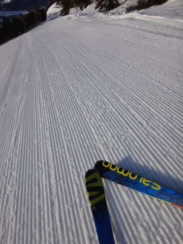
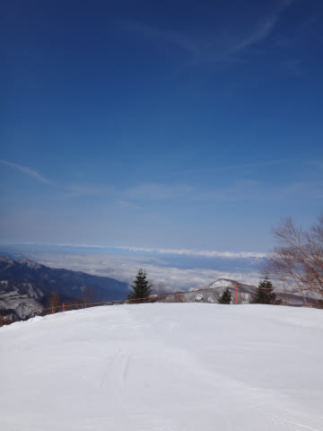
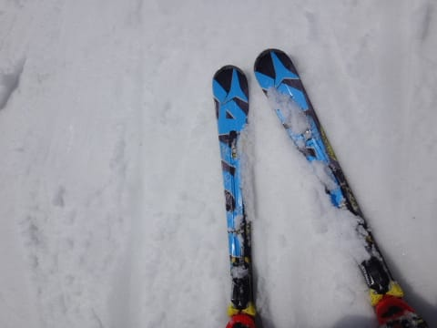
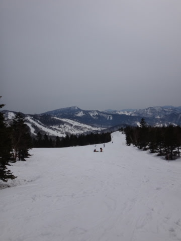
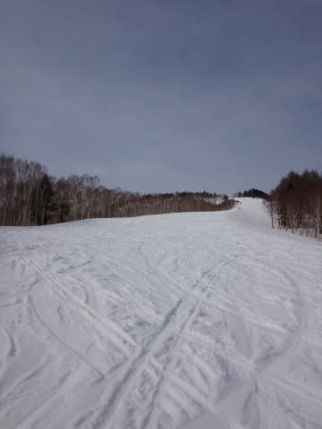

# 4月12日の志賀高原速報モード…晴天！朝は固いバーンで結構楽しめたかな～

📅 投稿日時: 2015-04-13 00:44:56

というわけで．

日曜夜の定番となりつつある，

今日の志賀高原，速報モードです…

えー．

本日は，朝はそこそこ冷え込んで…

早朝は，しっかり固い，スピードを出せるバーンでした～！！

いや～．

今シーズン初じゃないかな？

早朝がしっかり硬いバーンになってくれたのは…

いやー．

やっぱり，早朝ってこうあるべきでしょ？

って感じのバーンを気持ちよくかっ飛ばせました～！

で．

朝から天気も良く．

北アルプスもすっきりきれいに見える，

すっきり晴天！

…でも，日差しがあったので，

朝9時ごろには結構雪が緩んじゃったけど…（ちょっと残念）

でも，昼頃はうっすらと雲がかかり，

日差しがちょっと弱まった感じだったので，

気温は昼間でプラス8度くらいと高かったものの，

「暑いよ！」って感じではなく．

さらに，午前中はゴンドラ搬器数個分の待ち時間があったけど，

午後からは待ち時間が0と，人も少な目で．

薄曇り＆人が少ないというダブル効果のおかげで，

意外と午後まで，比較的荒れないままでしたね～！

って感じで．

早朝から夕方まで，結構楽しめた日曜だったのでした…

詳細レポートは，また明日！

＃Gokuさん，来るなら日曜だったかも…

## 💬 コメント一覧

### 💬 コメント by (Goku)
**タイトル**: だよねU+3030
**投稿日**: 2015-04-13 12:28:02

そうなんですよね、日曜日に行くべきだったんだけど、日曜日は用があったので、土曜日に掛けたんだけど、そしたらあんな天気で(T_T)

かなりへこんでます。

### 💬 コメント by (ひろちゃん)
**タイトル**: コブレッスンのお礼
**投稿日**: 2015-04-13 13:47:30

コブレッスン、アドバイスありがとうございました。日曜朝は、足が痺れる程、冷えたバーンでしたね、その後、奥志賀の、こぶにはまり、S様アドバイスで、終了まで、頑張りました。連休また、頑張ります。

### 💬 コメント by (komu)
**タイトル**: 人として…
**投稿日**: 2015-04-13 16:53:21

結局、土日とも早朝からリフトストップまで最小限の休憩時間で滑り続けてしまいました。

それでも滑り足りません。人として終わってしまったかもしれないと思うと不安です。

### 💬 コメント by (Skier_S)
**タイトル**: 日曜は意外とよかった…
**投稿日**: 2015-04-13 23:58:08

>Gokuさま

日曜の硬さがこの時期普通で，土曜までが

柔らかすぎなんだと思うんですが…

しかし，次はGWまで滑れなさそうなんですか…

また，去年・おととしみたいに冷え冷えGWに

なるといいんですが…（祈）．

>ひろちゃんさま

土日はお世話になりました～．

日曜の午後はお見かけしなかったな～，

と思っていたら．

奥志賀だったんですね．

コブレッスン効果出ましたか？？

また一緒に滑りましょう！！

>komuさま

いや…もう，終わっている人だって

知ってますから（笑）．

いまさら否定しても，誰も納得しませんから（笑）．

また，志賀でご一緒しましょう～！

