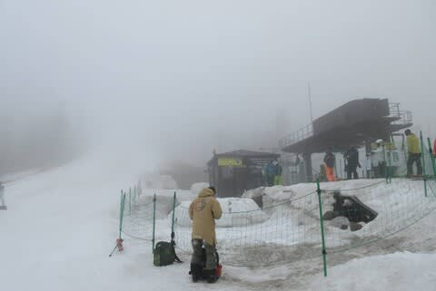
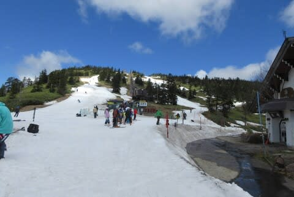
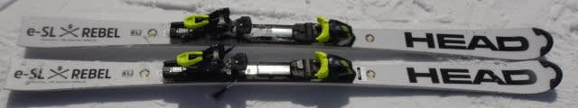
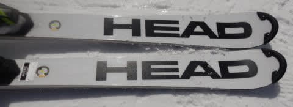
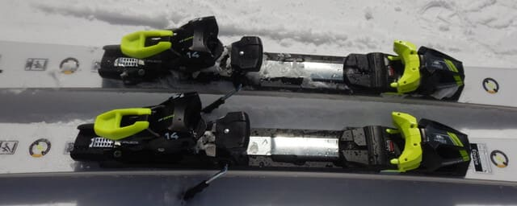
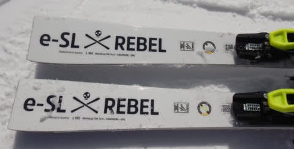
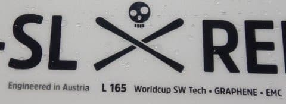

# 2023シーズンモデルのスキー板，試乗レポートその6…HEAD Worldcup REBELS e-SL RD

📅 投稿日時: 2022-05-29 00:26:38

今日も渋峠に行った特派員がいたようてすが…

早朝はまぁまぁ良かったようですが…

昼間はコースの狭いところは茶色くなっていて，

あと一週間はやばそうな感じというレポート

でし（涙）…

リフト乗り場近辺はまだマシそうに

みえるんですけどね…

ってなことで本題へ．

今日も2023シーズンモデルのスキー板試乗インプレッション。

今回はヘッド編です．

では，どうぞ〜！

○HEAD Worldcup REBELS e-SLRD 165cm

SL競技用

さすが競技用だけあって，かなりエッジ

グリップが強く，わずかに傾けたところから

ガッツリエッジが食い込んで，グイグイ

板が回り始めます．

フレックスはかなり強く，板のたわみを

出していくにはそこそこのスピードか

強い力が必要になります．

ただ，たわませなくてもサイドカーブに

沿って，板が強い旋回力で回っていきます．

グリップが強烈に強い板で，板はずらし

にくいかな．ずらしてコントロールする

板ではないです．

昨シーズンモデルくらいまでは，ずらしの

コントロール性がもう少しあった気がするけど…

来シーズンモデルは，かなりグリップが

強めで，谷回りでは板が動かせるものの，

山回りでずらすのは難しい感じ．

いろんな小技が使える板ではありません．

ただ，フレックス・トーションが強くて

しっかりグリップした中で，サイドカーブに

乗ってかなりクルクル回ってきます．

カービングでの旋回力は強烈に強い！

逆に言うと，小回りスペシャルで，

中回りや大回りを引っ張るの板じゃない

ですね…

カービング小回りに特化した，

小回りスペシャル板です．

潔いほど，カービング小回りに特化してます．

ただ，SL競技用としては履いた感じは軽く，

手強さは感じないかな．

それなのに，スピード耐性はすさまじく

高いです．

スピードを出した中で，板がたわみきることなく

安定してカービング小回りをかましていけます．

ハイスピードな小回り特化板が欲しい…

という，尖った板が欲しい人には

結構刺さる板だと思いました．
