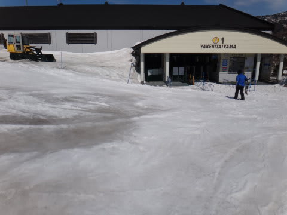

# 3月24日の志賀高原焼額山の状況は…日差しが暑い春スキーな一日だったよ

📅 投稿日時: 2013-03-25 01:14:29

🏷️ カテゴリ: [2013スキー滑走日記](c91dbe557f9a69230b1600e48622fdd61.md)

えー．

「スキー場レポートはいいから，試乗インプレッションを早く書かんかい！！」

って声が聞こえる気もするんですが…

聞こえるような気もするけど…

…聞こえなかったことにして，3連続志賀の最終日，日曜の志賀高原の状況に行きましょう．

さて．本日．

朝イチの焼額第一ゴンドラに並んでいるとき．

(まだ誰もいないゴンドラ乗り場)

「Skier_Sさんですか？」

と，呼びかける声が…

Blogに何度かコメントをもらっている，[gokuraku skier](http://red.ap.teacup.com/gokurakuskier/)さんが，声をかけてくれたのでした．

ゆうこさんに続く，2人目のSkier_S発見者(?)ですね～．＃発見者って…お前は指名手配犯人かっ？

いやー．一度も会ったことが無いのに．よく見つけられますねぇ…

っていうか．

Blogを見ただけなのに．わざわざ声をかけてくれて，見ず知らずの人と一緒に滑ることができるって．

なんだか不思議な感じ…．

で．

ゲレンデの状況はというと．

朝の気温はジャスト0度．

それほど冷え込んでないですねぇ…．

天気は，3日連続で晴れてくれて．

最終日の今日も，良い天気じゃのぉ…

雪の状況は…

やわらかめのザラメが圧雪された，滑りやすいバーン！

人も少ない！

いやーーーー！

朝イチは気持ちよくスピードが出せるっ！

この3日間とも，朝イチコンディションは抜群だねっ！

ぐひょひょひょひょ！

快楽の大回りバーンだっ！

…でも．

一緒に滑ったgokuraku skierさん．

置いていかれるかとおもうほど速かった…

私と同じ，大回りLoverですね～．

いやー．しかし．

気持ちよく飛ばせる朝イチはイイ！

…って感じの幸せタイムがいつまでも続けばいいんですが．

幸せはいつか終わりがやってくるもの（悲）．

人が増えて…

さらに，雪がやわらかくなったので．

多くの人に荒らされて，大回りは厳しくなってきちゃいました…

10時半で，すでにこんな感じ(泣）．

ってことで．朝イチの快適大回りタイムは，10時すぎには終了(涙)．

…やっぱり，人が少ない平日に比べて，雪が荒れるのが早いなぁ…

まぁ，でも．

ゴンドラ待ちは最高でも1-2分待ち程度で，そんなに待ちが無かったのが救い．

しかし…

なんというか．

これは．

完全に．

…春スキーですねぇ～

日差しは，暑いくらいだし…

気温も上がり…

雪は春の雪になり，かなりのでこぼこになってくるし…

ゴンドラ乗り場の前も…

雪が溶け溶けな感じ．

あぁ…春ですねぇ…（涙)．

やわらかい雪で荒れ荒れバーンになった午後も．

天気が良かったので．

ひたすら滑り続けてましたが．

でも．ゲレンデ全面でこぼこだったので，かなりの体力を消耗…

リフトストップまで滑ったころには，さすがの私も

「…もう，滑れないでござるよ…」

と．ヘロヘロになっていたのでした…

ああ．

しかし．

春ですねぇ…

## 💬 コメント一覧

### 💬 コメント by (ひろりん)
**タイトル**: Unknown
**投稿日**: 2013-03-25 14:02:15

スキー場レポートはいいかｒ（ｒｙ

えっと（笑）

行きたいんですが（TT)

しかし体力ありますね！

私なんかリフトストップまで絶対ムリ！

体力低下が留まることをしりませぬ（TT)

10時に開始して長い昼休みのあと15時から16時が

いっぱいっぱいという（TT)

漁師（自称）なのに（イミフ）

### 💬 コメント by (gokuraku skier)
**タイトル**: Unknown
**投稿日**: 2013-03-25 22:09:36

丸一日滑って、帰ってすかさずのブログ更新。

凄すぎる！

### 💬 コメント by (ＴＭ)
**タイトル**: 写真
**投稿日**: 2013-03-25 22:42:58

初めまして。昨年のアルペン試乗会＠ダイヤモンド以来、愛読させていただいてます。

あの試乗会は両日とも参加しており、この土日も焼額で滑ってまして、今日のエントリーの写真(ジャイアントスラローム中腹の棚)に、同行者が数名、写り込んでました。ニアミスしていた模様です。

Volkl緑とATOMIC水色はチェックしながら滑っていたのですが、わからないものですね。

ではまた。

### 💬 コメント by (Skier_S)
**タイトル**: 春スキーは体力消耗します…
**投稿日**: 2013-03-25 23:52:14

>ひろりんさま

え？リフトスタートに並んで，リフトストップまで滑るのが

デフォルトかと…(汗)

土日しか滑れないし，スキーシーズンは短いので，がしがし滑らないと！

体力は滑っていると，自然につきますよ…(笑）．

>gokuraku skierさま

夜11時半に帰宅して，レポート更新です…

このブログの更新時間，毎日結構ありえない

時間に更新してます(笑）．

睡眠時間を削って書いてます…

>TMさま

はじめまして～！

去年の試乗会って，ちょうど1年前ですね…

愛読ありがとうございます．

いやーー．仲間の方，写ってましたか．

おそらくどこかですれ違っているのかと…

今年も試乗会，参加するのですか？

私は参加予定です…

また，焼額滑るときは探してみてください～

