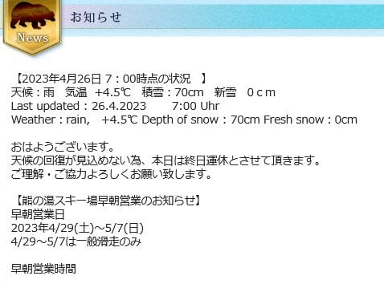
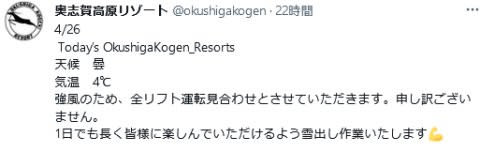
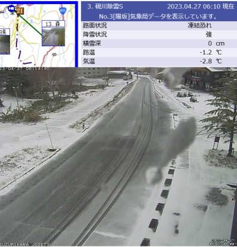

# 4月26日(水)の志賀高原スキー場は雨が降っただけじゃなく，強風で全リフト運休だったみたい…そして27日朝はわずかに積雪

📅 投稿日時: 2023-04-27 06:36:39

🏷️ カテゴリ: [日記](cc4b5682fb7b8b144980957a978653fb0.md)

いろいろ状況がクリティカルで，Blog更新する

時間が取れない…

とりあえず，大雨予想だった26日水曜ですが，

予想通りの大雨だったみたいですが…

雨だけじゃなく，強風も吹き荒れたみたいで，

熊の湯も…

（[熊の湯スキー場ホームページ](https://www.kumanoyu.co.jp/lift/)より)

奥志賀も…

（[奥志賀スキー場Facebook](https://twitter.com/okushigakogen?ref_src=twsrc%5Egoogle%7Ctwcamp%5Eserp%7Ctwgr%5Eauthor)より）

横手山も，朝から全リフト運休だったみたいです（涙）

（[横手山Facebook](https://twitter.com/2307Mt)より）

そして，26日オープン予定だった志賀草津道路も，

悪天候のため通行止めのようです…

で．本日27日（木）の志賀高原は，標高が高い

ところはわずかに積雪しているようです！！

（[北信建設事務所道路気象状況](http://hokushin.pref-nagano-roadcamera.jp/)より）

うーん．

今日も志賀草津道路，オープンは遅れそうかな…

ただ，昼間は気温が上がるので昼間に

オープンするかな？

多分，今日の志賀高原．

昼間は晴れて気温が上がるので…

うっすら積もった雪が融けて，

粘りつく滑りが悪い雪になりそう…

というか．

それ以前に，昨日の雨でゲレンデは無事なのか？？

30日まで営業できそうな状態なのか…？？

まだ，各スキー場からの情報がないですが…

かなりの豪雨だったのでヤバそうな感じ．

そして，これからの天気ですが…

27日（木）：朝は雲が残るけど午前から晴れ．

　気温は+10℃以上に上がる

28日（金）：朝から晴れ．最高気温+10℃越え．

　強烈な日差しで雪は解ける

29日（土）：曇り．気温は朝から高い．

　夜から雨

30日（日）：高温の雨（涙）

という感じなので…

30日まで，雪がめちゃくちゃ解けそうな感じの

予想です（涙）

さて．

志賀高原，GWまでゲレンデがもってくれるのか？？？
