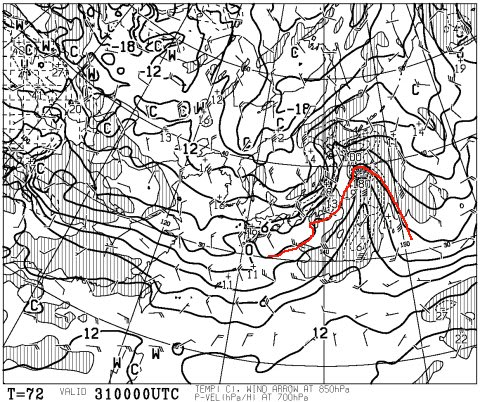
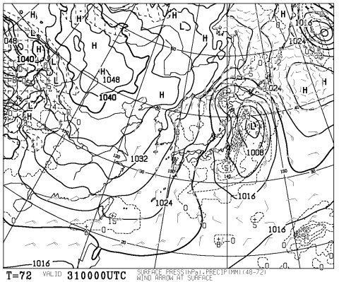
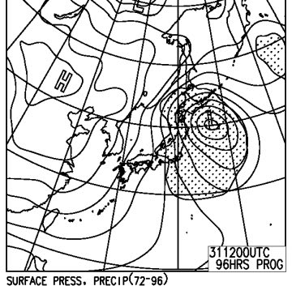
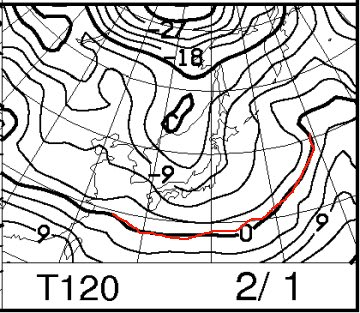
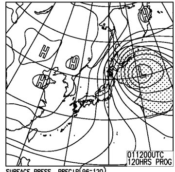

# 定番！この週末の志賀高原の天気は…ひたすら雪の週末

📅 投稿日時: 2015-01-29 00:42:10

あうーーーん．

なんだか．

なんだか．

27日から28日にかけての高温で．

[焼額も](http://blog.princehotels.co.jp/yakebi/2015/01/28/)，[熊の湯も](http://ameblo.jp/kumakumanoyu/entry-11982539269.html)．

ゲレンデがかなり固めのアイスバーンっぽくなっちゃったようで…（激烈涙）

で．

28日午後からの冷え込みで，ゲレンデは回復するかと思ったところ．

…昨日予告したように．

…30日の気温．

やっぱり，上がります…（強烈涙）．

ただ，まぁ．

雨にはならずに済みそうかな…

昼ごろの降り始めは湿った重い雪だけど．

夜からは冷えたいい雪に変わるはず…！

それで，だ．

気になる土曜日，31日の天気ですが．

朝9時の850hpaの予想気温図を見ると，志賀高原はマイナス6℃線と

9℃線に挟まれるくらい．

うーん．

朝イチの焼額山頂の気温は，マイナス10℃近いかな～．

土曜日には，しっかりとした冷え込みが戻りますね！

で，31日朝の地上天気図は，こんな感じで，

発達中の低気圧が日本の東側に居座る，西高東低．

だもんで．

この日は，一日中雪が降り続けそうかな～．

結構冷えた，いい雪が降りそうですけど．

前日からの積雪はそれほどじゃなさそうなので，

朝のパフパフパウダーは期待薄．

せいぜい，下地のアイスバーンが隠れることを祈りましょう…

31日の夜9時の天気図はこんな感じで，

低気圧はしっかり発達して，かなりはっきりした

縦縞の天気図になりますね．

んだもんで．

31日は，夜に向かって雪が強くなっていく感じかな～．

で，1日の日曜日ですが．

850hpaの気温はこんな感じで…

0℃線ははるか南！

志賀高原は朝はマイナス10℃以下，結構かなり気合入れて寒いよ！

で，この日も，地上天気図は…

をを！すんごいしっかりした縦縞．

志賀高原にもガンガン雪が積もるパターンですよ！

…ってことで，31日からひたすら冬型が続くので．

1日の朝は，結構パウダーが積もる期待度大っ！！！！

…でも．

この日も，やはり一日降り続け．

太陽は拝めない感じ…

逆に言えば，終日パフパフデーでしょう！

ってことで．

まとめると．

土曜：朝からひたすら雪．太陽は拝めない一日．

　ただ，朝の積雪はそれほどでもない．

　朝のゲレンデは，圧雪の上に5～10cm新雪，って感じかな．

　ひたすら雪が降り続け，午後はゲレンデがもさもさに荒れていきそう．

　夕方に向かって吹雪っぽくなっていくので，ゴンドラが

　減速運転になるかも…

日曜：モフモフ積雪デー．ってか，吹雪く一日．寒いよっ！！！

　この日も太陽は拝めず．

　朝はそこそこの新雪．非圧雪コースはパフパフ期待！少なくともひざパフ．

　…ただ，風が強くて焼額第2ゴンドラが動かない…とかいう

　可能性も．

　昼間も結構雪が降り続け，終日パウダーデーに

　なりそう．

　圧雪コースは昼間はモサモサでしょう．

　

ってことで．

冷え冷えの雪が降り続け，アイスバーンが隠れてくれそうなのは

嬉しいけど…

2日間，ひたすら雪が降り続け，太陽が拝めなさそうなのがちと

残念．

まぁ，日曜朝のパフパフに期待かな！

## 💬 コメント一覧

### 💬 コメント by (miya)
**タイトル**: 八方も…
**投稿日**: 2015-02-01 21:59:11

Sさんの天気予報を参考に、

金土で八方に行ってました。

が、まさしく予報通り…

昼間は湿雪でべしゃべしゃ、だんだん

乾雪となって１日中雪…

土曜日も朝から雪で、パノラマはまさに修行…

うさぎクワッドも動いてないため、

パノラマとリーゼンに人が集まりぼこぼこ…

水木は晴れたようなのに、なぜ…

（普段の「おこない」はいいほうです。）

ちなみにうちのBRレガシィくんは、5年目の車検を

過ぎても44,000kmです！

### 💬 コメント by (Skier_S)
**タイトル**: miyaさま
**投稿日**: 2015-02-02 00:33:27

うふふふ．

私の天気予想，かなり正確でしょ（自慢）．

…でも，時々，私の祈りが通じて，予想よりいい天気に

なることもありますが…←外れた時のいいわけ

八方も土曜はウサギ＆黒菱は動かなかったんですね．

志賀も焼額第2ゴンドラ，奥志賀ゴンドラが朝から

止まり，午後に向かって次々リフトが止まっていきました（涙）．

…ちなみに，うちのBRレガシぃ君はもう51000kmです

（早くもさらに1000km積み増し…）

一回目の車検を通すかどうか…

