# 2019年8月，4度目のモアルボアル・小6の娘Cカード取得1周年！その32…今回の全ダイビング，終了…

📅 投稿日時: 2020-09-21 00:19:47

えー．

そろそろシーズンインの時期が近づいてきましたが．

志賀高原索道協会のページには，そろそろ

志賀高原のオープン日情報が出始めてきました…！

熊の湯，横手山は，[新しく人工降雪機を入れた](https://yokoteyama2307.com/news/10232/)

というのもあり，気合が入っているのか．

昨シーズンより早い，

11月14日のオープン

となっています！

（横手は可能なら13日を目指すみたいですが…）

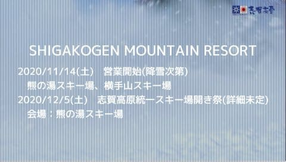

（[志賀高原索道協会ホームページ](https://www.shigakogen-ski.com/)より)

焼額は例年通り，12月第1週の12月5日(土)

オープン．

中央エリアはまだアナウンスがありませんね…

Yetiや狭山もまだオープン日程がアナウンス

されませんが，おそらくYetiは狭山の

オープンアナウンスを待って，その1週間前を

狙ってくるはず．

…とりあえず．

順調なら，あと1か月ほどでシーズンインです！！

…ってなことで．

スキーシーズンが着々と近づいていて．

前回はちゃんとスキーblogらしく，

スキーネタをやりましたが．

今日はダイビング旅行記をば…

では，どうぞ～！

ーーーー

ということで．

今回の遠征のファイナルダイブが

ついに終わってしまい．

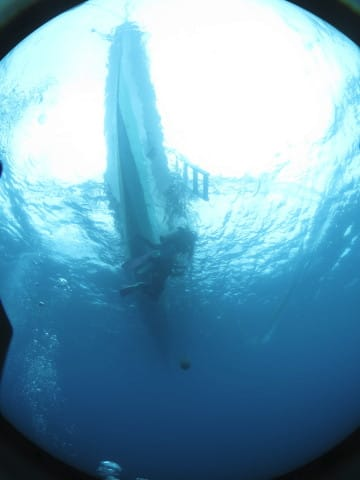

あとはショップに戻るだけ．

あぁ…終わっちゃった…（涙）

これでも，いつもより日程を

1日伸ばしたんだけど．

でも，現地4日は短く感じる…（涙）

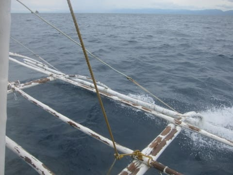

でも．

まぁ，最終日も3本潜れたし．

満足かな…！

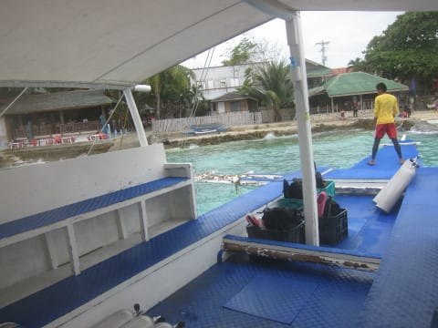

ってなことで．

我が家の貸し切りだったボートは

ショップ前に到着．

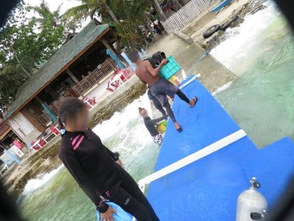

午前中に3本という，無理やりプラン

だったので．ボートを降りた時には

もう午後1時近く…

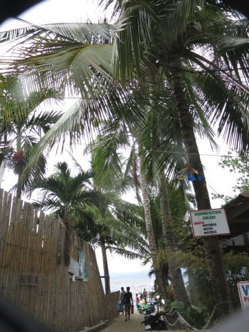

本日はラストデーなので．

ショップに戻ってから…

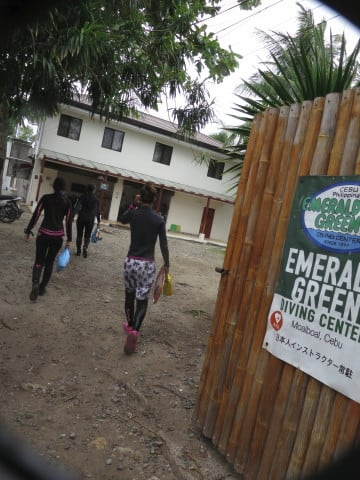

器材を洗わなくてはならないわけですが．

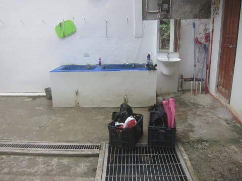

さすが殿様ダイビングのフィリピン．

カメラ以外の器材は，全てスタッフが

洗ってくれるという…

なんて楽なんだ！！

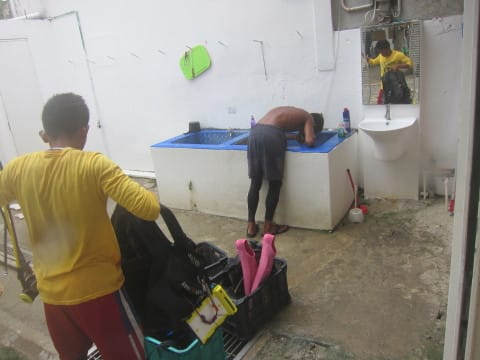

でも．

娘．

こんな楽してたら，お前，絶対

器材の洗い方忘れるよな…

スタッフが器材を洗ってくれている間，

我々はゆっくり暖かいシャワーを浴びて

いられるという．

なんてゼイタクな…

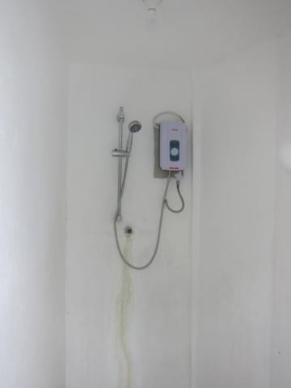

あ，ちなみにシャワーブースは，

器材洗い場の横に，こんな感じで

あります．

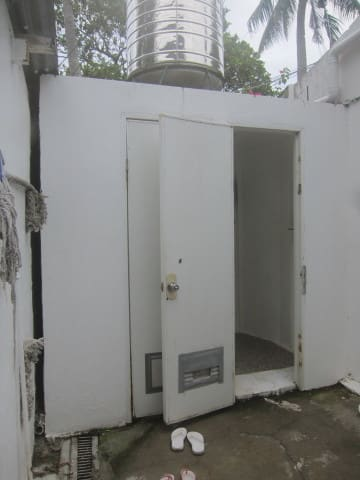

とりあえず，シャワーを浴びたら．

もうお昼を大きく過ぎてお腹も

減ってるし．

器材はまだびしょ濡れだから，

夕方にログづけがてら器材の回収に

ショップに戻ってるということで．

ホテルへ戻ってから，

すぐお昼ご飯へGo！

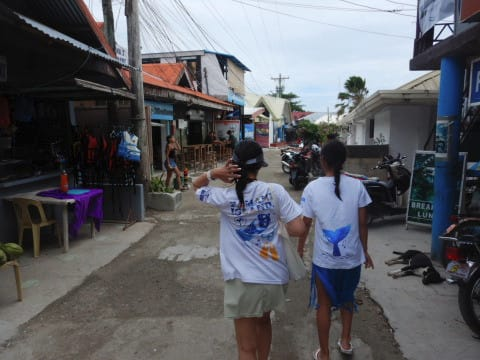

お昼ご飯にやってきたのは…

一日目の夜ご飯に立ち寄った，

Lantawレストラン．

「Neptune」の看板がある建物の

2階にあるレストランです．

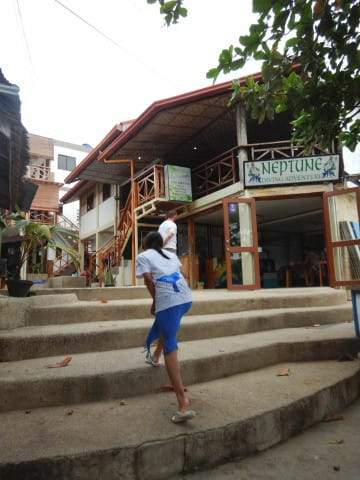

そして．

娘お気に入りの生マンゴージュースと，

私はダイビングがもう終わったので，

お昼からビール！

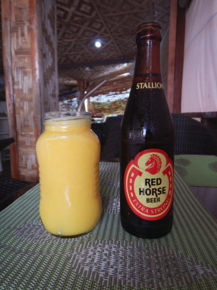

うむ．

なんてシアワセなんでしょう…

ちなみに，このレストラン．

いつもくらい夜の写真しかないので，

お店の中がどんなのか写った写真が

あまりなかったと思いますが．

お店の中はこんな感じです．

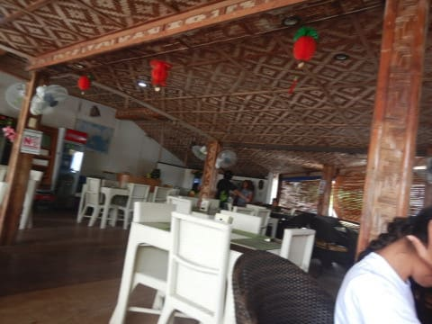

時間がお昼を大きく過ぎているので，

他のお客さんがいませんが…

さて．

何を食べましょうかね…

この店は，タイ・インドネシア・

フィリピン・中華という，

アジアンフードのお店．

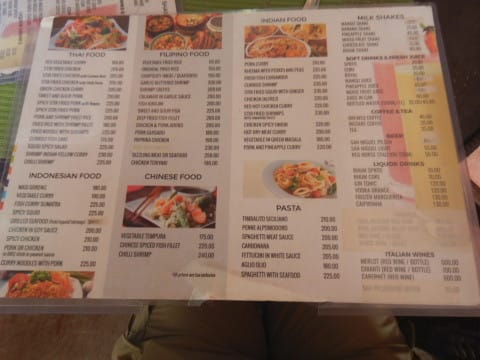

選んだのは…エビチリとナシゴレン．

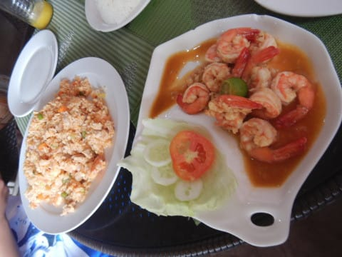

そして…

グリーンカレー．

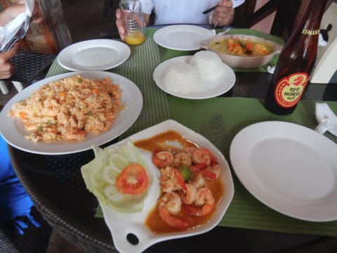

もう午後2時を過ぎていて．

朝ごはん以来何も食べてないから

腹ペコ！

いただきま～す！

…と，食べている時…

ネコが近づいてきて…

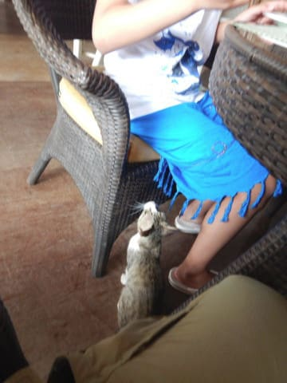

物欲しそうな目で，わが娘に

寄り添ってきました…

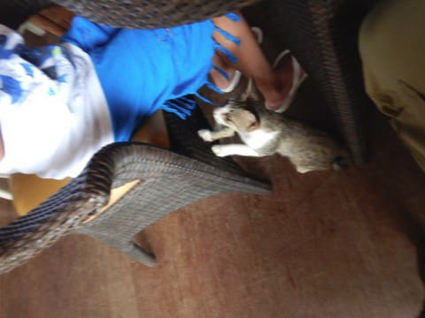

動物好きの娘は喜んでましたが．

「なんかくれよ～」って感じで，

図々しい猫ちゃんでした…

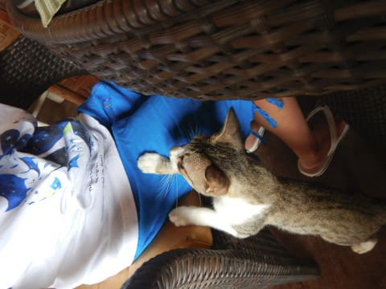

とりあえず．

お昼ご飯を食べて人心地着いたら，

午後3時．

ショップには午後4時に戻る予定なので，

1時間しかありません…

…

まさか，娘，またプールに行くのか？？

…と思ったら．

娘「…今日は天気悪くて寒いからいい」

え！！

…珍しいっ…！？？

そんなこともあるのね…
