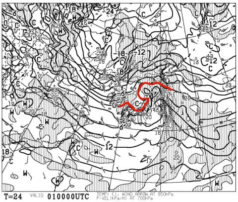
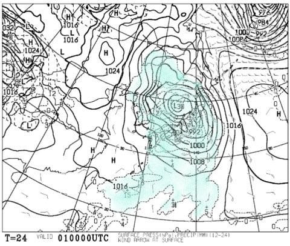
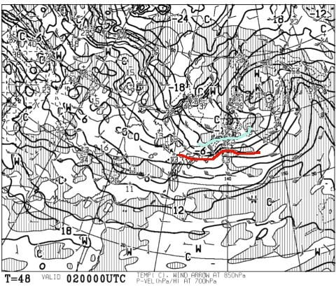
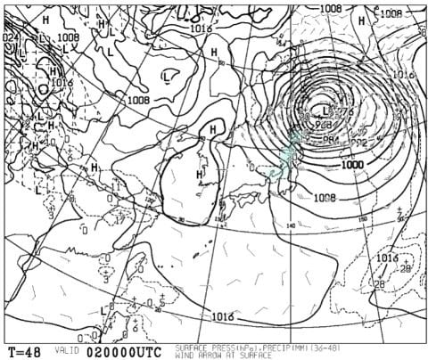
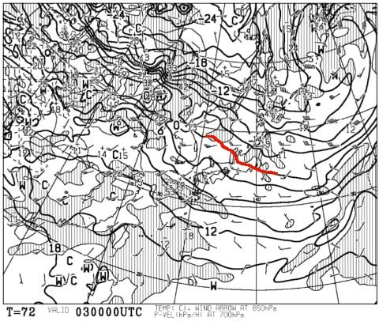
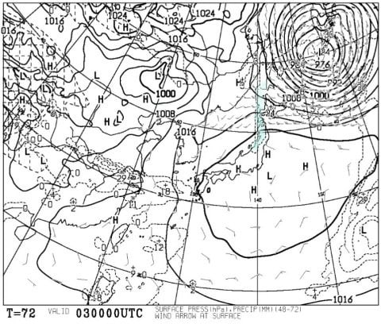
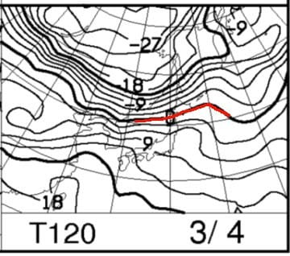
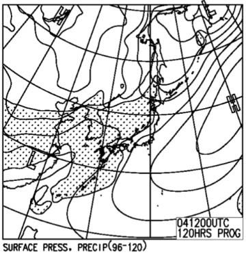
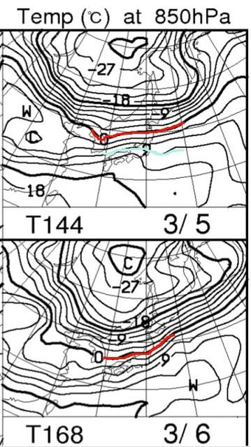
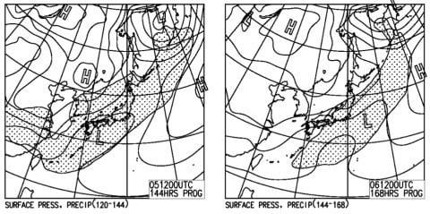

# 3月3，4日の週末の志賀高原スキー場の天気は…晴れそうだけど，昼は気温がめちゃ高い春スキーで雪はザブザブか（涙）

📅 投稿日時: 2018-03-01 00:25:04

えー．

昨日．

ATOMIC　S9i PROの試乗レポートを書いたものの．

来週の天気図がすごそうなのを見て．

…やっぱり試乗レポートはやめて，

天気予想にしよう…

と思っていたら．

何かの手違いで両方の記事を投稿してしまっていた

Skier_Sです．

…試乗レポートは次のネタに取っておこうと

思ったのに…（ちょっと涙）．

で．

月，火と天気ネタが続いたので．

そろそろ読者の皆さんも飽きていることとは

思いますが．

…今日は水曜なので．

水曜夜定例の，週末の天気予想に行くのだ！

…まず．

その前に．

明日木曜日，3月1日の850hpa気温を見てみると…

うむ．

やっぱり赤い0℃線は志賀高原より北．

朝は志賀でもプラス気温に上がりそう…（涙）

でも，思ったより0℃線が北上しなかったので．

夜中の降り始めは雪になってくれるかな？？

雨になるのは日が昇ってからくらいかも．

そして，地上天気図を見ると…

やっぱりすごい低気圧（涙）．

これは…荒れそう…

木曜はやっぱり，リフトもゴンドラもほとんど

動かないな～．これは…

で．

1日は，朝までは雪でもってくれそうなので．

日が昇るころに雨になってくる感じか…

さらに，雨になっても朝のうちに止んじゃいそうなので．

朝，雨になるかならないかで降り止んでくれれば，

思ったほど雪は壊滅的影響を受けずに済むかも…（楽観的希望）

で．

金曜，2日ですが…

850hpa気温は．

うむ．

2日は冷えてくれるようですね…

赤い0℃線は太平洋側まで下がり，

志賀には水色の-9℃線が近づいてます！

気温がぐぐぐっとあがる1日とは対照的に，

この日は朝は-10℃近くまで冷えそうな志賀高原．

でも，地上天気図を見ると…

水色の降水域が志賀高原にかかってませんね…

西風なので，志賀まで雪雲が届かないパターン．

降ったとしてもわずかに積もる程度なので．

1日の高温で溶けた雪がガチガチに固まる

一日ですね（涙）．

で．本題の．

土曜3日の850hpa気温図ですが．

うーむ．

赤い0℃線，ギリギリ志賀高原にかかっている程度…

これは，昼間は志賀高原でも気温はプラスっぽいですね．

で，土曜の地上天気図は．

…うむ．

すっぽり高気圧に覆われて，晴れそうですね…

でも．

気温が上がりそうなので．

それで晴れるということは…

雪が高温＆日差しで溶けて，春の雪に

なっちゃうということ…（涙）．

そして．

日曜4日の850hpa気温は…

…すごい．

赤い0℃線ははるか北に行き，

志賀高原には+9℃線が近づくレベル…

この日の昼間，3月になったばかりというのに．

「5月か！」ってくらい気温が上がりそう…

地上天気図は，こんな感じで．

高気圧は東に去っていくものの，

志賀にぎりぎり降水域はかかっておらず．

志賀は夕方までは晴れてくれそうか…

ってな感じで．

まとめると．

3日土曜：朝はうす曇り～晴れ．気温は朝は-3度くらいか…

　前日はかなり気温が冷えるものの，前日からの積雪はほどんどないので．

　朝は表面がガチガチに固まったアイスバーン状態でスタートか（泣）．

　ただ，昼間に向かって気温が上がり，午前早い段階で

　プラスになりそうなので．

　日差しと相まって，朝から雪が緩み始め．

　昼ごろには4月上旬並みの．かなりしっとりとした

　重い雪になっていきそう…

　夕方になっても気温が高いままなので，

　緩んだ雪は午後になっても柔らかいまま．

　夕方は春の午後っぽい，溶けた雪が蹴散らされた

　あれたバーンになるか…

4日日曜：朝からすっきり晴れ！気温は朝は0℃程度か…

　朝はかすかに締まっているかもしれないけど，

　朝から緩い感じの4月のような雪．

　昼間は気温がぐんぐん上がり，5月並みの

　+10℃近くまで上がりそう…

　雪は，表面はもうザブザブドボドボの，重い

　4月の雪ですね（泣）．

　この日は一日中晴れで，暑いくらいに感じる，

　まるでGWの春スキーのような一日でしょう…

あぁ…

まだ，3月になったばかりというのに．

なんで早くも，4月並みの気温＆雪に

なっちゃいそうなのか…（激泣）．

そしてやっぱり，

月，火も，二日続けて気温はプラスになりそうだし．

で，2日間，

液体が空から降り続けそうだし．

…例年，この時期に雨が降ったとしても，

せいぜい数時間の出来事．

こんなに2日間も降り続けるなんて，

普通はありえないんだけどなぁ…？？？

とりあえず．

3月に突入した，1日から6日までの間で．

かなり雪はダメージを食らいそうです…（あきらめの境地）．

あぁ…

いったいこれは何の仕打ちなんだろう…

とりあえず．

読者の皆様におかれましては．

昨日に引き続き．

5，6日以降は3月が終わるまでずっと，

気温が-20度クラスに冷え込み．

毎日1mくらい雪が積もり続けることを願って←だから，それだったら積雪20m超えるってば

ハイパー冷え冷え降れ降れ踊りをフルパワーで踊り続け

てくださいますよう，お願い申し上げます…

## 💬 コメント一覧

### 💬 コメント by (はっち)
**タイトル**: Unknown
**投稿日**: 2018-03-01 22:05:02

この時期に「春スキーを楽しめる！」とポジティブに考えましょう(笑)

### 💬 コメント by (Skier_S)
**タイトル**: はっちさま
**投稿日**: 2018-03-02 02:00:33

これが今週一回きりならいいんですが…

ヘタするとこの3月，毎週必死にポジティブシンキングを

しなくてはならないコンディションが続くかも…（戦慄）．

そうならないよう，必死に例の踊りを踊りましょう！！

