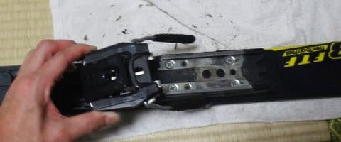
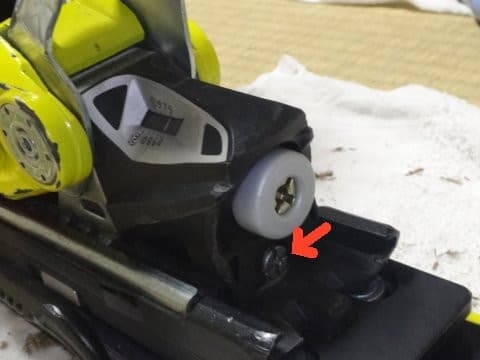

# ATOMICのVARビンディングとSALOMONのXビンディングって同じだよね…SALOMON　X-RACEにATOMICのVARビンディングがつくのか？その2

📅 投稿日時: 2017-02-24 05:58:10

🏷️ カテゴリ: [スキー雑談](c1f9d2cb7478308da16419928ea3945e9.md)

えー．

私の記憶が確かなら．

昨日は2時間睡眠で会社に行った気がするのだが．

なぜ，今日もこんな時間まで仕事して

たんだろう…（涙）．

まぁ．

徹夜覚悟だったのが，明け方に終わっただけ

マシとしておこう．

ということで．

死にそうな感じですが．

意地で更新．←何がここまでさせるんだろう…

で．

もう，昨日になりますが．

…やっぱり，午前中はかなりのザーザー降りだったようで…（涙）

そして．

強風でゴンドラどころか，リフトも止まっちゃったようですね…

（[焼額山公式F](https://www.facebook.com/yakebitaiyama/?fref=nf)Bより）

今は雪が降ってるようですが…

（[北信建設事務所道路状況ページ](http://www.q0.ws302.smilestart.ne.jp/index.htm)より）

でも．

そんなにドサドサ積もってない感じ（涙）．

金曜もそんなに積もらなさそうなんだけど…

うーむ．

土曜までにアイスバーンが隠れてくれないと…

この週末すごいことになっちゃうんですけど…

いや．

やっぱり．

ここは必死に，

今週金曜は冷え冷えになって

いい雪がドサドサ積もって下地の

アイスバーンが隠れる踊り

踊らないといけないのだ…っ！！！

…ってことで．

本題．

書きためておいた，ビンディング付け替えの記事．

完結編です…

ーーー

[前回](e66d987c87d412ae5a5a360c31a739df0.md)は，

古いATOMIC DEMO SXからX12 VARビンディングを取り外す

ところまで行きましたが．

今回は，外したビンディングが，X-RACEに着くかどうかの

試すことになります…

まず，トゥピース側ビンディング取り付け台を…

水色矢印3本のネジで固定します．

ATOMICの板では，赤矢印2本のネジ穴と，

水色矢印の右側2本のネジの計4本を使ってましたが．

SALOMONの板には，丁度写真でドライバが刺さっている

真ん中のネジ穴を使って，水色で示した

3本のネジでの固定になります．

ビンディング取り付け台座は，どちらにも穴が開いているので

問題なくSALOMONの板に固定可能でした．

トゥピース側がついたら，

今度は同じくヒールピース側を

取り付けます．

ヒールピースの固定穴は，ATOMICと

全く同じ位置の4か所（矢印部分）でした．

プレートが付いたら，この段階で

忘れずにブレーキを取り付けましょう…

取り外した時と同じ，ネジ1本でつけられます．

ブレーキがついたら．トゥピースをはめて…

トゥピースから伸びる金属に295とかかれている部分と

プレートにかかれている295と書かれている部分を，

こんな感じで合わせます…

これで，トゥピースの位置が決まるので．

次は，ヒールピースをはめます…

外した時と逆の手順で．

後ろから差し込めばOK.

差し込んだ後，

ヒールピース側の金属がトゥピース側の金属の上に

来るように調整してください．

で，そのあとは．

ヒールピース側の金属の先端を，自分の

ブーツのソールサイズの数値に合わせましょう．

私のブーツはソールサイズが295mmなので．

金属の先端をこんな感じで，295の目盛りに

合わせます．

そしたら，最後に白いパーツを付けましょう…

で．

あとは．

板にブーツをはめて，

ビンディングの調整を行います．

まず，適正前圧の調整です．

これ，大事．

Xビンディングを使う人は，この調整を忘れずに！

調整に使うのは，このネジ．

このネジが，ビンディングの後ろの平面とツライチになるよう，

ネジを回しこんで調整します．

こんな感じで，ネジの頭とビンディング後ろの平面が

ツライチになればOK!

後はトゥ側と…

ヒール側の解放値をそれぞれ調整すれば…

これで完成！

ということで．

…こうして．

ATOMICビンディングがついている，

不思議なSALOMON板が完成したのでした…

で．

これで実際滑ってみましたが．

全く問題なし！！！

ってなわけで．

とりあえず，見た目で

「たぶん同じもののはず…」

と，漠然と思っていた，

SALMONのX-ビンディングと，ATOMICのVARビンディング．

この二つがお互いに付け替えられることが，

明らかになったのでした～！

PS.ビンディングは技術者のいるスキー屋さんで　

　取り付けることが推奨されいてます．

　ちゃんとした技術者がいるお店で取り付けた場合，

　何かあった時の保険が効くようになってますが．

　自分でビンディングを着けると，

　保証＆保険が効かなくなるので．

　あまりおススメしません…

　と，書いておきます（笑）

## 💬 コメント一覧

### 💬 コメント by (かず)
**タイトル**: 今週末
**投稿日**: 2017-02-24 12:55:00

ゲレンデコンディションが…僕の中で先々週のパウダー4日間の最高のイメージしか無いんですけど面影は無さそうですね　試乗会無ければ中止なんですが　この日しか乗れない板あるので…スキーってビィンディング付けるの大変なんですね

### 💬 コメント by (いー)
**タイトル**: Unknown
**投稿日**: 2017-02-24 19:16:09

黄色が同じでシックリしてます‼

カッコいい！

ビンディングのないSXは廃棄ですか？

### 💬 コメント by (michi)
**タイトル**: 明日は…
**投稿日**: 2017-02-24 19:33:12

Sさま

明日は息子とヤケビに行く予定です。

スキー板しかわからないのでお会い出来るか分かりませんが、、、（笑）

息子は赤いウェアで黒のメット、自分はクリーム色のウェアに白のメットです。

見かけたらお声がけ下さい(^^)

### 💬 コメント by (Skier_S)
**タイトル**: 今週末はアイスバーンか…（涙）
**投稿日**: 2017-02-24 21:31:56

＞かずさま

今週末はダメっぽいです．

雪は降らなさそうです（涙）．

先週は10cm積雪があって助かったけど，

今週はダメです…

で．

そうなんですよ．

最近のスキー板は，指定ビンディングしかつけられない

ので，大変なんですよ…

＞いーさま

そうなんです！

意外と色がぴったりで…いい感じなんですよ．

全く違和感がありません．

SXはどうしようか悩んでますが…

ビンディングないと使えないので，

誰ももらってくれないんですよね．

オークションで売れるのかなぁ…

＞michiさま

はいはい～！

今週末も焼額グルグルしてます！

どんなウェアかはナイショなので，

板を目印に探してください～

…ってか，滑りとかゴンドラの乗り降りの

仕方で，すぐ分かるらしいですが（笑）

### 💬 コメント by (いか)
**タイトル**: Unknown
**投稿日**: 2017-02-25 19:19:26

先週の八方で、海外からのA社のSL板をはいたイントラが、左はA社のビンディング、右はS社のビンディングをつけてて、思わず二度見してしまいました(笑) 私もついに来期はビンディングの付け替えで安上がりにする予定です(*・∀・)

### 💬 コメント by (Skier_S)
**タイトル**: いかさま
**投稿日**: 2017-02-25 23:32:44

板の左右でビンディングが違うとは！！

なぜ，そんなことになったんでしょうねぇ…

来季の板は，ビンディング使いまわしてください～

VARビンディング，結構高いので…

### 💬 コメント by (Unknown)
**タイトル**: Unknown
**投稿日**: 2017-02-27 08:39:45

＞ATOMIC は 4 本固定で SALOMON は 3 本固定

逆向きの移植をするとネジが一本足りない？

＞SXはどうしようか悩んでますが…ビンディングないと使えないので

VAR　ビンディングより歴史の古い TL ビンディングならその辺に転がっているのですが・・・。

X-RACE は Z ビンディング X ビンディングの穴がプレドリルっぽいですが、

SX のダブルデッキに他の穴は空いてない？

### 💬 コメント by (Skier_S)
**タイトル**: Unknownさま
**投稿日**: 2017-02-28 01:37:18

そうなんです．

逆向きの移植をするときは，

ネジを一本準備する必要があります…

で．

SXのアッパーデッキには，大変残念なことに，

他の穴は一切空いてません．

'13＆'14モデルのSXは，VARビンディングのみ対応で

TLビンディング付きは無かったはずなので…

＃'15モデルから，ビンディングが選べるように

＃なったはず

TLビンディングとVARビンディング，

穴位置が一緒だったりしないかな～…

と，思ったけど．

調べてみると，やっぱり全然違うようです…（涙）．

### 💬 コメント by (Unknown)
**タイトル**: Unknown
**投稿日**: 2017-03-05 23:37:11

＞'15モデルから，ビンディングが選べるようになったはず

 所有されている '16SX '17SX には TLビンディングの穴も空いているのかどうかを予め確認されることをお勧めします。

きっと先々の物欲選手権が捗ることでしょう。

### 💬 コメント by (Skier_S)
**タイトル**: Unknownさま
**投稿日**: 2017-03-06 01:44:20

TLビンディングの穴があるかどうか，

ビンディングを外してみないと分からないので…

また，外す機会があれば確認してみます．

…もし，神田に行く機会があれば，

取り付け前の板を眺められるのですが…

…私が神田に行くというのは

何かの危険を伴うので，

なるべく避ける方向で…（笑）

### 💬 コメント by (Unknown)
**タイトル**: Unknown
**投稿日**: 2017-03-06 09:18:45

＞また，外す機会があれば確認してみます

金属プレートが流行っていた頃、輸送時の衝撃（？）でネジが固着する事故が多発したので、

通販で購入した板は到着直後・使用前に

プレート・ビンディング間のネジを緩めて締め直すのが癖になりました。

板とビンディングとの組み合わせを変えずに使い切る人は問題ないのでしょうが

「どれだけトルクをかけて締めているんだよ」って思う糞店舗も多いので、

未知の店舗からの購入する時は結構ドキドキします。

### 💬 コメント by (Skier_S)
**タイトル**: Unknownさま
**投稿日**: 2017-03-07 04:14:47

あ，そんな固着事故があるんですね…

私の場合はビンディングを自分で付け替える

ことがなかったので，そんな目には合ったことが

ありませんでしたが，今回のSXは前圧調整が

ちと甘かったです…

やはり，未知の店舗からの購入はドキドキです．

### 💬 コメント by (Unknown)
**タイトル**: Unknown
**投稿日**: 2017-12-19 13:50:39

初めまして、ATOMICのビンディングで検索してこちらにたどり着きました。

丁寧な記事と写真でとても参考になりました。

１点だけご存知でしたら教えて下さい。

＞トゥピースから伸びる金属に295とかかれている部分と

プレートにかかれている295と書かれている部分を，

こんな感じで合わせます…

これはソール長に関係なく２９５で共通なのでしょうか？

私のはソール長２８５（小さい！）なので

どこに合わせればよいか迷っています。

もちろん自己責任は承知しております。

### 💬 コメント by (Skier_S)
**タイトル**: Unknownさま
**投稿日**: 2017-12-20 02:00:57

徒然スキーヤー日記へようこそ！

プレートの295の目印は，あくまでソール長295mmの

場合の目安ですので…ソール長が変わった場合は，

基準位置も変わります．

トゥピースの295の目印を，プレートの295の目印と合わせると，トゥピースの横にかかれている三角印が，トゥピースを押さえる部分に書かれている『4』の目盛りを

指していると思います．

この目盛り，大体7.5mm間隔で打たれており，

トゥピースは7.5mm単位で前後できます．

285だと，トゥピースをひと目盛り後ろにずらし，

『5』の目盛りに合わせるのが標準になるかと．

…ただ，「VAR」ビンディングは，

レバーひとつでビンディングの前後位置を自由に

調整できる「Variable」からその名前が来ている

ビンディングですので，滑ってみて気に入る位置に

前後位置を合わせればOKです．

ブーツポジション前寄りが好きなら4，

後ろ寄りが好きなら5から6へ動かしてみる…

というのを，滑りながら探すのも楽しいですよ．

という感じで．

得体のしれないスキーネタ満載のBlogですので，

今後もこのBlogをご愛読ください…

### 💬 コメント by (Unknown)
**タイトル**: SL PRO に VAR ビンディングを取付中です
**投稿日**: 2017-12-20 03:49:42

同じ時に同じことで悩んでいる人がいるのですね。

295mm の刻印に従うと 295mm はポジション 4 なんですが、資料によっては 295mm はポジション 5 だったりポジション 6 だったりします。

http://blog.goo.ne.jp/wangel-sports-info/e/c380b4f1040b4924f6789484252bd86d

https://i-love-ski.blogspot.jp/2014/04/x.html

両方共、トゥピースは外側のプレドリル、ヒールピースは内側のプレドリルに取り付けろというところまでは同じなんですが VAR ポジションだけが違います。

＞滑ってみて気に入る位置に前後位置を合わせればOKです

結局、自分の感覚を信じるしかないってこと？

### 💬 コメント by (Unknown)
**タイトル**: ありがとうございました
**投稿日**: 2017-12-20 10:51:44

トゥピースの調整を教えて頂いた物です。

即答、それも詳しく教えて頂いてありがとうございました。

早速調整して、ゲレンデでポジション含め試してみます。

### 💬 コメント by (Skier_S)
**タイトル**: こんな古い記事が盛り上がるとは…
**投稿日**: 2017-12-21 01:02:46

＞SL PROのUnknownさま

295mmのポジションが4だったり，5だったりってのは…

もしかしたら，板によってビンディングベースプレート取り付け位置が違い，板毎に最適な目盛りが

違っているのかも？？？

と思っています．

＞トゥピース調整を質問されたUnknownさま

お役に立てなら何よりです～！

ぜひ試してみてください．

そして，志賀に来るときはまたSkier_Sを

探してみてください！

### 💬 コメント by (コヤマ)
**タイトル**: Unknown
**投稿日**: 2020-12-02 18:03:07

すみません。ＸビンディングとRACEビンディングの互換はいかがでしょうか？

### 💬 コメント by (Skier_S)
**タイトル**: ＞コヤマさま
**投稿日**: 2020-12-02 23:07:36

RACEビンディングとの互換性は試したことが無いので分からないですが，

トゥピースの抑え方が違うので，互換性はなさそうな気がしています…

