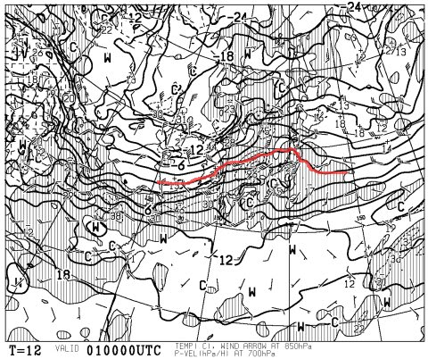
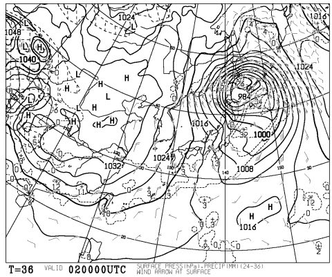
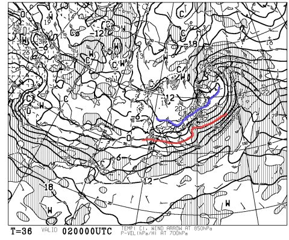
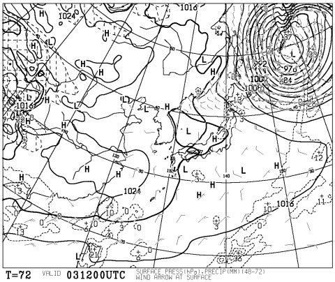
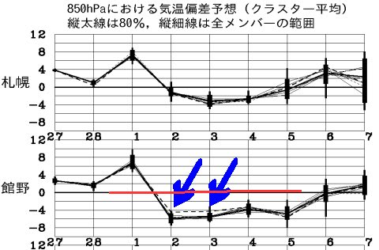

# 好評！今週末の志賀高原の天気予想は？

📅 投稿日時: 2013-03-01 03:02:04

あー．

Blog書いてる暇があるのか？というほど，

仕事がテンパっているSkier_Sです．

＃一体何時にBlog書いてるんだ…←自分への突っ込み

ですが．

定番の，今週末の志賀高原の天気予想をば…

なんだか，金曜は終日気温が上がりそうですね～

…こんな感じで，850hpaの0度線が，青森近辺まで北上しちゃってます…(涙)

志賀高原でも，昼間はプラスまで気温が上がっちゃいそうです…

日も射すので，雪のコンディションはちょっと悪くなるかも…(泣）．

でも．

でも．

安心するのだ．

金曜夜から，土曜朝にかけて．

冷えます．降ります．

また，積もりそうです．

こーんな感じで．

土曜の朝9時の地上予想図は完全な冬型．

等圧線も見事に縦縞です！

んで，850hpa面の高層天気図も…

0度線は南に下がってくれてますね～．

赤く記した0度線，あんまり南下してないように見えますが．

青く記したマイナス9度のラインが志賀高原近辺までしっかり下りてきてます

志賀高原，土曜の朝は間違いなくマイナス10度以下に冷えますねー．

…でも．これって，荒れて風が強くなるパターン．

ゴンドラが止まらなきゃ良いけど．

んで，

日曜．

…

なんだか．

すごい不思議な地上天気図…

こんなの，はじめて見たんですけど．

これって…日本海と四国付近とで数箇所，等圧線，交差してない？？

なんかの間違いじゃないかな～？

とりあえず，冬型は緩むので．

朝のうちはは雲が残って雪がちらつくかもしれないけど．

基本的に昼ごろからは日が射し，絶好のスキー日和になりそうですね．

あー．でも．

こんな感じで，2日と3日，

ともに平年より6度ほど低いみたいなので．

日曜も，3月にしては冷えますよ～．

って感じで．

まとめると．

土曜は朝から終日雪．風も強くて冷えるよっ！

パウダーが楽しめそうだけど…天気は荒れぎみでゴンドラ止まっちゃわないか心配．

日曜は，朝のうちは雲が出て，ちらちら雪が残るかもしれないけど．

午前中，遅くとも昼ごろには晴れて．

前日積もった，よく冷えた最高の雪がきれいに圧雪されて．

ピカピカ大回りバーンを楽しめるでしょう！

## 💬 コメント一覧

### 💬 コメント by (gokuraku skier)
**タイトル**: Unknown
**投稿日**: 2013-03-01 19:48:32

いつも素晴らしい予報ありがとうございます。

日曜日は良さげですね。

と言うことで日曜日出没します。

ちなみに木曜日の焼額山、オリンピック、ＧＳ共に終日最高でした。

ゴンドラがまた30分ほど止まりましたが…

### 💬 コメント by (Skier_S)
**タイトル**: gokuraku skierさま
**投稿日**: 2013-03-02 09:13:56

…土曜日は，予想通り志賀高原では強風でゴンドラ＆リフトが止まってる

みたいですね．

ヤケビは第1，第2ともにゴンドラが止まってるようで…

私は今仕事から戻ったばっかりで，今日はスキーにいけません(涙）．

明日もいけるか微妙な状況…（激泣）．

これから寝ます…ｚｚｚ

### 💬 コメント by (ゆうこ)
**タイトル**: お疲れ様です。
**投稿日**: 2013-03-02 12:49:49

今は第一ゴンドラは動いてます。

第二は動いてないので、午前中は15分待ちくらいでした。

昨日の雨で、上林温泉からの道がつるつるになって立ち往生する車が大量にあったり、ゲレンデもアイスバーンで、あまり快適じゃないです。

今は、Skier_Sさんの予報通り雪が降って来ました。明日にはコンディション回復を祈ります。

仕事お疲れ様です。ゆっくり休んでください。

### 💬 コメント by (Skier_S)
**タイトル**: ゆうこさま
**投稿日**: 2013-03-02 19:28:10

あーーー．

予想より雪が降らなかったみたいですね…

金曜に雪のコンディションが悪くなる予想は

していたんですが，土曜は下地が隠れるほど

降りそうだから，大丈夫かな，と思ったんですが…

アイスバーンでしたか(涙）．

スキーに行けなかった日が最高のコンディションだと

くやしいので，少しだけ救われたかも…

（ゆうこさんには悪いですが(＾＾;))

今晩の仕事の進み具合に，明日いけるかどうか

かかっています…

明日も楽しんでください！

