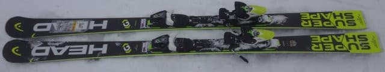
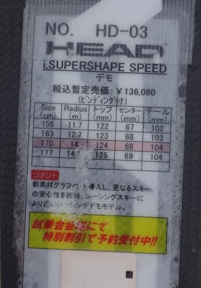
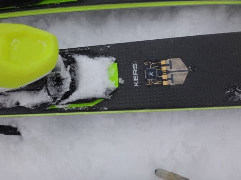

# 2018シーズンモデル，スキー試乗レポート第6回…HEAD編その1

📅 投稿日時: 2017-04-21 02:19:58

🏷️ カテゴリ: [スキー板試乗](c0bd8048615710cee890e403a36cc9a2b.md)

ということで．

今週末はそこそこ冷えて天気も良く．

いい感じの週末になりそうですが．

とりあえず，本日も続く，スキー板の試乗レポート．

本日はヘッド編．

今日も帰宅が遅く，あまり時間がないので（涙）．

1機種だけのレポートです．

では，どうぞ～！

HEAD i.Supershape Speed 170cm

エキスパートオールラウンド

オールラウンドですが，170cmでもR14と，

サイドカーブだけを見るとかなり小回りっぽく

感じますね～…．

乗ってみると，結構粘りが強く，ウエットな感じで．

最初は柔らかくたわみ始めるのに，たわみが大きくなっていくと

だんだん粘るように踏み応えが出てきて，板に芯が出てくる

感じ．

低速だと優しく柔らかくたわむ感じがするのに，

スピードを出すと，板の芯がしっかりした感じが出てくるので，

結構なスピードまで耐える板です．

…これがKERSの効果なのかな？

トーションは強めで，しっかりエッジグリップしますが，

板が比較的軽いので，本人の意向に反して板の

行きたい方向にいってしまうような板ではなく，

ずらそうと思えばずらせる自由度があります．

ターンのどの局面からも，板を思い通りに

動かすことができて，コントロール性は

かなり高いです．

さらに，返りがそんなに早い板ではないので，

スピードを出すとどうしても小回りに

なっていってしまう…ということもないです．

170cmという長さのためか，R=14という

サイドカーブから想像するよりも大回りまで

行けるし．

しっかりたわませれば小さめのミドルターンくらいまで，

レールターン状にエッジに乗ったまま行けて．

ミドル～ロングが気持ちいい板に感じました．

高速でしっかりエッジグリップして，

粘るようにたわんでいき，かなりのハイスピード

大回りまで行ける強いスピード耐性があるのに，

軽快でかなりコントロール性は高く感じる…

という，かなりいい感じの板でした．
