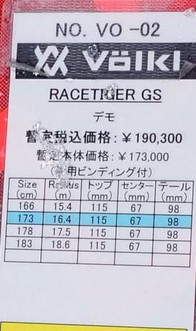

# 2025シーズンモデルのスキー板，試乗レポートその25…VOLKL RACETIGER GS

📅 投稿日時: 2024-07-06 03:18:40

やっと週末がやってきましたが…

今日も寝たのが朝5時半過ぎで，

さらに帰宅も深夜0時近く（涙）

今週はずっとこんな感じの激務だったので，

さすがに明日早起きして山に出かける

元気がもう残ってない…

…でも．土日で終わらないくらいの宿題が

あるので，日曜も山に行けないだろうなぁ…

疲れてて睡眠不足でも，無理にでも運動

しないと，運動不足で身体がダメになって

不健康になっていくし．

精神疲労だけで肉体疲労がないと，

睡眠も浅くなり，寝ても疲労回復しなく

なるし．

気分転換の運動をしないとメンタルも

弱まるので，精神の健康のためにも，

なるべく無心になれる運動をしないと

いけないから.

健康のために，また明日も睡眠2時間で

無理してでも走りに行こうかな？？

…という考えが．

自分が健康になるための手助けになって

いるのか，

あるいは自分の寿命を削ることに

なっているのか…

果たしてどっちだ！！？？？

どっちと思うかコメントください（笑）

……ってな感じで．

健康のために無理をするということに．

「健康のためなら死ねる」的な，

そこはかとない矛盾を感じた本日．

とりあえず，今晩は寝る．

もう寝る．

仕事せずに寝る！！

明日，明後日で仕事をやっつける！！

ってなことで．

もう寝ますが…

それでも今日も2025シーズンモデルの

スキー板試乗レポートを書いてしまう，

この義務感…偉いのかなんなのか．

本日はフォルクル編です！！

〇VOLKL RACETIGER GS 173cm

基礎大回り

競技用のRACETIGER GS WCシリーズとは違い，

基礎用のRACETIGER GSシリーズです．

競技用と違い，WCプレートはつかず

rMotionビンディングが板に直付けとなります．

173cmだと，R=16 となり，大回り用としては

かなりラディウスが小さめですね…

滑ってみると…

やっぱりラディウスが小さめなので，

スピードを出していくと良く回り，

ミドルっぽいターンになっていきます．

スピードが出た中でしっかり角付けを

していくと，カービング小回りに

近い領域までぐいぐい回っていく

感じで，良くたわんでたわみに沿って

気持ちよく回っていく板です．

あまり踏まずに，板なりに楽にクルーズ

していけば大回りで落ちていくので．

体力を使わずロングコースをゆったり

クルーズするのとかに向いてそう．

重さはなく，ロングの板としてはかなり

軽快なので，ロングの板と気合を入れる

ことなく，かなり楽に履けるクルーズ用

って感じ．

板が長い分，荒れた雪でもそこそこの

走破性があるので，春の雪とかでも

そこまでの急斜面じゃなければ，

板の軽さの割には結構気持ちよく

凸凹を踏みつぶして滑っていってくれます．

私が硬めの斜面で滑ると，R=16という

こともあり，旋回性がかなり強く，

旋回半径がロングというより

ミドルっぽくなっちゃいますが…

そのミドルターンも，長いエッジがしっかり

雪面に食いついて板が良くたわんで，

ターン終了時に気持ちよくゆったりとその

たわみが解放されて，谷回りに自然に

入っていける気持ちよさがあります．

そして，ポジションの許容度が広く，

前より・後ろよりのどっちに乗っても

板が自然に回ってきてくれるし．

どう乗っても踏まなくても気持ちよく

回ってきてくれる，オートマチック性が

あります．

オートマチックに回ってくるけど，

傾きや踏む量で半径は大回りから

小回りに近いところまでもっていける

操作性の高さはあるし．

体力がなくても，どんなレベルの人でも

気持ちよく楽にハイスピードロングターン

ができる，かなり楽に気持ちよく滑れる

板です…

GS板ほどの板がいらないけど，

お気楽にロングクルーズができる

大回りベースのオールラウンド板が

欲しいとすれば，これがかなりおススメ

できますね…！

うん．

やっぱりVolklの板，いいなぁ…

## 💬 コメント一覧

### 💬 コメント by (カンタロス)
**タイトル**: Unknown
**投稿日**: 2024-07-06 13:15:07

寿命を剤ってるに一票（笑）

やはりセパレートビンディングと違って、ポジション許容度が高いのですね。

VARビンディングと同じですね。

### 💬 コメント by (Skier_S)
**タイトル**: ＞カンタロスさま
**投稿日**: 2024-07-07 03:36:00

やっぱり命削ってますか…（笑）

この板，かなりポジション許容度高かったですね～…

どこに乗っても曲がります．

ビンディングが効いているんでしょうかね…？

いい板でしたよ！

