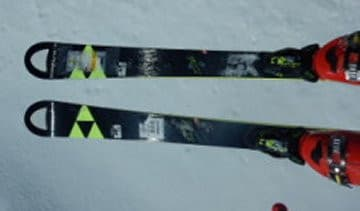

# 昨日のアサマ2000での2019シーズンモデルスキー試乗会，こんな板を試したよ…今後のレポートをお待ちください

📅 投稿日時: 2018-03-28 04:22:47

🏷️ カテゴリ: [スキー板試乗](c0bd8048615710cee890e403a36cc9a2b.md)

ってなわけで．

月曜はアサマ2000の試乗会に行ってきたわけですが．

…アサマ2000に行くと予告も全くしてなかったし．

さらに，試乗会だったので，ゴールドステッカー付き

SXを履いていたわけでもないのに．

なぜか，複数名の方が私を発見して声をかけて

くださったんですが…

どうして私と特定できたのか，

かなり謎が深まるSkier_Sです．

うーむ．どうやって私だと分かったんだろう…

で．

今回の試乗会．

開始後から終了時間まで，ひたすらひたすら

板を交換しつつ．

昼休みもとらず滑り続けて．

乗りに乗ったり，18機種！！

いやーーー．

乗りましたよ．

朝のうちは結構バーンの状態も良く．

雪が緩み始めた午後も，人が少なかったので

比較的フラットなバーンを滑れて．

結構いい感じの雪で試乗できました～！

一の瀬ダイヤモンドよりは距離も長くて．

結構良かったかも…

試乗した板を，ざざーっと並べてみると．

SALOMON S/RACE SL X12TL 165cm

SALOMON S/RACE SL X12VAR 165cm

SALOMON S/MAX BLAST 165cm 

OGASAKA KS-RT+FL585 170cm

OGASAKA TC-SA+FL585 165cm

OGASAKA TC-MA+FL585 172cm

ATOMIC REDSTER S9i pro 165cm

ATOMIC REDSTER S9i 165cm

ATOMIC REDSTER S9 165cm

ATOMIC REDSTER G9i 171cm

HEAD Worldcup iSPEED RP 175cm

HEAD Worldcup iSLR 160cm

FISCHER RC4 W.C. SL Curv Booster 165cm

FISCHER RC4 W.C.SC Yellow base 165cm

ROSSIGNOL DEMO ALPHA PLUS TI 166cm

ROSSIGNOL GS MASTER 185cm

VOLKL RACETIGER SL DEMO 160cm

VOLKL RACETIGER GS DEMO 175cm

だいたいいつもと同じような感じのモデルを選んで

乗ってます…

基本的に，デモ用トップモデルに偏ってます（笑）．

これから試乗レポートを順次掲載していきますので，

お楽しみに！

## 💬 コメント一覧

### 💬 コメント by (yama)
**タイトル**: 20000mクラブ
**投稿日**: 2018-03-29 03:21:19

25日に雪が緩んだ奥志賀、ヤケビから早めに一の瀬に戻ってリフト営業最終日の３高をぐるぐるしているとほぼ同じぐらいの速さの方がいました。何回かリフトに同乗したので、声をかけさせてもらったところ、コンスケさんのアドバイスをもらってチャレンジ中でした。リフトに乗りながら回数をメモしていました。Kさんは最終的に６７本ほど乗って達成しました。今シーズン３人目でしょうか。おめでとう(*^▽^)/ございます！次の日もコンスケさんと３人でリフトに乗りましたが、一緒に滑るのは断られました。

### 💬 コメント by (Skier_S)
**タイトル**: yamaさま
**投稿日**: 2018-03-29 07:00:44

日曜に20000チャレンジされた方，無事達成されたのですね…

iSKIじゃなくて，回数でカウントなら確実ですね．

達成された方，おめでとうございます！

