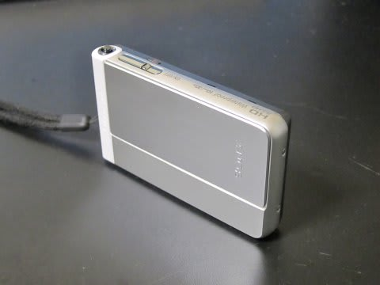

# フィリピン…なぜかSONYのデジカメと相性が悪い場所

📅 投稿日時: 2014-08-26 03:46:08

えー．

本日は，やはりというか，なんというか．

仕事復帰一日目のてんやわんやで．

帰宅がこんな時間…（涙）．

とりあえず．

フィリピンレポートはまた後日スタートするとして．

今日はフィリピンでのちょいと悲しい出来事を…

…なんだか．

どうも．

私はフィリピンと相性が悪いのか，何なのか．

昨年11月のフィリピン・オスロブの旅行で，

SONYのデジカメ，[TX20を水没させてしまい](ec2fd28e254e78b285474bec50dc164a2.md)．

TX30を買ったばかりというのに．

今回の旅行で．

また，このTX30をも水没させてしまったようです…（涙）

それも．

前回の水没に懲りて．

「船の上と陸上だけで使う！」

と，水中にはもっていかなかったというのに…

船の上で，結構水にぬれていて．

それだけで水没しちゃったようです…

それも，前回と全く同じで．

電池ブタを開けても，水が出てくるわけでもなく．

電池も無事で．

[本体に数滴の水が入っただけの故障](ed93330f6f9f06b076e4e348661368854.md)のようです…

なんてこった～っ！

まだ1年経ってないのにっ！

水中にもっていってないのにっ！

水没するとは…

ということで．

どうやらフィリピンと相性が悪いらしい，

SONYのデジカメ．

前回のフィリピンでのTX20死亡に引き続き．

それからわずか9か月後．

今回のフィリピンではTX30が死亡するという．

何かに呪われているのかな～？？？（涙）．
