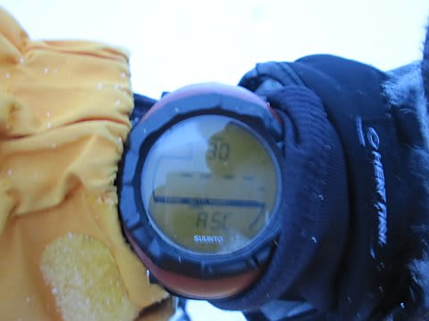

# この週末の滑走標高差，33000m！！

📅 投稿日時: 2011-01-27 02:28:38

この週末，志賀に行ってきた報告をしましたが．

なんにしろ空いてましたね～

焼額第1ゴンドラの待ちが終日なかった，というのは…

平日には経験したことがあったけど，休日では私の知る限り，

これまでになかったことのような気がします…

12月とか4月とか，初すべり・春スキー期間だったら

ゴンドラ待ちが一日中全く無し，ってこともあるんですけど，

1月のハイシーズンでこれは初めての経験ではなかろうか…

＃スキー場の経営が心配ではあるが

おかげさまで，この週末はむちゃくちゃいっぱい滑れました！

これまでの一日最高ゴンドラ乗車記録は34回だったんだけど．

記録更新しましたね～．

これまでの記録は，ゴンドラの待ち時間がない春スキー期間に，

焼額第2ゴンドラで実現したもの．

第2ゴンドラって遅いから，どれだけがんばっても1時間4本しか

乗れないんですよね～．

なので，「一日何本滑れるのかな？」と，記録にチャレンジしようと

意気込んで，まさに朝8時から午後4時半の営業終了まで，

昼ごはんも抜いて休まず滑って打ち立てた，これが精一杯の記録．

で，第2ゴンドラと比較して，第1ゴンドラは速度が速いので，

待ち時間がなければ1時間に5本乗れるんだけど．

…でも，第1ゴンドラが動いているハイシーズンは，昼間に混んで

待ち時間が必ずあるので，一日30本以上なんて絶対無理．

混まない平日は第1ゴンドラは減速運転しているので，これもまた

30本以上は絶対無理．

絶対無理…だったんですが．

今回．

待ち時間が全くなかったので．

なんと．普通に昼休みを取ったにもかかわらず，ゴンドラ34回

+高速リフト4回乗車できちゃいました～！！

いやーーー．

これだけ滑ると，滑った気になりますね～．

どうでもいいんですが，滑走標高差を記録している

我が腕時計，Altimax.

16380mを超えると，記録上限を超えてしまって

こんな表記になっちゃいます…

というわけで，さっきの写真では16375mって写ってますが，

これが記録できる最高値なんで，これ以上滑っている

ことは確実．

何m滑ったのかなぁ…17000m近く行ってる気がします．

この日はナイターにも行ったので，一日19000mくらい滑りました．

満足～！！！！

んで，次の日も空いていたので，午後3時過ぎに切り上げたにも

かかわらず，滑走標高差14000m以上．

…というわけで，2日間のトータル滑った標高差，33000m．

滑った．これだけ滑れれば満足．

超おなかいっぱいな2日間．

幸せすぎる！！！

この記録を超えられる，これ以上に幸せな日は来るのか？？？
