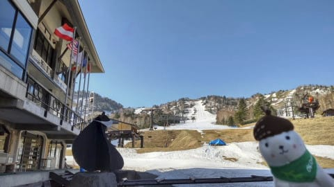
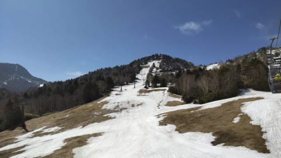
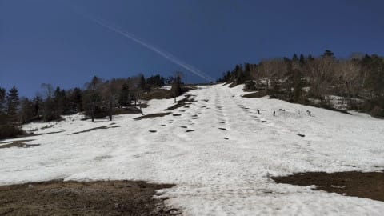
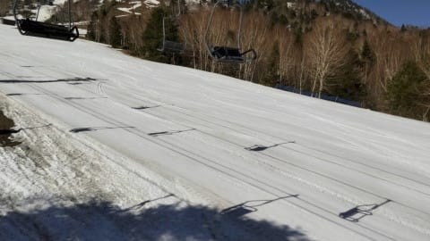
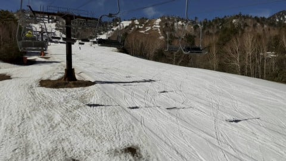
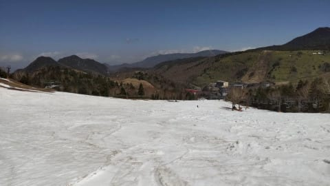
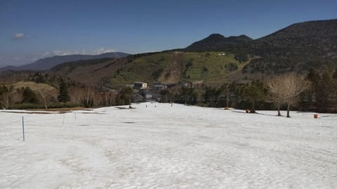
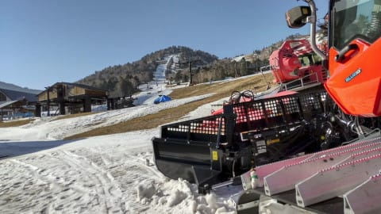

# 今日は昼更新…2021/5/8(土)志賀高原熊の湯スキー場，特派員情報！

📅 投稿日時: 2021-05-09 11:12:08

えー．

昨日は久しぶりに家の食卓で

夕食を食べて…

そして，久しぶりに家でお酒を

飲んでしまったのですが．

その前の夜が3時間しか寝てなかったからか．

食後，すぐ倒れたように寝てしまい．

朝まで死んだように寝てました…

ってなことで．

私の長い志賀高原歴でも，最長の7連続志賀

というご無体な遊びをやってしまった反動で，

今週末は仕事をやることになってしまって

いるわけで…

今日は時間のあいた昼に更新！

ってことで．

昨日土曜の熊の湯ですが…

昨日も晴天だったようです！

…この時期，雪が悪くなる晴れは

むしろ恨めしくあるのですが…

で，気温はこの日も異常に高く．

雪は減る一方です…

第3緩斜面は，もうダメですね．

(この時期にものすごく増えたらそれはそれで怖いけど)

もうクローズにはなってますが，

第2Aの斜面も雪は減ってます…

ただ，今オープンしている第2緩斜面．

ここは人工雪をつけてあるのでまだまだ

大丈夫！

…だけど．

土曜日というのに，人がいませんね…

9時ごろには30人ちょい，

10時半ごろでも70~80人くらいということで．

週末と考えると超ガラガラですね…

バーンの雪は超ザクザクで．

かなりとけてしまったのもあり…

これからこの高温＆晴天が続くと

ヤバそうな感じ…

板の滑りも悪そうですね(涙）

ってなことで．

営業予定の5月16日までもつのかどうか？

微妙な感じに見えますが．

いや．このGWの5連休も．

その前の4月29日は「GW最後までもたないな…」

と思ったものだけど．5月１，２，3日の

奇跡の降雪で，5連休最終日まで問題なく

盛ったので．

今回も奇跡の降雪があれば，16日まで

もつに違いない…！！！

と思いながらも．

13日あたり，高温の雨が降りそうで．

むしろヤバいかも…

ってことで．

余談ですが．

いつものおこみん特派員からのチャレンジ．

おこみんはどこだ？

## 💬 コメント一覧

### 💬 コメント by (大阪のK.)
**タイトル**: Unknown
**投稿日**: 2021-05-09 18:59:28

おこみんはキャタピラーの上ですね。

大阪ではタ◯ベスポーツが、5月15日から変則営業を再開します。

月曜日から木曜日までは休み。

金曜日から日曜日まで営業。

メンテに持っていく日を何時にしようかと思案中。

### 💬 コメント by (Skier_S)
**タイトル**: ＞大阪のKさま
**投稿日**: 2021-05-10 00:31:14

正解！

で，タナベスポーツ…

平日休みなんですね！

すごい変則営業ですね…

